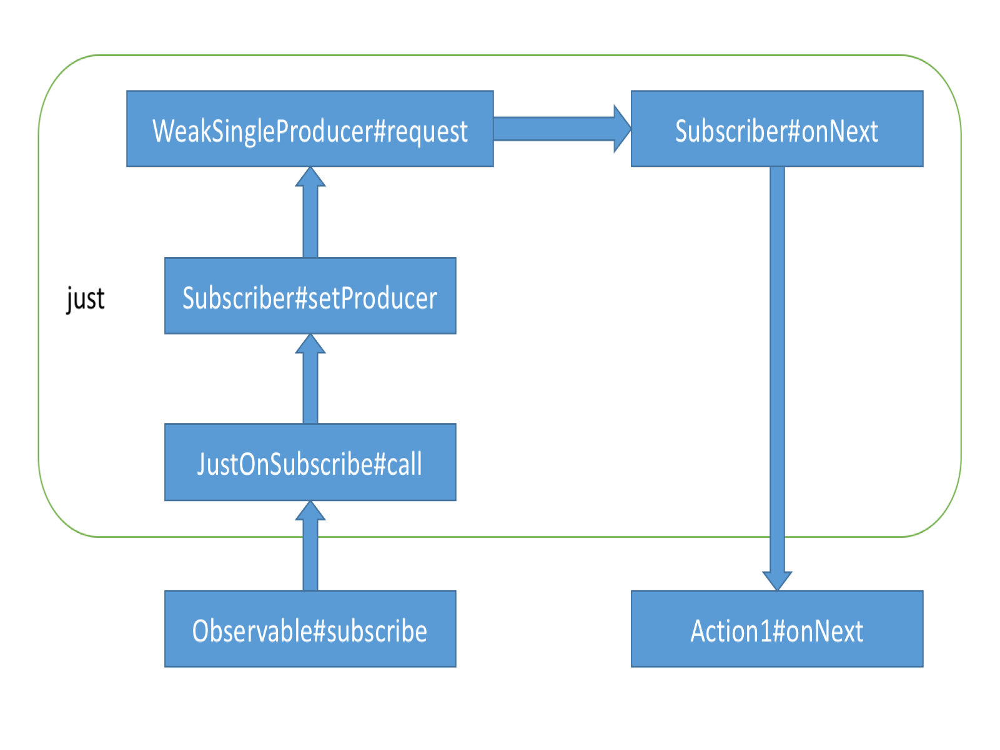

# RxJava 1 操作符源码分析

## 1. just

### Observable#just

```java
    public static <T> Observable<T> just(final T value) {
        return ScalarSynchronousObservable.create(value);
    }

    public static <T> ScalarSynchronousObservable<T> create(T t) {
        return new ScalarSynchronousObservable<T>(t);
    }

    protected ScalarSynchronousObservable(final T t) {
        super(RxJavaHooks.onCreate(new JustOnSubscribe<T>(t)));
        this.t = t;
    }
```

　　创建的是 ScalarSynchronousObservable ，是一个 Observable 的子类。

　　所以传给父类构造函数的就是 JustOnSubscribe，一个 onSubscribe 的实现类。

　　just() 方法将传入的参数依次发送出来。

　　Observable 的构造函数接受一个 OnSubscribe，它是一个回调，会在 Observable#subscribe 中使用，同于通知 observable 自己被订阅。

### JustOnSubscribe#call

　　在 just() 的实现里面，创建了一个 JustOnSubscribe，在 subscribe() 方法中执行 hook.onSubscribeStart(observable, observable.onSubscribe).call(subscriber) 方法实际执行的就是 JustOnSubscribe 的 call 方法。

```java
    static final class JustOnSubscribe<T> implements OnSubscribe<T> {
        final T value;

        JustOnSubscribe(T value) {
            this.value = value;
        }

        @Override
        public void call(Subscriber<? super T> s) {
            s.setProducer(createProducer(s, value));
        }
    }

    static <T> Producer createProducer(Subscriber<? super T> s, T v) {
        if (STRONG_MODE) {
            return new SingleProducer<T>(s, v);
        }
        return new WeakSingleProducer<T>(s, v);
    }
```

　　在 RxJava 1.x 中，数据都是从  observable push 到 subscriber 的，但要是 observable 发的太快，subscriber 处理不过来，该怎么办？一种办法是，把数据保存起来，但这显然可能导致内存耗尽；另一种办法是，多余的数据来了之后就丢掉，至于丢掉和保留的策略可以按需指定；还有一种办法就是让 subscriber 向  observale 主动请求数据，subscriber 不请求，onservable 就不发出数据。它两互相协调，避免出现过多的数据，而协调的桥梁，就是 producer。

### Subscriber#setProducer

```java
    public void setProducer(Producer p) {
        long toRequest;
        boolean passToSubscriber = false;
        synchronized (this) {
            toRequest = requested;
            producer = p;
            // 一次包装，ActionSubscriber 包装为 SafeSubscriber
            if (subscriber != null) {
                // middle operator ... we pass through unless a request has been made
                if (toRequest == NOT_SET) {
                    // we pass through to the next producer as nothing has been requested
                    passToSubscriber = true;
                }
            }
        }
        // do after releasing lock
        // 发生一次 pass through ，然后回进入 else 代码块
        if (passToSubscriber) {
            subscriber.setProducer(producer);
        } else {
            // we execute the request with whatever has been requested (or Long.MAX_VALUE)
            // 这列所有的 requested 初始值都是 NOT_SET,所以回请求 Long.MAX_VALUE ，即无限个数据。
            if (toRequest == NOT_SET) {
                producer.request(Long.MAX_VALUE);
            } else {
                producer.request(toRequest);
            }
        }
    }
```

　　最后调用了 producer 的 request() 方法。

### WeakSingleProducer#request

```java
    static final class WeakSingleProducer<T> implements Producer {
        final Subscriber<? super T> actual;
        final T value;
        boolean once;

        public WeakSingleProducer(Subscriber<? super T> actual, T value) {
            this.actual = actual;
            this.value = value;
        }

        @Override
        public void request(long n) {
            if (once) {
                return;
            }
            if (n < 0L) {
                throw new IllegalStateException("n >= required but it was " + n);
            }
            if (n == 0L) {
                return;
            }
            once = true;
            Subscriber<? super T> a = actual;
            if (a.isUnsubscribed()) {
                return;
            }
            T v = value;
            try {
                a.onNext(v);
            } catch (Throwable e) {
                Exceptions.throwOrReport(e, a, v);
                return;
            }

            if (a.isUnsubscribed()) {
                return;
            }
            a.onCompleted();
        }
    }
```

　　在 request() 中，调用了 subscriiber 的 onNext() 和 onCompleted()，那么 Hello World 就传递到了 Action 中，并被打印出来了。

### just 为例的完成过程



　　一切行为都由 subscribe 触发，而且都是直接的函数调用，所以在调用 subscribe 的线程执行。

##  2. map 操作符

　　使用 map 操作符：

```java
        Observable.just("hello word")
                .map(new Func1<String, Long>() {
                    @Override
                    public Long call(String s) {
                        return s != null ? s.length() : 0l;
                    }
                })
                .subscribe(new Action1<Long>() {
                    @Override
                    public void call(Long s) {
                        Log.d(TAG, "get " + s + " @ " + Thread.currentThread().getName());
                    }
                });
```

　　使用 map 操作符，把字符串转换为它的长度。

#### Observable#map

```java
    public final <R> Observable<R> map(Func1<? super T, ? extends R> func) {
      	// 新建了一个 Observable 并使用新的 OnSubscribeMap 来封装传入的数据
        return unsafeCreate(new OnSubscribeMap<T, R>(this, func));
    }
    public static <T> Observable<T> unsafeCreate(OnSubscribe<T> f) {
        return new Observable<T>(RxJavaHooks.onCreate(f));
    }
```

　　map 的实现本来是利用 lift + Operator 实现的，但是后来改成了 create + OnSubscribe(RxJava #4097)；二是 lift 的实现本来是直接调用 observable 构造函数，后来改成了调用 create（RxJava #4007）。后者先发生，引入了新的 hook 机制，前者则是为了提升一点性能。

　　所以这里实际上是 OnSubscribeMap 干活了。

#### OnSubscribeMap

```java
// OnSubscribeMap 是 OnSubscribe 的子类
public final class OnSubscribeMap<T, R> implements OnSubscribe<R> {

    final Observable<T> source;

    final Func1<? super T, ? extends R> transformer;

    public OnSubscribeMap(Observable<T> source, Func1<? super T, ? extends R> transformer) {
      	// 经过 Observable.interval() 函数生成的 Observable
        this.source = source;
        this.transformer = transformer;
    }

  	// 传入的 o 就是 subscribe() 处传入的 Subscriber
    @Override
    public void call(final Subscriber<? super R> o) {
      	// 对传入的 Subscriber 进行再次封装成 MapSubscriber
      	// 具体 Observable.map() 的逻辑是在 MapSubscriber 中
        MapSubscriber<T, R> parent = new MapSubscriber<T, R>(o, transformer);  //1
        // 加入到 SubscriptionList 中，为了之后取消订阅
      	o.add(parent);                //2
      	// Observable.interval() 返回的 Observable 进行订阅
        source.unsafeSubscribe(parent); //3
    }

}
```

　　它的实现很直观：

1. 利用传入的 subscriber 以及我们进行转换的 Func1 构造一个 MapSubscriber。
2. 把一个 subscriber 加入到另一个 subscriber 中，是为了让它们可以一起取消订阅。
3. unsafeSubscribe 相较于前面的 subscribe，可想而知就是少了一层 SafeSubscriber 的包装。为什么不要包装？因为会在最后调用 Observable#subscribe 时进行包装，只需要包装一次即可。

　　call() 方法的逻辑很简单，只是将例子中 Observable.subscribe() 传入的 Subscriber 进行封装后，再将上流传入的 Observable 进行订阅。

#### MapSubscriber

```java
		static final class MapSubscriber<T, R> extends Subscriber<T> {

        final Subscriber<? super R> actual;

        final Func1<? super T, ? extends R> mapper;

        boolean done;

        public MapSubscriber(Subscriber<? super R> actual, Func1<? super T, ? extends R> mapper) {
          	// Observable.subscribe() 传入的 Subscriber
            this.actual = actual;
            this.mapper = mapper;
        }

        @Override
        public void onNext(T t) {
            R result;

            try {
              	// 数据进行了交换
                result = mapper.call(t);  //1
            } catch (Throwable ex) {
                Exceptions.throwIfFatal(ex);
                unsubscribe();
                onError(OnErrorThrowable.addValueAsLastCause(ex, t));
                return;
            }
						// 往下流传
            actual.onNext(result); //2
        }

        @Override
        public void onError(Throwable e) {
            if (done) {
                RxJavaHooks.onError(e);
                return;
            }
            done = true;

            actual.onError(e);
        }


        @Override
        public void onCompleted() {
            if (done) {
                return;
            }
            actual.onCompleted();
        }

        @Override
        public void setProducer(Producer p) {
            actual.setProducer(p);
        }
    }
```

　　MapSubscriber 依然很直观：

1. 上游每新来一个数据，就用 mapper 进行数据转换。
2. 再把转换之后的数据发送给下游。

　　just 在 map 的上面，Action1 在 map 的下面，数据从 just 传递到 map 再传递到 Action1，所以对于 map 来说，just 就是上游，Action1 就是下游。数据是从上游（Observable）一路传递到下游（Subscriber）的，请求则相反，从下游传递到上游。

#### 完整的过程

　　map 的完整调用过程图：


　　上面的流程依然由 subscribe 触发，而且都是直接的函数调用，所以都在调用 subscribe 的线程执行。

#### Observable.interval

```java
    public static Observable<Long> interval(long initialDelay, long period, TimeUnit unit, Scheduler scheduler) {
        return unsafeCreate(new OnSubscribeTimerPeriodically(initialDelay, period, unit, scheduler));
    }
```

　　可以看出 interval() 和 map() 一样都是通过生成新的 Observable 并向 Observable 中传入与之对应的 OnSubscribe 的子类来完成具体操作。

##### OnSubscribeTimerPeriodically

```java
public final class OnSubscribeTimerPeriodically implements OnSubscribe<Long> {
    final long initialDelay;
    final long period;
    final TimeUnit unit;
    final Scheduler scheduler;

    public OnSubscribeTimerPeriodically(long initialDelay, long period, TimeUnit unit, Scheduler scheduler) {
        this.initialDelay = initialDelay;
        this.period = period;
        this.unit = unit;
        this.scheduler = scheduler;
    }
		
  	// 传入的 Subscriber 为 OnSubscribeMap.call() 方法中 source.unsafeSubscribe(parent)；
    @Override
    public void call(final Subscriber<? super Long> child) {
        final Worker worker = scheduler.createWorker();
        child.add(worker);
        worker.schedulePeriodically(new Action0() {
            long counter;
            @Override
            public void call() {
                try {
                    child.onNext(counter++);
                } catch (Throwable e) {
                    try {
                        worker.unsubscribe();
                    } finally {
                        Exceptions.throwOrReport(e, child);
                    }
                }
            }

        }, initialDelay, period, unit);
    }
}

```


## 3. 参考文章
[拆轮子系列：拆 RxJava](https://blog.piasy.com/2016/09/15/Understand-RxJava/index.html)

[RxJava 源码解析之观察者模式](https://juejin.im/post/58dcc66444d904006dfd857a)