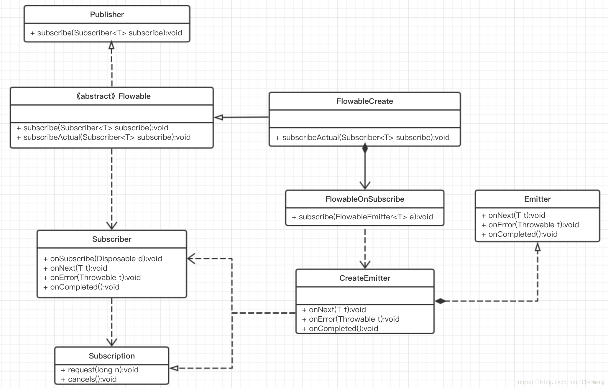

# RxJava 2 背压源码分析

## Flowable 源码分析

　　背压 Flowable 方法的简单使用：

```java
        Flowable.create(new FlowableOnSubscribe<Object>() {
            @Override
            public void subscribe(FlowableEmitter<Object> emitter) throws Exception {
                if (!emitter.isCancelled()) {
                    emitter.onNext("1");
                    emitter.onComplete();
                }
            }
        }, BackpressureStrategy.DROP).subscribe(new FlowableSubscriber<Object>() {
            @Override
            public void onSubscribe(Subscription s) {
                s.request(Long.MAX_VALUE);
            }

            @Override
            public void onNext(Object o) {

            }

            @Override
            public void onError(Throwable t) {

            }

            @Override
            public void onComplete() {

            }
        });
```

　　Flowable 是专门用于背压使用，在 onSubscribe 方法中需要手动做一个响应式拉取，即 s.request(Long.MAX_VALUE)，否则不会调用 onNext() 方法。

* 首先创建通过调用 Flowable 的 create 方法创建实例，传入两个参数，第一个是 OnSubscribe 接口实例，并实现其 subscribe 方法，第二个参数则是背压特有的背压策略。
* 调用 Flowable 的 subscribe 方法。

### Flowable#create

```java
    @CheckReturnValue
    @BackpressureSupport(BackpressureKind.SPECIAL)
    @SchedulerSupport(SchedulerSupport.NONE)
    public static <T> Flowable<T> create(FlowableOnSubscribe<T> source, BackpressureStrategy mode) {
        ObjectHelper.requireNonNull(source, "source is null");
        ObjectHelper.requireNonNull(mode, "mode is null");
        return RxJavaPlugins.onAssembly(new FlowableCreate<T>(source, mode));
    }
```

　　这里返回的是一个 FlowableCreate 对象，在 subscribe() 方法里调用 subscribeActual() 方法，就会调用 FlowableCreate  类的 subscribeActual() 方法：

### FlowableCreate#subscribeActual

```java
    @Override
    public void subscribeActual(Subscriber<? super T> t) {
        BaseEmitter<T> emitter;

        switch (backpressure) {
        case MISSING: {
            emitter = new MissingEmitter<T>(t);
            break;
        }
        case ERROR: {
            emitter = new ErrorAsyncEmitter<T>(t);
            break;
        }
        case DROP: {
            emitter = new DropAsyncEmitter<T>(t);
            break;
        }
        case LATEST: {
            emitter = new LatestAsyncEmitter<T>(t);
            break;
        }
        default: {
            emitter = new BufferAsyncEmitter<T>(t, bufferSize());
            break;
        }
        }

        t.onSubscribe(emitter);
        try {
            source.subscribe(emitter);
        } catch (Throwable ex) {
            Exceptions.throwIfFatal(ex);
            emitter.onError(ex);
        }
    }
```

　　由此可见背压的策略有 MISSING、ERROR、DROP、LATEST 这几种，不同的策略对应不同的 BaseEmitter，与 Observable 做法相同，再包装传入的 SUbscribe 参数，接着调用 Subscribe 接口的 onSubscribe 方法，即 `t.onSubscribe(emitter);`,传入指定策略对应的 Emitter，此时调用订阅的传递的对象 FlowableSubscriber 的 onSubscribe 被回调。

　　接着调用了 source.subscribe(emitter)，就是调用了  FlowableOnSubscribe 的 subscribe 方法，并传入 emitter，意味着订阅流程开启，代码中创建 Flowable 时实现的 subscribe 方法被调用，里面调用的 onNext()、onComplete() 方法依次执行。

### BaseEmmitter

```java
    abstract static class BaseEmitter<T>
    extends AtomicLong
    implements FlowableEmitter<T>, Subscription {
        private static final long serialVersionUID = 7326289992464377023L;

        final Subscriber<? super T> downstream;

        final SequentialDisposable serial;

        BaseEmitter(Subscriber<? super T> downstream) {
            this.downstream = downstream;
            this.serial = new SequentialDisposable();
        }

        @Override
        public void onComplete() {
            complete();
        }

        protected void complete() {
            if (isCancelled()) {
                return;
            }
            try {
                downstream.onComplete();
            } finally {
                serial.dispose();
            }
        }

        @Override
        public final void onError(Throwable e) {
            if (!tryOnError(e)) {
                RxJavaPlugins.onError(e);
            }
        }

        @Override
        public boolean tryOnError(Throwable e) {
            return error(e);
        }

        protected boolean error(Throwable e) {
            if (e == null) {
                e = new NullPointerException("onError called with null. Null values are generally not allowed in 2.x operators and sources.");
            }
            if (isCancelled()) {
                return false;
            }
            try {
                downstream.onError(e);
            } finally {
                serial.dispose();
            }
            return true;
        }

        @Override
        public final void cancel() {
            serial.dispose();
            onUnsubscribed();
        }

        void onUnsubscribed() {
            // default is no-op
        }

        @Override
        public final boolean isCancelled() {
            return serial.isDisposed();
        }

        @Override
        public final void request(long n) {
            if (SubscriptionHelper.validate(n)) {
                BackpressureHelper.add(this, n);
                onRequested();
            }
        }

        void onRequested() {
            // default is no-op
        }

        @Override
        public final void setDisposable(Disposable d) {
            serial.update(d);
        }

        @Override
        public final void setCancellable(Cancellable c) {
            setDisposable(new CancellableDisposable(c));
        }

        @Override
        public final long requested() {
            return get();
        }
    }
```

　　BaseEmmitter 的作用同 Observable 中的 CreateEmmitter 相同，都是实现了 onNext、onComplete、onError 相关接口。在起哄做了简单处理，使得最后在代码中通过 FlowerableEmitter 调用 onNext 相关方法，实际上时通过传入并实现的 Subscribe 接口本身自己调用。

　　不同之处在于，BaseEmmitter 还实现了背压特有的 request(long n)方法，这个方法就是在使用例子中 FlowableSubscriber 的 onSubscribe 方法中调用的方法。

　　在 request 方法中首先判断传入的参数是否有效（不得小于 0 ），接着调用 BackpressureHelper 的 add 方法，传入 BaseEmitter 实例和指定的数值。

#### BackpressureHelper#add

```java
    public static long add(AtomicLong requested, long n) {
        for (;;) {
            long r = requested.get();
            if (r == Long.MAX_VALUE) {
                return Long.MAX_VALUE;
            }
            long u = addCap(r, n);
            if (requested.compareAndSet(r, u)) {
                return r;
            }
        }
    }
```

　　首先获取默认值 r ，为 0 ，接着调用 addCap 方法，其实就是返回 n，最后将 AtomicLong 类型的 requested 设置为 n，将其返回。

### DropAysncEmitter

　　以 DropAysncEmitter 为例，查看背压的具体实现：

```java
    abstract static class NoOverflowBaseAsyncEmitter<T> extends BaseEmitter<T> {
        ...
        @Override
        public final void onNext(T t) {
            if (isCancelled()) {
                return;
            }

            if (t == null) {
                onError(new NullPointerException("onNext called with null. Null values are generally not allowed in 2.x operators and sources."));
                return;
            }

            if (get() != 0) {
                downstream.onNext(t);
                BackpressureHelper.produced(this, 1);
            } else {
                onOverflow();
            }
        }

        abstract void onOverflow();
    }

    static final class DropAsyncEmitter<T> extends NoOverflowBaseAsyncEmitter<T> {
        private static final long serialVersionUID = 8360058422307496563L;
       	...
    }
```

　　在 DropAysncEmitter 的 onNext 方法中首先调用 get 方法取出对应的值，默认值是 0，这就事说如果不在 onSubscribe 方法中设置这个值，那么就是 0，所以就不会执行 actual 变量（就是 Subscribe 接口实例）的    onNext() 方法。

## 分析图




## 参考文章
[浅析RxJava 1.x&2.x版本使用区别及原理（一）：Observable、Flowable等基本元素源码解析](https://blog.csdn.net/itermeng/article/details/80139074)