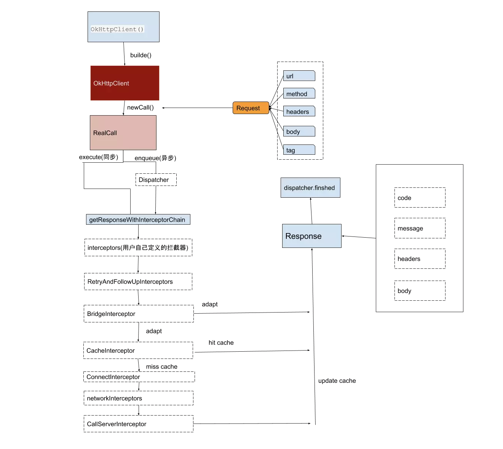

# 开源库常见的问题

# 1. 网络库

　　解决各种协议（GET,POST,PUT,HEAD,DELETE...）的网络数据的获取及请求，支持异步、同步请求；文件多线程下载断点续传、上传；请求自动重试，gzip 压缩，Cookies 自动解析并持久化，数据的缓存。目标是让网络请求更方便、简洁、高效、稳定。

| 名称                                                         | 概要                                                | 详情                                                         |
| ------------------------------------------------------------ | --------------------------------------------------- | ------------------------------------------------------------ |
| [Retrofit2.0]()                                              | 以接口/注解的形式定义请求和响应                     | Square 开源的项目。是一套 RESTful 家口的 Android(Java) 客户端实现，基于注解，提供 JSON to POJO(Plain Ordinary Java Object，简单的 Java 对象)，POJO to JSON，网络请求（POST,GET,PUT,DELETE等）封装。本身的网络核心可以替换，如 Apache HTTP Client,URL connection,OKHTTP 等，数据解析核心也可以替换如 Gson,Jackson,fastjson,xStream等。力求用最少的代码，实现最强大的功能。 |
| [okhttp](https://github.com/square/okhttp)                   | 一个为安卓和 java 应用诞生的 Http+SPDY 的网络处理库 | square 开源项目。支持 HTTP,HYTTPS,HTTP/2.0 和 SPDY 协议；自动缓存数据，节省流量；内部自动 GZIP 压缩内容。 |
| [android-async-http](https://github.com/loopj/android-async-http) | 一个异步的 AndroidHttp 库                           | 比较经典的网络请求库，基于 Apache 的 HttpClient 库实现，但是由于 Android M(6.0)去除了对 HttpClient 相关 API，意味着 google 不再推荐使用。 |
| [Volley](https://github.com/mcxiaoke/android-volley)         | 一个能让 Android 的网络请求更简单快捷的 Http 库     | Volley 集成了 AsyncHttpClient 和 Universal-Image-Loader 的优点，既可以像 AsyncHttpClient 一样非常简单地进行 HTTP 通信，也可以像 Universal-Image-Loader 一样轻松加载网络上的图片。但是对大数据量的网络操作如文件的下载支持较差。 |

# 2. 图片库

　　解决网络、文件、res、assets 等图片的获取、解析、展示、缓存等需求...

| 名称                                                         | 概要                                  | 详情                                                         |
| ------------------------------------------------------------ | ------------------------------------- | ------------------------------------------------------------ |
| [Picasso](https://github.com/square/picasso)                 | 强大的图片下载和缓存库                | Square 开源的项目，主导者是 JakeWharton。不支持 gif 的显示。 |
| [Glide](https://github.com/bumptech/glide)                   | Google 推荐的图片加载和缓存的库       | 专注于平滑滚动时的流畅加载，Google 开源项目，2014 年 Google I/O 上被推荐 |
| [Fresco](https://github.com/facebook/fresco)                 | Facebook 推荐的 Android 图片加载库    | 自动管理图片的加载和图片的缓存。Facebook 在 2015 年上半年开源的图片加载库 |
| [Android-Universal-Image-Loader](https://github.com/nostra13/Android-Universal-Image-Loader) | 早期广泛使用的开源图片加载库          | 强大又灵活的 Adroid 库，用于加载、缓存、显示图片。           |
| [Volley](https://github.com/mcxiaoke/android-volley)         | 2013 年 Google I/O 推荐的网络通讯框架 | 使用 Volley 加载网络图片，主要用到其中的 ImageLoader，NetworkImageView 类，注意它不仅仅是个图片加载库。 |
| [Cube-sdk](https://github.com/etao-open-source/cube-sdk)     | 轻量级的 Android 开发框架             | 高效方便地加载网络图片，更简易地处理网络 API 请求。          |

# 3. OkHttp 原理

　　OkHttp 是一个非常强大而有效的网络架构，其主要特点在于：

* 对于同一个主机的所有请求，允许其在 Http /Http2 上共享同一个套接字，这就避免了重复的 TCP 连接带来的 3 次握手的时间。
* 对于 Http 协议，其支持连接池用于减少请求延迟。
* 数据都使用了 gzip 压缩传输，从而减少网络传输 size 的大小。
* 对响应进行缓存，避免缓存有效期内重复的网络请求。
* 弱网情况下，在连接失败后，OkHttp 会自动进行重试，特别是有备用地址时还会通过备用地址进行连接。而安全上，其支持新一代的 TLS 功能、SNL 和 ALPN，如果服务器不支持的化则会自动降级到 TLS 1.0。

## 3.1. OkHttp 请求网络的流程图

## 3.2. OkHttp 原理

　　OkHttp 有同步和异步的两种请求。

　　当调用 OkHttpClient 的 newCall() 时返回的是一个 RealCall 对象，ReadCall 对象主要负责网络的请求。

　　在 OkHttpClient 的异步请求时调用的就是 RealCall 的 enqueue() 方法，而 RealCall 的 enqueue() 方法调用的是 OkHttpClient 的 Dispatcher 对象的 enqueue () 方法执行 AsyncCall 的任务。在 Dispatcher 的 enqueue 中如果当前还可以运行线程任务，则将 AsyncCall 任务加入运行队列，并将 AsyncCall 任务放入线程池中去执行，如果不能放入运行队列中，则加入等待队列中。运行队列中的任务完成后会从运行队列中移除任务，如果运行队列中没有了任务，则将等待队列中的任务移到运行队列中。

　　AsyncCall 处理网络请求任务是通过责任链模式来完成的，会先去初始化责任链，责任链初始化完成后，就执行责任链。

　　OkHttp 里面的拦截器有：

1. 在配置 OkHttpClient 时设置的 interceptors（addInterceptor），自定义拦截器。
2. 负责失败重试以及重定向的 RetryAndFollowUpInterceptor。
3. 负责把用户构造的请求转换为发送服务器的请求、把服务器返回的响应转换为用户友好的响应的 BridgeInterceptor。
4. 负责读取缓存直接返回、更新缓存的 CacheInterceptor。
5. 负责和服务器建立连接的 ConnectInterceptor。
6. 配置 OkHttpClient 时设置的 networkInterceptors（addNetworkInterceptor）。
7. 负责向服务器发送请求数据、从服务器读取响应数据的 CallServerInterceptor。

　　位置决定了功能，最后一个 CallServerInterceptor 负责和服务器实际通讯，重定向、缓存等一定是在实际通讯之前的。

　　执行责任链是从第一个到最后一个，每一个拦截器都会被执行，执行的处理步骤基本是：1.请求数据前的处理，2.调用下一个责任，并获得请求结果，3.对请求结果进行处理。这样每一个拦截器都可以对请求处理也可以获取到请求结果。

　　OkHttp 的同步请求调用的是 RealCall 的 execute() 方法，同步请求是直接交给 Dispatcher 来处理请求的，将 RealCall 加入 Dispatcher 的同步队列中，并执行责任链，请求网络得到响应数据，完成后，从同步队列中移除任务。

# 4. Retrofit

　　Retrofit 是一个网络请求框架的封装。网络请求的工作本质上是 OkHttp 完成的，而 Retrofit 仅负责网络请求接口的封装。

　　Retrofit 支持多种数据解析方式，比如 GSON、Protobuf、Jackson 等。也支持多种网络请求适配方式：RxJava、Guava、Java8。

## 4.1. Retrofit 原理

　　Retrofit 的主要原理是利用了 Java 的动态代理技术，把 ApiService 的方法调用集中到了 InvocationHandler.invoke，再构建了 ServiceMethod 、OkHttpClient，返回 callAdapter.adapter 的结果。

　　retrofit 源码流程图：

# 5. Glide 原理

Glide 最简单的使用案例就是从远程服务器或者本地文件系统加载图片，把他们放在磁盘与内存缓存中，然后加载到 view 上。它可以用在全是图片的 app 中，Glide 为包含图片的滚动列表做了尽可能流畅的优化。

# 6. RxJava 原理

# 7. RabbitMQ 知识

