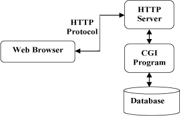

# HTTP

## HTTP 简介
　　HTTP 协议是 Hyper Text Transfer Protocol(超文本传输协议)的缩写，是用于从万维网（WWW:World Wide Web）服务器传输超文本到本地浏览器的传送协议。

　　HTTP 是基于 TCP/IP 通信协议来传输数据（HTML 文件，图片文件，查询结果等）。

#### HTTP 工作原理
　　HTTP 协议工作于客户端-服务端架构上。浏览器作为 HTTP 客户端通过 URL 向 HTTP 服务端发送所有请求。

　　Web 服务器有：Apache 服务器，IIS 服务器（Internet Information Service）等。

　　Web 服务器根据接收到的请求后，向客户端发送响应信息。

　　HTTP 默认端口号为 80，也可以改为 8080 或者其他端口。

**HTTP 三点注意事项：**
* HTTP 是无连接：无连接的含义是限制每次连接只处理一个请求。服务端处理完客户的请求，并收到客户的应答后，即断开连接。采用这种当时可以节省传输时间。
* HTTP 是媒体独立的：这意味着，只要客户端和服务端知道如何处理的数据内容，任何类型的数据都可以通过 HTTP 发送。客户端以及服务端指定使用合适的 MIME-type 内容类型。
* HTTP 是无状态：HTTP 协议是无状态协议。无状态是指协议对于事务处理没有记忆能力。缺少状态意味着如果后续处理需要前面的信息，则它必须重传，这样可能导致每次连接传送的数据量增大。另一方面，在服务器不需要先前信息时它的应答就较快。

　　下图是 HTTP 协议通信流程：

　　浏览器显示的内容都有 HTML、XML、GIF、FLASH 等，浏览器是通过 MIME Type 区分它们，决定用什么内容什么形式来显示。

　　MIME Type 是该资源的媒体类型，MIME Type 不是个人指定的，是通过互联网（IETF）组织协商，以 RFC(是一系列以编号排定的文件，几乎所有的互联网标准都有收录在其中)的形式作为建议的标准发布在网上的，大多数的 Web 服务器和用户代理都会支持这一规范（顺便说一句，Email 附件的类型也是通过 MIME Type 指定的）。

　　媒体类型通常通过 HTTP 协议，由 Web 服务器告知浏览器的，更准确的说，是通过 Content-Type 来表示的。

　　如果是某个客户端子机定义的格式，MIME Type 一点只能以 application/x- 开头。

## 
　　

## 参考文章
[HTTP 教程](https://www.runoob.com/http/http-tutorial.html)
[网络：HTTP](https://blog.csdn.net/oldwang1999/article/details/98526414)
[网络之 HTTP 协议](https://blog.csdn.net/qq_42725815/article/details/87892480)

