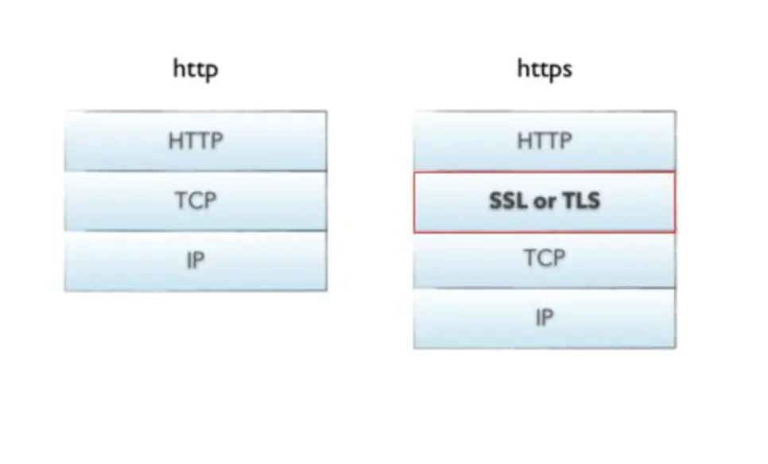

# HTTPS

　　https 协议（Hypertext Transfer Protocol Secure）：超文本传输安全协议。缩写为：HTTPS，常称为 HTTP over TLS，HTTP over SSL 或 HTTP source。

　　是一种通过计算机网络进行安全通信的传输协议。HTTPS 经由 HTTP 进行通信，但利用 SSL/TSL 来加密数据包。HTTPS 开发的主要目的是提供对网站服务器的身份认证，保护交换数据的隐私与完整性。这个协议由网景公司（Netscape）在 1994 年首次提出，随后扩展到互联网上。

　　简单来说，HTTPS 是 HTTP 的安全版，是使用 SSL/TLS 加密的 HTTP 协议。通过 TSL/SSL 协议的身份验证、信息加密和完整性校验的功能，从而避免信息窃听、信息篡改和信息劫持的风险。

　　HTTPS 提供了加密（Encryption）、认证（Verification）、鉴定（Identification）三种功能。

1. 私密性（Confidentiality/Privacy）：也就是提供信息加密，保证数据传输的安全。
2. 可信性（Authentication）：身份验证，主要是服务器端的，确认网站的真实性，有些银行也会对客户端进行认证。
3. 完整性（Message Integrity）：保证信息传输过程中的完整性，防止被修改。

　　HTTPS 就是在应用层和传输层中间加了一道验证的门槛以保证数据安全。

## SSL/TLS 协议

　　SSL（Secure Socket Layer）安全套接层

　　TLS（Transport Layer Security）传输层安全

　　1996 年 NetScape 公司发布 SSL V3.0；1999 年互联网标准化组织 ISOC 接替 NetScape 公司，发布了 SSL 的升级版 TLS 1.0 版；2006 年和 2008 年，TLS 进行了两次升级，分别为 TLS 1.1 版和 TLS 1.2 版。

　　SSL 及其继任者 TLS 是为网络通信提供安全及数据完整性的一种安全协议。TLS 与 SSL 在传输层对网络连接进行加密。

　　SSL 协议主要服务：

1. 认值用户和服务器，确保数据发送到正确的客户机和服务器。
2. 加密数据以防止数据中途被窃取。
3. 维护数据的完整性，确保数据在传输过程中不被改变。

　　

## 基本的运行过程

## SSL、TLS 的握手过程

## 对客户端的验证

## 参考文章

1. [https协议](https://www.jianshu.com/p/f9b8a3e62af1)
2. [HTTPS 与 SSL 证书概要](https://www.runoob.com/w3cnote/https-ssl-intro.html)