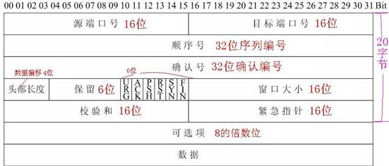
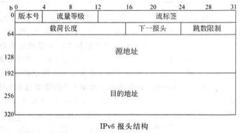
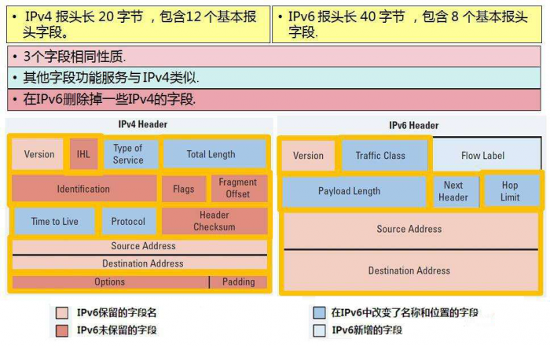
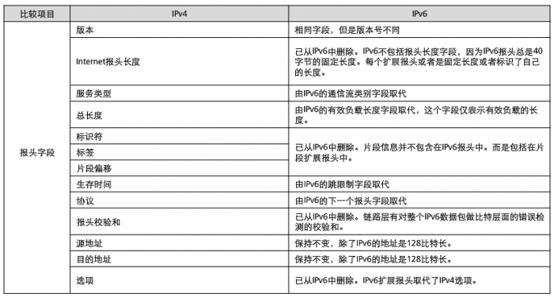

# IPv4 和 IPv6

## 1. 概述

　　网络上每台机器都有唯一的标识符。计算机使用唯一标识符将数据发送到网络上的特定计算机，这与在邮件中发送信件的地址相同。今天的大多数网络，包括 Internet 上的所有计算机，都使用 TCP/IP 协议作为网络上通信的标准。在 TCP/IP 协议中，计算机的唯一标识符称为 IP 地址。

　　IP 地址有两个标准：IP 版本 4 （IPv4）和 IP 版本 6（IPv6）。所有有 IP 地址的计算机都有 IPv4 地址，许多计算机也开始使用新的 IPv6 地址系统。

　　IPv4 是互联网协议（Internet Protocol，IP）的第四版，也是第一个被广泛使用，构成现今互联网技术的基石的协议。1981 年 Jon Postel 在 RFC 791 中定义了 IP，IPv4 可以运行在各种各样的底层网络上，比如端对端的串行数据链路（PPP 协议和 SLIP 协议）、卫星链路等等。局域网中最常用的是以太网。

　　传统的 TCP/IP 协议基于 IPv4 属于第二代互联网技术，核心技术属于美国。它的最大问题是网络地址资源有限，从理论上讲，编址 1600 万个网络、40 亿台主机。但采用 A、B、C 三类编码方式后，可用的网络地址和主机地址的数目大打折扣，以致 IP 地址已经枯竭。其中北美占用 3/4，约 30 亿个，而人口最多的亚洲只有不到 4 亿个，中国截至 2010 年 6 月 IPv4 地址数量达到 2.5 亿，落后于 4.2 亿网民的需求。虽然用动态 IP 及 Nat 地址转换等技术实现了一些缓冲，但 IPv4 地址枯竭已经成为不争的事实。在此，专家提出 IPv6 的互联网技术，也正在推行，但 IPv4 的使用过渡到 IPv6 需要很长的一段过渡期。

　　传统的 TCP/IP 协议基于电话宽带以及以太网的电器特性而制定的，其分包原则与检验占用了数据包很大的一部分比例造成了传输效率低，网络正向着全光纤网络高速以太网方向发展，TCP/IP 协议不能满足其发展需要。

　　IPv6 是 Internet Protocol Version 6 的缩写，其中 Internet Protocol 译为 “ 互联网协议 ”。IPv6 是 IETF（互联网工程任务组，Internet Engineering Task Force）设计的用于替代现行版本 IP 协议（IPv4）的下一代 IP 协议，IPv6 将 IPv4 中 32 位的地址长度扩展到了 128 位，使用 IPv6 ，可以让全世界的每一粒沙子都能分配到一个 IP 地址。

### 1.1. 电脑如何得到它的 IP 地址

　　IP 地址可以是动态的，也可以是静态的。静态地址是通过编辑计算机的网络设置来配置自己的地址。这种类型的地址很少见，如果在不了解 TCP/IP 的情况下使用它，可能会造成网络问题。动态地址是最常见的。它们由运行在网络上的服务动态主机配置协议（DHCP）分配。DHCP 通常运行在网络硬件上，如路由器或专用的 DHCP 服务器。

　　动态 IP 地址是使用租赁系统发出的，这意味着 IP 地址只在有限的时间内有效。如果租约到期，计算机将自动请求新的租约。有时，这意味着计算机也将获得一个新的 IP 地址，特别是在计算机在租约之间断开网络连接的情况下。这个过程通常对用户是透明的，除非计算机警告网络上的 IP 地址冲突（两台具有相同 IP 地址的计算机）。地址冲突很少见，而今天的技术通常会自动修复问题。

## 2. IPv4

　　IPv4 使用 32 个二进制位在网络上创建单个唯一地址。IPv4 地址由四个数字表示，用点分割。每个数字都是十进制（以 10 为基底）表示的八位二进制（以 2 为基底）数字，例如：216.27.61.137。

　　地址长度：32 位。

　　地址数量：2^32。

　　IPv4 头结构：

## 3. IPv6

　　IPv6 使用 128 个二进制位在网络上创建一个唯一地址。IPv6 地址由八组十六进制（以 16 为基数）数字表示，这些数字由冒号分割，如 2001:cdba:0000:0000:0000:0000:0000:3257:9652 所示。为了节省空间，通常省略包含所有零的数字组，留下冒号分隔符来标记空白（如 2001:cbda::3257:9652）。

　　地址长度：128 位。

　　地址数量：2^128

　　IPv6 头结构：

## 4. IPv4 与 IPv6 头部对比

## 5. IPv4  与 IPv6 的比较

| 描述                              | IPv4                                                         | IPv6                                                         |
| --------------------------------- | ------------------------------------------------------------ | ------------------------------------------------------------ |
| IP 头部                           | 长度为 32 位（4 个字节）   地址由网络和主机部分组成，这取决于地址类。根据地址的前几位，可定义各种地质类：A、B、C、D 或 E。IPv4 地址的总数为 4，294，967，296.  IPv4 地址的文本格式为 nnn.nnn.nnn.nnn，其中 9<= nnn <= 255，而每个 n 都是是十进制数。可省略前导 9。最大打印字符数为 15 个，不计掩码。 | 长度为 128 位（16 个字节）  通常体系结构的网络数字为 64 位，主机数字为 64 位。通常，IPv6 地址（或其部分）的主机部分将派生自 MAC 地址或其他接口标识。  根据子网前缀，IPv6 的体系结构比 IPv4 的体系结构更复杂。  IPv6 地址的数目比 IPv4 地址的数目大 10^28 倍。IPv6 地址的文本格式为 xxxx : xxxx : xxxx : xxxx : xxxx : xxxx : xxxx : xxxx，其中每个 x 都是十六进制数，表示 4 位。可省略前导零。可在地址的文本格式中使用一次双冒号（::），用于指定任意数目的 0 位。例如，:: ffff : 10.120.78.40 表示 IPv4 映射的 IPv6 地址。 |
| 地址分配                          | 最初，按网络类分配地址。随着地址空间的消耗，使用 “ 无类域间路由 ”（CIDR）进行更小的分配。没有在机构和国家或地区之间平均分配地址。 | 分配尚处于早期阶段。“ 因特网工程任务组织 ”（IETE）和 “ 因特网体系结构委员会 ”（IAB）建议基本上为每个组织、家庭或实体分配一个 /48 子网前缀长度。它将保留 16 位供组织进行子网划分。地址空间时足够大的，可为世界上每个人提供一个其自己的 /48 子网前缀长度。 |
| 地址生存期                        | 通常，除使用 DHCP 分配的地址之外，此概念不适用于 IPv4 地址。 | IPv6 地址有两个生存期：首选生存期和有效生存期，而首选的生存期总是小于等于有效的生存期。  首选生存期到期后，如果由同样好的首选地址可用，那么该地址便不再用作新连接的源 IP 地址。有效生存期到期后，该地址不再用作入局信息包的有效目标 IP 地址或源 IP 地址。  根据定义，某些 IPv6 地址有无限多个首选生存期和有效生存期，如本地链路。 |
| 地址掩码                          | 用于从主机部分指定网络。                                     | 未使用。                                                     |
| 地址前缀                          | 有时用于从主机部分指定网络。有时根据地址的表示格式写为 /nn 后缀。 | 用于指定地址的子网前缀。按照打印格式写为 /nn（最多 3 位十进制数字，0 <= nnn <= 128）后缀。例如 fe80 :: 982 : 2a5c/10，其中前 10 位组成子网前缀。 |
| 地址解析协议（ ARP ）             | IPv4 使用 ARP 来查找与 IPv4 地址相关联的物理地址（如 MAC 或链路地址）。 | IPv6 使用因特网控制报文协议版本 6（ICMPv6）将这些功能嵌入到 IP 自身作为无状态自动配置和邻节点发现算法的一部分。因此，不存在类似于 ARP6 之类的东西。 |
| 地址作用域                        | 此概念不适用于单点广播地址。有指定的专用地址范围和回送地址。将该范围之外的地址假设为全局地址。 | 在 IPv6 中，地址作用域是该体系结构的一部分。单点广播地址有两个已定义的作用域，包括本地链路和全局链路；而多点广播地址有 14 个作用域。为源和目标选择缺省地址时要考虑作用域。  作用域区域是特定网络中作用域的实例。因此，有时必须输入 IPv6 地址或使它与区域标识相关联。语法是 %zid，其中 zid 是一个数字（通常较小）或名称。区域标识写在地址之后前缀之前。例如，2ba :: 1 : 2 : 14e : 9a9b : c%3/48。 |
| 地址类型                          | IPv4 地址分为三种基本类型：单点广播地址、多点广播地址和广播地址。 | IPv6 地址分为三种基本类型：单点广播地址、多点广播地址和任意广播地址。 |
| 通信跟踪                          | 通信跟踪是一个收集进入和离开系统的 TCP/IP （及其他）信息包的详细跟踪资料的工具。 | 同样支持 IPv6。                                              |
| 配置                              | 新安装的系统必须在进行配置之后才能与其他系统通信；即，必须分配 IP 地址和路由。 | 根据所需的功能，配置是可选的。IPv6 可与任何以太网配置器配合使用并且可通过回送接口运行。IPv6 接口是使用 ipv6 无状态自动配置进行自我配置的。还可手动配置 IPv6 接口。这样，根据网络的类型以及是否存在 IPv6 路由器，系统将能与其他本地和远程的 IPv6 系统通信。 |
| 域名系统（ DNS ）                 | 应用程序使用套接字 API gethostbyname() 接受主机名，然后使用 DNS 来获得 IP 地址。  应用程序还接受 IP 地址，然后使用 DNS 和 gethostbyaddr() 获得主机名。  对于 IPv4，逆向查找域为 in-addr.arpa。 | 同样支持 IPv6。使用 AAAA（四个 A）记录类型和逆向查找（IP 到名称）支持 IPv6。应用程序可选择（是否）从 DNS 接受 IPv6 地址，然后（是否）使用 IPv6 进行通信。  套接字 API gethostbyname() 仅支持 IPv4。对于 IPv6，使用新的 getaddrinfo() API 以仅获取 IPv6 或获取 IPv4 和 IPv6 地址（在应用选择上）。  对于 IPv6，用于逆向查找的域为 ipv6.arpa，如果找不到，那么会使用 ip6.int。 |
| 动态主机配置协议( DHCP )          | DHCP 用于动态获取 IP 地址及其他配置信息。IBM i 支持对 IPv4 使用 DHCP 服务器。 | 通过 IBM i 实现的 DHCP 不支持 IPv6。但是，可以使用 ISC DHCP 服务器实现。 |
| 文件支持协议（ FTP ）             | FTP 允许通过网络发送和接收文件。                             | 同样支持 IPv6。                                              |
| 片段                              | 如果一个信息包对于要传送它的下一链路来说太大，那么可由发送方（主机或路由器）对其分段。 | 对于 IPv6 ，只能在源节点进行分段，且只能在目标节点完成重新装配。使用分段扩展报头。 |
| 主机表                            | 将因特网地址与主机名关联的可配置表，例如，127.0.0.1 用于回送，在开始 DNS 查找之前或者 DNS 查找失败之后（由主机名搜索优先级确定），套接字名称解析器将使用此表。 | 同样支持 IPv6。                                              |
| IBM Navigator for i 支持          | IBM Navigator for i 提供完整的 TCP/IP 配置解决方案。         | 同样支持 IPv6。                                              |
| 接口                              | 概念性或逻辑实体，由 TCP/IP 用来发送和接收信息包，即使不以 IPv4 地址命名页始终与 IPv4 地址紧密关联。有时称为逻辑接口。  可使用 IBM Navigator for i 以及使用 STRTCPIFC 和 ENDTCPIFC 命令彼此独立并独立于 TCP/IP 启动和停止 IPv4 接口。 | 同样支持 IPv6。                                              |
| 因特网控制报文协议（ ICMP ）      | 由 IPv4 用来进行网络信息通信。                               | 由 IPv6 的使用情况类似；然而，因特网控制报文协议版本 6 （ICMPv6）提供一些新的属性。  保留了基本错误类型，如目标不可到达、回传请求和应答。添加了新的类型和代码以支持邻节点发现和相关的功能。 |
| 因特网组管理协议（ IGMP ）        | IGMP 由 IPv4 路由器用来查找需要特定多点广播组通信的主机，并由 IPv4 主机用来由 IPv4 路由器通告（主机上）现有的多点广播组帧听器。 | ICMP 在 IPv6 中由 MLD（多播侦听器发现）协议取代。MLD 执行 IGMP 对 IPv4 所执行的必要操作，但通过添加一些特定于 MLD 的 ICMPv6 类型值来使用 ICMPv6。 |
| IP 报头                           | 根据提供的 IP 选项，有 20-60 个字节的可变长度。              | 40 个字节的固定长度。没有 IP 报头选项。通常，IPv6 报头比 IPv4 报头简单。 |
| IP 报头选项                       | IP 报头（在任何传输报头之前）可能附带各种选项。              | IPv6 报头没有选项，而 IPv6 添加了附加（可选）的扩展报头。扩展报头包括 AH 和 ESP （和 IPv4 的一样）、逐跳扩展、路由、分段和目标。目前，IPv6 支持一些扩展报头。 |
| IP 报头协议字节                   | 传输层或信息包有效复杂的协议代码，例如，ICMP。               | 报头类型紧跟在 IPv6 报头后面。使用与 IPv4 协议字段相同的值。此结构的作用是允许以后的报头使用当前定义的范围并且易于扩展。下一个报头将是传输报头、扩展报头或 ICMPv6。 |
| IP 报头 “ 服务类型 ” 字节         | 由 Qos 和差别服务用来指定通信类。                            | 但使用不同的代码来指定 IPv6 流量类。目前，IPv6 不支持 TOS。  |
| LAN 连接                          | LAN 连接由 IP 接口用来达到物理网络。存在许多类型，例如，令牌环和以太网。有时，它称为物理接口、链路或线路。 | IPv6 可与任何以太网适配器配合使用并且可通过虚拟以太网在逻辑分区间使用。 |
| 第 2 层隧道协议（L2TP）           | 可将 L2TP 看作是虚拟 PPP，并通过任何支持的线路类型工作。     | 同样支持 IPv6。                                              |
| 回送地址                          | 回送地址是地址为 127. * . * . * （通常是 127.0.01）的接口，只能由节点用来向自身发送信息包。该物理接口（线路描述）倍命名为 * LOOPBACK。 | 与 IPv4 的概念相同。单个回送地址为 0000 : 0000 : 0000 : 0000 : 0000 : 0000 : 0000 : 0001 或 ::1（简短版本）。虚拟物理接口被命名为 *LOOPBACK。 |
| 最大传输单元（MTU）               | 链路的最大传输单元是特定链路类型（如以太网或调制解调器）支持的最大字节数，对于 IPv4，最小值一般为 576。 | IPv6 的 MTU 下限为 1280 个字节。也就是说，IPv6 不会在低于此极限时对信息包分段。要通过字节数小于 1280 的 MTU 链路发送 IPv6，链路层必须以透明方式对 IPv6 信息包进行分段及合并。 |
| Netstat                           | Netstat 是一个用于查看 TCP/IP 连接、接口或路由状态的工具。在使用 IBM Navigator for i 和字符界面时可用。 | 同样支持 IPv6。                                              |
| 网络地址转换（ NAT ）             | 集成到 TCP/IP 中的基本防火墙功能，是使用 IBM Navigator for i 配置。 | 目前，NAT 不支持 IPv6。通常，IPv6 不需要 NAT。IPv6 扩展了地址空间，这样就解决了地址短缺问题并使重新编号变得更加容易。 |
| 网络表                            | IBM Navigator for i 上一个将网络名称与无掩码的 IP 地址相关联的可配置表。例如，主机网络 14 与 IP 地址 1.2.3.4。 | 对于 IPv6，目前此表不变。                                    |
| 节点信息查询                      | 不存在。                                                     | 一种简易的网络工具，其工作方式应类似于 ping，只是内容不同：IPv6 节点可查询目标 DNS 名称的另一个 IPv6 节点、IPv6 单点广播地址或 IPv4 地址，目前不受支持。 |
| 开放式最短路径优先协议（ OSPF  ） | OSPF 是在优先于 RIP 的较大型自治系统网络中使用的路由器协议。 | 同样支持 IPv6。                                              |
| 信息包过滤                        | 信息包过滤是集成到 TCP/IP 中的基本防火墙功能。它是通过使用 IBM Navigator for i 配置的。 | 信息包过滤不支持 IPv6。                                      |
| 信息包转发                        | 可将 IBM i TCP/IP 堆栈配置为转发其接收到的非本地 IP 地址的 IP 信息包。通常，入站接口和出站接口各自连接到不同的 LAN。 | 信息包转发对 IPv6 的支持优先。IBM i TCP/IP 堆栈不支持作为路由器而执行的邻节点发现。 |
| PING                              | PING 是测试可达性的基本 TCP/IP 工具。在使用 IBM Navigator for i 和字符界面时可用。 | 同样支持 IPv6。                                              |
| 点到点协议（ PPP ）               | PPP 支持基于各种调制解调器和线路类型的拨号接口。             | 同样支持 IPv6。                                              |
| 端口                              | TCP 和 UDP 有独立的端口空间，分别由范围为 1-65535 之间的端口号标识。 | 对于 IPv6，端口的工作与 IPv4 相同。因为它们处于新地址系列，现在有四个独立的端口空间。例如，有应用程序可绑定的两个 TCP 端口 80 空间，一个在 AF_INET 中，一个在 AF_INET6 中。 |
| 专用地址和公用地址                | 除由 IETF RFC 1918 指定为专用的三个地址范围 10. * . * . *（10/8），172.16.0.0 至 172.31.255.255（172.16/12）和 192.168. * . *（192.168/16）之外，所有 IPv4 地址都是公用的。专用地址域通常在组织内部使用，专用地址不能通过因特网路由。 | IPv6 有类似的概念，但还有重要差别。  地址是公用或临时的，先前称为匿名地址。与 IPv4 专用地址不同，临时地址可进行全局路由。动机也不一样：IPv6 临时地址要在它开始通信时屏蔽其客户机的身份（涉及隐私）。临时地址的生存期优先，且不包含是链路（MAC）地址的接口标识。它们通常与公用地址没有区别。  IPv6 具有受限地址作用域的概念，它使用其设计的作用域指定。 |
| 协议表                            | 在 IBM Navigator for i 中，协议表是将协议名称与其分配的协议号关联（例如，将 UDP 与 17 关联）的可配置表。随系统交付的只有少量的项：IP、TCP、UDP 和 ICMP。 | 该表可与 IPv6 直接配合使用而不需要更改。                     |
| 服务质量（ Qos ）                 | 服务质量允许为 TCP/IP 应用程序请求信息包优先级和带宽。       | 目前，通过 IBM i 实现的 Qos 不支持 IPv6。                    |
| 重新编号                          | 重新编号通过手动重新配置完成，可能存在 DHCP 的例外情况。通常，对于站点或组织，重新编号是应尽可能避免的复杂且繁琐的过程。 | 重新编号是 IPv6 的一个重要结构元素，特别是在 /48 前缀中已很大程度上实现自动化。 |
| 路由                              | 从逻辑上讲，是一组 IP 地址（可能只包含 1 个）的映射，这些 IP 地址映射为物理接口和单个下一中继段 IP 地址。使用该线路将其目标地址定义为该组的一部分的 IP 信息包转发至下一中继段。IPv4 路由与 IPv4 接口关联，因此，它是一个 IPv4 地址。  缺省路由为 *DFTROUTE。 | 从概念上讲，与 IPv4 类似。一个重要差别是：IPv6 路由与物理接口（链路，如 ETH03）而不是接口相关联（绑定）。路由与物理接口相关联的一个原因是 IPv6 与 IPv4 的源地址选择功能不同。 |
| 路由信息协议（ RIP ）             | RIP 是路由守护程序支持的路由协议。                           | 目前，RIP 不支持 IPv6。                                      |
| 服务表                            | IBM i 上的一个可配置表，它将服务名称与端口和协议关联（例如，将服务名称 FTP 与端口 21、TCP 即用户数据报协议（UDP）关联）。  服务表中列示了大量众所周知的服务。许多应用程序使用此表来确定要使用哪个端口。 | 对于 IPv6，此表不变。                                        |
| 简单网络管理协议（ SNMP ）        | SNMP 是一个用于系统管理的协议。                              | 同样支持 IPv6。                                              |
| 套接字 API                        | 应用程序通过使用这些 API 来使用 TCP/IP。不需要 IPv6 的应用程序不受为支持 IPv6 所做的套接字更改的影响。 | IPv6 使用新的地址系列：AF_INET6 增强了套接字以便应用程序现在可使用 IPv6。  设计了这些增强以便现有的 IPv4 应用程序完全不受 IPv6 和 API 更改的影响。希望支持并发 IPv4 和 IPv6 通信或纯 IPv6 通信的应用程序可以容易地适应使用 IPv4 映射的 IPv6 地址格式 :: ffff : a.b.c.d，其中 a.b.c.d 是客户机的 IPv4 地址。  新的 API 还支持从文本至二进制及从二进制文本的 IPv6 地址转换。 |
| 源地址选择                        | 应用程序可指定源 IP （通常，使用套接字 bind()）。如果它绑定至 INADDR_ANY，那么根据路由来选择源 IP。 | 与 IPv4 一样，应用程序可使用 bind() 指定源 IPv6 地址，和 IPv4 类似，它可通过使用 in6addr_any 让系统选择 IPv6 源地址。但是，因为 IPv6 线路有许多 IPv6 地址，所以选择源 IP 的内部方法不同。 |
| 启动和停止                        | 请使用 STRTCP 和 ENDTCP 命令来启动或结束 IPv4。当运行 STRTCP 命令来启动 TCP/IP 时，IPv4 始终处于启动状态。 | 请使用 STRTCP 或 ENDTCP 命令的 STRIP6 参数来启动或结束 IPv6。当 TCP/IP 已启动时，IPv6 可能未启动。稍后，可独立启动 IPv6。  如果 AUTOSTART 参数设置为 *YES（缺省值），那么任何 IPv6 接口都会自动启动。IPv6 必须与 IPv4 配合使用或配置。当启动 IPv6 时，会自动定义并激活 IPv6 回送接口 ::1。 |
| Telnet                            | Telnet 允许登录并使用远程计算机，就好像直接与其连接一样。    | 同样支持 IPv6。                                              |
| 跟踪路由                          | 跟踪路由是进行路径确定的基本 TCP/IP 工具，在使用 IBM Navigator for i 和字符界面时可用。 | 同样支持 IPv6。                                              |
| 传输层                            | TCP、UDP 和 RAW。                                            | IPv6 中存在相同的传输。                                      |
| 未指定地址                        | 顾名思义，未定义的地址。套接字编码将 0.0.0.0 用作 INADDR_ANY。 | 定义为 ::/128（128 个 0 位）。它在某些邻节点发现信息包和各种其他的上下文（如套接字）中用作源 IP。套接字编码将 ::/128 用作 in6addr_any。 |
| 虚拟专用网络（ VPN ）             | 虚拟专用网络（使用 IPsec）允许在现有的公用网络上扩展安全的专用网络。 | 同样支持 IPv6。                                              |

### 5.1. IPv4 和 IPv6 的区别

　　一、IPv6 和 IPv4 都属于 “ 互联网协议 ”。

　　二、IPv6 和 IPv4 的区别：

1. IPv6 的地址空间更大。

   * （1）IPv4 中规定 IP 地址长度为 32，既有 2^32 -1 个地址。
   * （2）IPv6 中 IP 地址的长度为 128，既有 2^128 -1 个地址。

2. IPv6 的路由表更小。

   IPv6 的地址一开始就遵循聚类（Aggregation）的原则，这可使路由器能在路由表中，用一条记录标识一片子网。大大减少了路由器中路由表的长度，提高了路由器转发数据包的速度。

3. IPv6 增强了组播（Multicast）支持以及对流的控制（Flow Control）。

   这使得网络上的多媒体应用有了长足发展的机会，为服务质量控制（Qos，Quality of Service）提供了良好的网络平台。

4. IPv6 加入了对自动配置（Auto Configuration）的支持。

   这是对 DHCP 协议的改进和扩展，使得网络（尤其是局域网）的管理更加方便和快捷。

5. IPv6 具有更高的安全性。

   在使用 IPv6 网络中，用户可以对网络层的数据进行加密并对 IP 报文进行校验，这极大地增强了网络安全。

6. IPv6 允许协议扩充。

7. IPv6 使用新的头部格式，简化和加速了路由选择的过程，因为大多数的现象不需要由路由选择。

## 6. 参考文章
1. [IPV4 和 IPV6 有什么用？](https://www.zhihu.com/question/305588873)
2. [什么是 IP 地址？IPv4 和 IPv6 有什么区别？](http://www.360doc.com/content/19/0809/12/29215996_853855203.shtml)
3. [IPv4 与 IPv6 的比较](https://www.cnblogs.com/ithomer/p/9246146.html)
4. [ipv4  和 ipv6 的区别](https://www.cnblogs.com/98pyh/p/11953241.html)