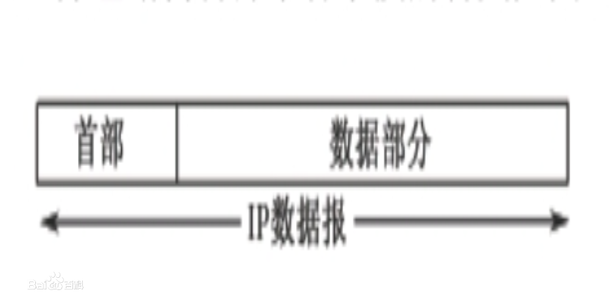
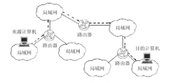

# IP 协议

　　IP 是 Internet Protocol（网络互联协议）的缩写，是 TCP/IP 体系中的网络层协议。设计 IP 的目的是提高网络的可扩展性：一是解决互联网问题，实现大规模、异构网络的互联互通；二是分割顶层网络应用和底层网络技术之间的耦合关系，以利于两者的独立发展。根据端对端的设计原则，IP 只为主机提供一种无连接、不可靠的、尽力而为的数据报传输服务。

## 1. 简介

　　IP 是整个 TCP/IP 协议族的核心，也是构成互联网的基础。IP 位于 TCP/IP 模型的网络层（相当于 OSI 模型的网络层），对上可载送传输层各种协议的信息，例如 TCP、UDP 等；对下可将 IP 信息包放到链路层，通过以太网、令牌环网络等各种技术来传送。

　　为了能适应异构网络，IP 强调适应性、简洁性和可操作性，并在可靠性做了一定的牺牲。IP 不保证分组的交付时限和可靠性，所传送分组可能出现丢失、重复、延迟或乱序等问题。

## 2. 主要内容

　　IP 主要包含三方面内容：IP 编址方案、分组封装格式及分组转发规则。

### 2.1. IP 分组的转发规则

　　路由器仅根据网络地址进行转发。当 IP 数据包经由路由器转发时，如果目标网络与本地路由器直接相连，则直接将数据报交付给目标主机，这称为直接交付；否则，路由器通过路由表查找路由信息，并将数据报转交给指明的下一跳路由器，这称为间接交付。路由器在间接交付中，若路由表中有到达目标网络的路由，则把数据包传送给路由表指明的下一跳路由器；如果没有路由，但路由表中有一个默认路由，则把数据报传送给指明的默认路由器；如果两者都没有，则丢弃数据包并报告错误。

### 2.2. IP 分片

　　一个 IP 包从源主机传输到目标主机可能需要经过多个不同的物理网络。由于各种网络的数据帧都有一个最大传输单元（MTU）的限制，如以太网帧的 MTU 是 1500；因此，当路由器在转发 IP 包时，如果数据包的大小超过了出口链路的最大传输单元时，则会将该 IP 分组分解成很多足够小的片段，以便能够在目标链路上进行传输。这种 IP 分片重新封装一个 IP 包独立传输，并在到大目标主机时才会被重组起来。

### 2.3. IP 分组结构

　　一个 IP 分组由首部和数据两部分组成。首部的前 20 字节是所有 IP 分组必须具备的，也称固定首部。在首部固定部分的后面是一些可选字段，其长度是可变的。

　　IP 分组结构：

### 2.4. IP数据包首部各字段的含义

## 3. 提供的服务

　　IP 所提供的服务大致可归纳为两类：

1. IP 信息包的传送。
2. IP 信息包的分割和重组。

### 3.1. IP 信息包传送

　　IP 是网络之间信息传送的协议，可将 IP 信息包从源设备（例如用户的计算机）传送到目的设备（例如某部门的 www 服务器）。为了达到这样的目的，IP 必须依赖 IP 地址与 IP 路由器两种机制来实现。

#### 3.1.1. IP 地址

　　IP 规定网络上所有的设备都必须有一个独一无二的 IP 地址，就好比是邮件上都必须注明收件人地址，邮递员才能将邮件送到。同理，每个 IP 信息包都必须包含有目的设备的 IP 地址，信息包才可以正确地送到目的地。同一设备不可以拥有多个 IP 地址，所有使用 IP 的网络设备至少有一个唯一的 IP 地址。

#### 3.1.2. IP 路由

　　互联网是由许多个网络连接所形成的大型网络。如果要在互联网中传送 IP 信息包，除了确保网络上每个设备都有一个唯一的 IP 地址之外，网络之间还必须有传送的机制，才能将 IP 信息包通过一个个的网络传送到目的地。此种传送机制称为 IP 路由。

　　IP 地址与 IP 路由是 IP 信息包传送的基础。此外，IP 信息包传送时还有一项很重要的特性，即使用非连接式的传送方式。非连接式的传送方式是指 IP 信息包传送时，源设备与目的设备双方不必事先连接，即可将 IP 信息包送达。即源设备完全不用理会目的设备，而只是单纯地将 IP 信息包逐一送出。至于目的设备是否收到每个信息包、是否收到正确的信息包等，则由上层地协议（例如 TCP）来负责检查。

　　使用非连接式的优点是过程简单化，可提高传输的效率。此外，由于 IP 信息包必须通过 IP 路由的机制，在一个个路由器之间传递，非连接式的传送方式较易在此种机制中运行。

　　相对于非连接式的传送方式，也有连接式的传送方式，也就是源与目的设备双方必须先建立连接，才能进一步传输数据，TCP 就是使用连接式的传送方式。

### 3.2. IP 信息包的分割和重组

　　为了能把一个 IP 报文放在不同的物理帧中，最大 IP 报文的长度就只能等于这条路径上所有物理网络的 MTU 的最小值。当数据报通过一个可以传输长度更大的帧的网络时，把数据报的大小限制在互联网上最小的 MTU 值是不经济；如果数据报的长度超过互联网上最小的 MTU 值的话，则当该数据报在穿越该子网时，就无法被封装在一个帧中。

　　IP 协议在发送 IP 数据包时，一般选择一个合适的初始长度。如果这个报文要经历的中间物理网络的 MTU 值比 IP 报文长度要小，则 IP 协议把这个报文的数据部分分割成若干个较小的数据片，组成较小的报文，然后放到物理帧中去发送。每个小的报文称为一个分段，分段的动作一般在路由器上进行。如果路由器从某个网络接口收到了一个 IP 报文，要向另外一个网络转发，而该网络的 MTU 比 IP 报文长度要小，那么就要把该 IP 报文分成多个小 IP 分段后再分别发送。

　　重组是分段的逆过程，把若干个 IP 分段重新组合后还原为原来的 IP 报文。在目的端收到一个 IP 报文时，可以根据其分段偏移和 MF 标志位来判断它是否是一个分段。如果 MF 位是 0，并且分段偏移为 0，则表明这是一个完整的 IP 数据报。否则，如果分段偏移不为 0，或者 MF 标志位为 1，则表明它是一个分段，这时目的地端需要实行分段重组。IP 协议根据 IP 报文头中的标识符字段的值来确定哪些分段属于同一个原始报文，根据分段偏移来确定分段在原始报文中的位置。如果一个 IP 数据报的所有分段都正确地到达目的地，则把它重新组织成一个完整的报文后交给上层协议去处理。

　　总结如下：IP 信息包在传送过程中，可能会经过许多个使用不同技术的网络。假设 IP 信息包从 ATM 网络所发出，原始长度为 9180B，如果 IP 路由途中经过以太网络，便面临信息包太大，无法在以太网上传输的障碍。为了解决此问题，路由器必须有 IP 信息包分割和重组的机制，将过长的信息包进行分割，以便能在最大传输单位较小的网络上传输。分割后的 IP 信息包，由目的设备接收后重组，恢复成原来的 IP 信息包。

## 4. IP 信息包的传送方式

　　在传送 IP 信息包时，一定会指明源地址与目的地址。源地址当然只有一个，但是目的地址却可能代表单一或多部设备。根据目的地址的不同，区分为 3 种传送方式：单点传送、广播传送以及多点传送。

### 4.1. 单点传送

　　单点传送是一对一的传递模式。在此模式下，源端所发出的 IP 信息包，其 IP 报文中的目的地址代表单一目的设备，因此只有该目的设备能收到此 IP 信息包。在互联网上传送的信息包，绝大多数都是单点传送的 IP 数据包。

### 4.2. 广播传送

　　广播传送是一对多的传递方式。在此方式下，源设备所发出的 IP 信息包，其 IP 报头中的目的地址代表某一网络，而非单一设备，因此该网络内的所有设备都能收到、并处理此类 IP 广播信息包。由于此特性，广播信息包必须小心使用，否则稍有不慎，便会波及该网络内的全部设备。

### 4.3. 多点传送

　　多点传送是一种介于单点传送与广播传送之间的传送方式模式。多点传送也是属于一对多的传送方式，但是它与广播传送有很大的不同。广播传送必定会传送至某一个网络内的所有设备，但是多点传送却可以将信息包传送给一群指定的设备。即多点传送的 IP 信息包，其 IP 报头中的目的地址代表的是一群选定的设备。凡是属于这一群的设备都可收到此多点传送信息包。

　　设置多点传送方式的原因是：假设要必须传送一份数据给网络上 10 部指定的设备。如果使用单点传送的方式，必须重复执行 10 次传送的操作才能达成目的，不仅没有效率，且浪费网络宽带。如果使用广播传送的方式，则指定网络中的所有（例如 20 部）计算机都能收到、且必须处理这些广播传送信息包。换言之，将影响到其他不相干的计算机。这时候，如果使用多点传送，便能避免单点传送与广播传送的问题。

　　多点传送非常适合传送一些即时共享的信息给一群用户。例如传送即时股价、多媒体影音信息等。不过，虽然在同一个网络内进行多点传送没有技术上的问题，但如果要通过互联网，则沿途的路由器必须都支持相关的协议才行，这也是多点传送所面临的瓶颈。

## 5. 协议版本

### 5.1. IPv4 协议

　　网际协议第 4 版（Internet Protocol version4，IPv4）是 TCP/IP 协议使用的数据报传输机制。数据报是一个可变长分组，有两部分组成：头部和数据。头部长度可由 20-60 个字节组成，该部分包含有与路由选择和传输有关的重要信息。头部各字段意义按顺序如下：

1. 版本（4 位）：该字段定义 IP 协议版本，负责向处理机所运行的 IP 软件指明此 IP 数据报是哪个版本，所有字段都要按照此版本的协议来解释。如果计算机使用其他版本，则丢弃数据报。
2. 头部长度（4 位）：该字段定义数据报协议头长度，表示协议头部具有 32 位字长的数量。协议头最小值为 5，最大值为 15。
3. 服务（8 位）：该字段定义上层协议对处理当前数据报所期望的服务质量，并对数据报按照重要性级别进行分配。前 3 位成为优先位，后面 4 位成为服务类型，最后 1 位没有定义。这些 8 位字段用于分配优先级、延迟、吞吐量以及可靠性。
4. 总长度（16 位）：该字段定义整个 IP 数据报的字节长度，包括协议头部和数据。其最大值为 65535 字节。以太网协议对能够封装在一个帧中的数据有最小值和最大值的限制（46-1500个字节）。
5. 标识（16 位）：该字段包含一个整数，用于识别当前数据报。当数据报分段时，标识字段的值被复制到所有的分段之中。该字段由发送端分配帮助接收端几种数据报分段。
6. 标记（3 位）：该字段由 3 位字段构成，其中最低位（MF）控制分段，存在下一个分段置为 1，否则置为 0 标识该分段是最后一个分段。中间为 （DF）指出数据报是否可进行分段，如果为 1 则机器不能将该数据报进行分段。第三位即最高位保留不适用，值为 0。
7. 分段偏移（13 位）：该字段指出分段数据在源数据包中的相对位置，支持目标 IP 适当重建源数据。
8. 生存时间（8 位）：该字段是一个计数器，在丢弃数据报的每个点值依次减 1 直至减少为 0。这样确保数据报拥有有限的环路过程（即 TTL），限制了数据报的寿命。
9. 协议（8 位）：该字段指出在 IP 处理过程完成之后，有哪种上层协议接收导入数据报。这个字段的值对接收方的网络层了解数据属于哪个协议很有帮助。
10. 头部校验和（16 位）：该字段帮助确保 IP 协议头的完整性。由于某些协议头字段的改变，这就需要对每个点重新计算和检验。计算过程是先将校验和字段置为 1，然后将这个头部每 16 位划分为一部分，将各部分相加，再将计算结果取反码，插入到校验和字段中。
11. 源地址（32 位）：源主机 IP 地址，该字段在 IPv4 数据报从源主机到目的主机传输期间必须保持不变。
12. 目的地址（32 位）：目标主机 IP 地址，该字段在 IPv4 数据报从源主机到目的主机传输期间同样必须保持不变。

### 5.2. IPv6 协议

　　自从 1970 年代 IPv4 问世一来，数据通信技术日新月异有了很大发展。虽然 IPv4 设计得很好，但其缺点也逐渐显露出来：

1. 虽说借助子网化、无类寻址和 NAT 技术可以提高 IP 地址使用效率，因特网中 IP 地址的耗尽仍然是一个没有彻底解决的问题；
2. IPv4 没有提供对实时音频和视频传输这种要求传输最小时延的策略和预留资源支持；
3. IPv4 不能对某些有数据加密和鉴别要求的应用提供支持。

　　为了克服这些缺点，IPv6（Internet working Protocol version6）被提了出来。在 IPv6 中，IP 地址格式和分组长度以及分组的格式都改变了。IPv6 每个分组由必须的基本头部和其后的有效载荷组成。有效载荷由可选的扩展头部和来自上层的数据组成。基本头部占用 10 字节，有效载荷可以包含 65535 字节数据。IPv6 头部各字段意义按顺序如下：

1. 版本（4 位）：该字段定义 IPv6 协议版本，其值为 6，负责向处理机所运行的 IP 软件指明此 IP 数据报是 IPv6 版本。
2. 优先级（4 位）：该字段定义当发生通信阻塞时的分组的优先级。
3. 流标号（24 位）：该字段用来对特殊的数据流提供专门处理。
4. 有效载荷长度（16 位）：该字段定义整个 IPv6 数据报的字节长度，包括基本头部和有效载荷。其最大值为 65535 字节。
5. 下一个头部（8 位）：该字段定义了数据报中跟随在基本头部之后的头部。下一个头部可以是 IP 所使用的可选扩展头部，也可以是上层协议的头部。
6. 条数限制（8 位）：该字段与 IPv4 中生存时间（TTL）字段一样是一种计数器，在丢弃数据报的每个点值依次减 1 直至减少为 0。
7. 源地址（128 位）：源主机 IP 地址，该字段在 IPv6 数据报从源主机到目的主机传输期间必须保持不变。
8. 目的地址（128 位）：目标主机 IP 地址，该字段在 IPv6 数据报从原主机到目的主机传输期间同样必须保持不变。
9. 扩展头部：该字段包含 6 个可选类型，包括逐跳选项、源路由选择、分段、鉴别、加密的安全有效载荷、目的端选项。

### 5.3. IPv4 到 IPv6 的过渡

　　考虑到因特网上的系统和设备非常之多，想要一次性从 IPv4 升级到 IPv6 是无法做到的。而要实现 IP 版本的升级，需要花费相当多的时间，且升级过程必须是相当平滑的，防止升级过程中出现任何问题。IETF（Internet Engineering Task Force，国际互连工程任务组）设计了三种策略来实现平滑的 IP 版本升级：

1. 双协议栈策略，就是一个站同时运行 IPv4 和 IPv6，直到整个因特网使用 IPv6。当一个分组被发送到目的端时，主机向 DMS 进行查询。如果 DNS 返回一个 IPv4 地址，那么源主机就发送一个 IPv4 分组，如果返回一个 IPv6 地址，就发送一个 IPv6 分组。
2. 隧道技术策略，当两台使用 IPv6 的计算机要进行相互通信，但其分组数据要通过使用 IPv4 的网络时，该分组要封装成 IPv4 分组，而当分组离开时该网络时再去掉这个封装。
3. 头部转换策略，当因特网中绝大多数系统设备已经过渡到 IPv6，但一些系统仍然使用 IPv4 时，发送方想使用IPv6，但接收方不能识别 IPv6，这时将 IPv6 头部格式转换成 IPv4 头部格式，IPv6 地址按照一定规则映射转换为 IPv4 地址。

## 6. IP 地址

### 6.1. IP 地址的结构

　　IP 地址时用来识别网络上的设备，因此，IP 地址是由网络地址与主机地址两部分所组成。

　　电脑如何得到它的 IP 地址？IP 地址可以是动态的，也可以是静态的。静态地址是通过编辑计算机的网络设置来配置自己的地址。这种类型的地址很少见，如果在不了解 TCP/IP 的情况下使用它，可能会造成网络问题。动态地址是最常见的。它们由运行在网络上的服务动态主机配置协议（DHCP）分配。DHCP 通常运行在网络硬件上，如路由器或专用的 DHCP 服务器。

　　动态 IP 地址是使用租赁系统发出的，这意味着 IP 地址只在有限的时间内有效。如果租约到期，计算机将自动请求新的租约。有时，这意味着计算机也将获得一个新的 IP 地址，特别是在计算机在租约之间断开网络连接的情况下。这个过程通常对用户是透明的，除非计算机警告网络上的 IP 地址冲突（两台具有相同 IP 地址的计算机）。地址冲突很少见，而今天的技术通常会自动修复问题。

　　将计算机添加到网络时。该计算机使用四步过程从 DHCP 获取 IP 地址：

1. 发现：计算机在网络上发送广播消息，希望发现一个 DHCP 服务供应商。
2. 提供：每个 DHCP 提供程序都会听到消息，识别计算机的唯一硬件地址，并向该计算机发回一条消息，提供其服务。
3. 请求：计算机从提供的服务中选择一个 DHCP 提供程序，然后向该提供程序发送请求 IP 地址分配的请求。
4. 确认：目标 DHCP 提供程序确认请求，并向计算机发出一个 IP 地址，该地址与网络上当前活动的任何其他 IP 地址都不匹配。

#### 6.1.1. 网络地址

　　网络地址可用来识别设备所在的网络，网络地址位于 IP 地址的前段。当组织或企业申请 IP 地址时，所获得的并非 IP 地址，而是取得一个唯一的、能够识别的网络地址。同一网络上的所有设备，都有相同的网络地址。IP 路由的功能是根据 IP 地址中的网络地址，决定要将 IP 信息包送至所指明的那个网络。

#### 6.1.2. 主机地址

　　主机地址位于 IP 地址的后段，可用来识别网络上设备。同一网络上的设备都会有相同的网络地址，而各设备之间则是以主机地址来区别。

　　由于各个网络的规模大小不一，大型的网络应该使用较短的网络地址，以便能使用较多的主机地址；反之，较小的网络则应该使用较长的网络地址。为了符合不同网络规模的需求，IP 在设计时便根据网络地址的长度，设计与划分 IP 地址。

#### 6.1.3. 五种地址等级

　　子网是通过路由器连接到较大网络的较小计算机网络。子网可以有自己的地址系统，因此同一子网中的计算机可以快速通信，而无需通过更大的网络发送数据。

　　A、B、C、D 、E 类地址：

1. A 类地址以 0 开头，第一个字节作为网络号，地址范围为： 0.0.0.0 ~ 127.255.255.255；
2. B 类地址以 10 开头，前两个字节作为网络号，地址范围是：128.0.0.0 ~ 191.255.255.255；
3. C 类地址以 110 开头，前三个字节作为网络号，地址范围是：192.0.0.0 ~ 223.255.255.255；
4. D 类地址以 1110 开头，地址范围是 224.0.0.0 ~ 239.255.255.255，D 类地址作为组播地址（一对多的通信）；
5. E 类地址以 1111 开头，地址范围是 240.0.0.0 ~ 255.255.255.255，E 类地址为保留地址，供以后使用。

　　注：只有 A、B、C 有网络号和主机号之分，D 类地址和 E 类地址没有划分网络号和主机号。

　　前三个（在类 A、B 和 C 中）是最常用于创建子网的。

　　在设计 IP 时，着眼于路由与管理上的需求，因此制定了 5 种 IP 地址的等级。不过，一般最常用到的便是 A、B、C 类这三种等级的 IP 地址。5 种等级分别使用不同长度的网络地址，因此适用于大、中、小型网络。IP 地址的管理机构可根据申请者的网络规模，决定要赋予哪种等级。

　　传统 IP 地址的运行方式，由于以等级来划分，因此成为等级式的划分方式。相对的，后来又产生了无等级的划分方式，也就是 CIDR。

#### 6.1.4. 特殊的 IP 地址

　　在实际应用上，有些网络地址与主机地址有特别的用途，因此在分配或管理 IP 地址时，要特别注意这些限制。

##### 6.1.4.1. 广播地址

　　所有主机号部分为 1 的地址是广播地址。广播地址分为两种：直接广播地址和有限广播地址。

　　在一特定子网中，主机地址部分为全 1 的地址称为直接广播地址。一台主机使用直接广播地址，可以向任何指定的网络直接广播它的数据报，很多 IP 协议利用这个功能向一个子网上广播数据。

　　32 个比特全为 1 的 IP 地址（即 255.255.255.255）被称为有限广播地址或本地网广播地址，该地址被用作在本网络内部广播。使用有限广播地址，主机在不知道自己的网络地址的情况下，也可以向本子网上所有的其他主机发送消息。

　　广播地址不像其他的 IP 地址那样分配给某台具体的主机。因为它是指满足一定条件的一组计算机。广播地址只能作为 IP 报文的目的地址，标识该报文的一组接收者。

##### 6.1.4.2. 组播地址

　　D 类 IP 地址就是组播地址，即在 224.0.0.0 - 239.255.255.255 范围内的每个 IP 地址，实际上代表一组特定的主机。

　　组播地址与广播地址相似之处是都只能作为 IP 报文的目的地址，表示该报文的一组接收者，而不能把它分配给某台具体的主机。

　　组播地址和广播地址的区别在于广播地址是按主机的物理地址来划分各组的（属于同一个子网），而组播地址指定一个逻辑组，参与该组的计算机可能遍布整个 Internet。组播地址主要用于电视会议、视频点播等应用。

　　网络中的路由器根据参与的主机位置，为该组播的通信组形成一棵发送树。服务器在发送数据时，只需发送一份数据报文，该报文的目的地址为相应的组播地址。路由器根据已经形成的发送树依次转发，只是在树的分岔点处赋值数据报，向多个网络转发一份副本。经过多个路由器的转发后，则该数据报可以到达所有登记到该组的主机处。这样就大大减少了源端主机的负担和网络资源的浪费。

##### 6.1.4.3. 0 地址

　　主机号为 0 的 IP 地址从来不分配给任何一个单个的主机号为 0，例如，202.112.7.0 就是一个典型的 C 类网络地址，表示该网络本身。

　　网络号为 0 的 IP 地址是指本网络上的某台主机。例如如果有一台主机（IP 地址为 202.112.7.13）接收到一个 IP 报文，它的目的地址中网络号部分为 0，而主机号部分与它自己的地址匹配（即 IP 地址为 0.0.0.13），则接收方把该 IP 地址解释成为本网络的主机地址，并接收该 IP 数据报。

　　0.0.0.0 代表本主机地址。网络上任何主机都可以用它来表示自己。

##### 6.1.4.4. 回送地址（环回地址）

　　原本属于 A 类地址范围内的 IP 地址 127.0.0.0 - 127.255.255.255 却并没有包含在 A 类地址之内。

　　任何一个以数字 127 开头的 IP 地址（127.x.x.x）都叫做回送地址。它是一个保留地址，最常见的表示形式为 127.0.0.1。

　　在每个主机上对应于 IP 地址 127.0.0.1 有个接口，称为回送接口。IP 协议规定，当任何程序用回送地址作为目的地址时，计算机上的协议软件不会把该数据包向网络上发送，而是把数据直接返回给本主机。因此网络号等于 127 的数据报文不能出现于任何网络上，主机和路由器不能为该地址广播任何寻址信息。回送地址的用途是，可以实现对本机网络协议的测试或实现本地进程间的通信。

##### 6.1.4.5. 专用 IP 地址

　　169.254.0.1 - 169.254.255.254，这时计算机从 DHCP 服务器获取地址失败时自动分配的专用 IP 地址（APIPA）范围。

## 7. IP 传输工作原理

　　目前，电视节目直播信号选择通过 IP 传输方式来实现，主要是依靠通信运行商的网络。直播信号经过发送端编码设备编码后形成能在通信网络中传输的数据流，并附加了接收端在通信网络中所对应的唯一 IP 地址，当数据流到达接收端，再通过解码设备解码生成所需的视音频信号。IP 编解码设备接入通信网络的技术已经日趋成熟，接入网络的方式也变得越来越丰富，既能通过有限网络和无线 Wifi 接入，又可以使用移动数据 4G 网络接入。可以说，只要有网络覆盖，就能实现电视节目直播信号的 IP 传输。

　　IP 传输系统具有结构简单、安全高效以及传输成本低等特点，既能很好地作为传统电视直播信号传输方式的补充，又能在一定程序上降低节目制作地成本。同时，在我国通信技术不断发展、通信基础设施不断完善地背景下，电视直播信号基于 IP 网络的传输技术也会越来越成熟和完善。

## 8. 重要作用及优势

　　物联网作为 Internet 延伸与扩展的网络，在其构建的过程中，对 IP 协议进行合理地引入是非常必要的。由于物联网中的物品之间需要进行信息通信，所以保证网络传输的畅通是最为基本的前提条件，IP 地址缺乏成为制约企业物联网建设的关键性因素之一，而 IPv6 协议的出现给这一问题的解决提供了途径，这是因为 IPv6 有大量的地址空间。

　　IP 协议的优势在如下几个方面上体现：

1. 一是开放性。IP 协议由 IETE （互联网工程任务组）负责规范，在这一前提下，使得 IP 协议具有了开放性的特点，该特点为 IP 协议的应用提供了广阔的空间。
2. 二是轻量级。各种轻量级 IP 协议栈的发布，为 IP 协议的推广应用奠定了坚实基础，可支持多种不同的应用场合。
3. 三是稳定性。在全球范围内 IP 协议得到了广泛使用，这与其架构本身所具备的稳定性有着密不可分的关联。
4. 四是可扩展性。IPv6 协议有着大量的地址空间，物联网连接的所有设备都能够分配到一个相应的 IP 地址。

　　同时，IP 可以为网络设备之间提供通信，整个过程无需转换网关，也不需要配置中间协议。正是因为 IP 协议所具备的上述特点和优势，使其在物联网建设中发挥着不可替代的作用，也奠定了不可动摇的地位。

## 9. 参考文章
1. [IP](https://baike.baidu.com/item/IP/224599)