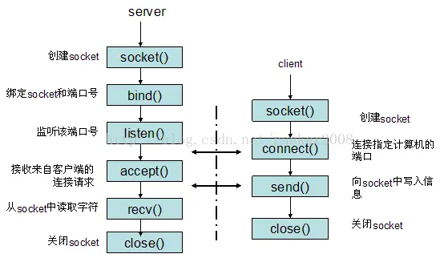

# Socket

## Socket 原理

### 什么是 Socket

　　在计算机通信领域，socket 被翻译为 “套接字”，它是计算机之间进行通信的一种约定或一种方式。通过 socket 这种约定，一台计算机可以接收其他计算机的数据，也可以向其他计算机发送数据。

　　socket 起源于 Unix，而 Unix/Linux 基本哲学之一就是 “一切皆文件”，都可以用 " 打开 open -> 读写 write/read -> 关闭 close " 模式来操作。

　　Socket 就是该模式的一种实现：即 socket 是一种特殊的文件，一些 sockte 函数就是对其进行的操作（读/写 IO、打开、关闭）。

　　Sokcet() 函数返回一个整型的 Socket 描述符，随后的连接建立、数据传输等操作都是通过该 Sokcet 实现的。

　　Socket 是应用层与 TCP/IP 协议族通信的中间软件抽象层，它是一组接口。在设计模式中，Socket 其实就一个门面模式，它把复杂的 TCP/IP 协议族隐藏在 Socket 接口后面，对用户来说，一组简单的接口就是全部，让 Socket 取阻止数据，以符合指定的协议。


### 网络中进程如何通信

　　既然 Sokcet 主要是用来解决网络通信的，那么就来理解网络中进程是如何通信的。

#### 本地进程间通信

1. 消息传递（管道、消息队列、FIFO）
2. 同步（互斥量、条件变量、读写锁、文件和写记录锁’信号量）
3. 共享内存（匿名的和具名的，eg:channel）
4. 远程过程调用（RPC）

#### 网络中进程如何通信

　　要理解网络中进程如何通信，得解决两个问题：

1. 要如何标识一台主机，即怎样确定将要通信的进程是在那一台主机上运行。
2. 要如何标识唯一进程，本地通过 pid 标识，网络中应该怎样标识？

　　解决方法：

1. TCP/IP 协议族已经解决了这个问题，网络层的 “ip 地址”可以唯一标识网络中的主机。
2. 传输层的 “协议+端口”可以唯一标识主机中的应用程序（进程），因此，利用三元组（ip 地址、协议、端口）就可以标识网络的进程了，网络中的进程通信就可以利用这个标志与其他进程进行交互。

### Socket 怎么通信

　　网络层的 “ ip 地址 ” 可以唯一表示网络中的主机，而传输层的 “ 协议+端口 ” 可以唯一标识主机中的应用程序（进程）。这样利用三元组（ip 地址、协议、端口）就可以标识网络的进程了，网络中的进程通信就可以利用这个标志与其他进程进行交互。

　　利用三元组【ip 地址，协议，端口】可以进行网络通信了，而 Socket 就是利用三元组解决网络通信的一个中间件工具，就目前而言，几乎所有的应用程序都是采用 socket，如 UNIX BSD 的套接字（socket）和 UNIX System V 的 TLI（已经被淘汰了）。

　　Socket 通信的数据传输方式，常用的有两种：

1. SOCK_STREAM：表示面向连接的数据传输方式。数据可以准确无误地到达另一台计算机，如果损坏或丢失，可以重新发送，单效率相对较慢。常用的 http 协议就是用 SOCK_STREAM 传输数据，因为要确保数据的正确性，否则网页不能正常解析。
2. SOCK_DGRAM：表示无连接的数据传输方式。计算机只管传输数据，不作数据校验，如果数据在传输中损坏，或者没有达到另一台计算机，是没有办法补救的。也就是说，数据错了就错了，无法重传。因为 SOCK_DGRAM 所做的校验工作少，所以效率比 SOCK_STREAM 高。

　　例如：QQ 视频聊天和语音聊天就是用 SOCK_DGRAM 传输数据，因为首先要保证通信的效率，尽量减少延迟，而数据的正确性是次要的，即使丢失很小的一部分数据，视频和音频也可以正常解析，最多出现噪点或杂音，不会对通信质量有实质的影响。

### Socket 常用函数接口及其原理

　　图解 socket 函数：




　　先从服务器端说起。服务器先初始化 Socket，然后与端口绑定（bind），对端口进行监听（listen），调用 accept 阻塞，等待客户端连接。在这时如果有个客户初始化一个 Socket，然后连接服务器（connect），如果连接成功，这是客户端与服务器端的连接就建立了。客户端发送数据请求，服务器端接收请求并处理请求，然后把回应数据发送给胡端端，客户端读取数据，最后关闭连接，一次交互结束。

#### 使用 socket() 函数创建套接字

```c++
int socket(int af, int type, int protocol);
```

　　socket 函数对应于普通文件的打开操作。普通文件的打开操作返回一个文件描述字，而 socket() 用于创建一个 socket 描述符（socket descriptor），它唯一标识一个 socket。这个 socket 描述符跟文件描述符一样，后续的操作都有用到它，把它作为参数，通过它来进行一些读写操作。

　　正如可以给 fopen 的传入不同参数值，以打开不同的文件。创建 socket 的时候，也可以指定不同的参数创建不同的 socket 描述符，socket 函数的三个参数分别为：

1. af 即协议域，又称为协议族（Family），也就是 IP 地址类型，常用的有 AF_INET 、AF_INET6、AF_LOCAL（或称 AF_UNIX、Unix 或 socket）、AF_ROUTE 等等。协议族决定了 socket 的地址类型，在通信中必须采用对应的地址，如 AF_INET 决定了要用 ipv4 地址（32 位的）与端口号（16 位的）的组合、AF_UNIX 决定了要用一个绝对路径名作为地址。AF 是 “Address Family” 的简写，INET 是 “Inetnet” 的简写。AF_INET 表示 IPv4 地址，例如 127.0.0.1；AF_INET6 表示 IPv6 地址，例如 1030:C9B4:FF12:48AA:1A2B。

   127.0.0.1 是一个特殊 IP 地址，表示本机地址。

2. type ：指定 socket 类型。为数据传输方式，常用的是 SOCK_STREAM 、 SOCK_DGRAM、SOCK_RAW、SOCK_PACKET、SOCK_SEQPACKET 等等。

3. protocol 表示传输协议，常用的有 IPPROTO_TCP 、 IPPROTO_UDP、IPPROTO_SCTP、IPPROTO_TIPC 等，分别表示 TCP 传输协议、UDP 传输协议、STCP 传输协议、TIPC 传输协议。

　　注意，并不是上面的 type 和 protocol 可以随意组合的，如 SOCK_STREAM 不可以跟 IPPROTO_UDP 组合。当 protocol 为 0 时，会自动选择 type 类型对应的默认协议。

　　当调用 socket 创建一个 sock 时，返回的 socket 描述字它存在于协议族（address family，AF_XXX）空间中，但没有一个具体的地址。如果想要给它赋值一个地址，就必须调用 bind() 函数，否则就当调用 connect()、listen() 时系统会自动随机分配一个端口。

#### 使用 bind() 和 connect() 函数

　　socket() 函数用来创建套接字，确定套接字的各种属性，然后服务器端要用 bind() 函数将套接字与特定的 IP 地址和端口绑定起来，只有这样，流经该 IP 地址和端口的数据才能交给套接字处理；而客户端要用 connect() 函数建立连接：

```c++
int bind(int sock, struct sockaddr *addr, socklen_t addrlen);  
```

　　sock 为 socket 文件描述符，addr 为 sockaddr 结构体变量的指针，addrlen 为 addr 变量的大小，可由 sizeof() 计算得出。

　　将创建的套接字与 IP 地址 127.0.0.1、端口 1234 绑定：

```c++
//创建套接字
int serv_sock = socket(AF_INET, SOCK_STREAM, IPPROTO_TCP);
//创建sockaddr_in结构体变量
struct sockaddr_in serv_addr;
memset(&serv_addr, 0, sizeof(serv_addr));  //每个字节都用0填充
serv_addr.sin_family = AF_INET;  //使用IPv4地址
serv_addr.sin_addr.s_addr = inet_addr("127.0.0.1");  //具体的IP地址
serv_addr.sin_port = htons(1234);  //端口
//将套接字和IP、端口绑定
bind(serv_sock, (struct sockaddr*)&serv_addr, sizeof(serv_addr));
```

　　connet() 函数用来建立连接，它的原型为：

```java
int connect(int sock, struct sockaddr *serv_addr, socklen_t addrlen); 
```

#### 使用 listen() 和 accept() 函数

　　于服务器端程序，使用 bind() 绑定套接字后，还需要使用 listen() 函数让套接字进入被动监听状态，再调用 accept() 函数，就可以随时响应客户端的请求了。

　　通过 listen() 函数可以让套接字进入被动监听状态，它的原型为：

```c++
int listen(int sock, int backlog); 
```

　　sock 为需要进入监听状态的套接字，backlog 为请求队列的最大长度。

　　所谓被动监听，是指当没有客户端请求时，套接字处于 “ 睡眠 ” 状态，只有当接收到客户端请求时，套接字才会被 “ 唤醒 ” 来响应请求。

　　请求队列：当套接字正在处理客户端请求时，如果有新的请求进来，套接字时没法处理的，只能把它放进缓冲区，待当前请求处理完毕后，再从缓冲区读取出来处理。如果不断有新的请求进来，它们就按照西安候顺序再缓冲区中排队，直到缓冲区满。这个缓冲区，就称为请求队列（Request Queue）。

　　缓冲区的长度（能存放多少个客户端请求）可以通过 listen() 函数的 backlog 参数指定，但究竟为多少并没有什么标准，可以根据需求来定，并发量小的话可以是 10 或者 20。

　　如果将 backlog 的值设置为 SOMAXCONN，就由系统来决定请求队列长度，这个值一般比较大，可能是几百，或者更多。

　　当请求队列满时，就不再接收新的请求，对于 Linux，客户端会收到 ECONNREFUSED 错误。

　　注意：listen() 只是让套接字处于监听状态，并没有接收请求。接收请求需要使用 accept() 函数。

　　当套接字处于监听状态时，可以通过 accept() 函数来接收客户端请求。它的原型为：

```c++
int accept(int sock, struct sockaddr *addr, socklen_t *addrlen); 
```

　　它的参数与 listen() 和 connect() 是相同的：sock 为服务器端套接字，addr 为 sockaddr_in 结构体变量，addrlen 为参数 addr 的长度，可由 sizeof() 求得。

　　accept() 返回一个新的套接字来和客户端通信，addr 保存了客户端的 IP 地址和端口号，而 sock 是服务器端的套接字。后面和客户端通信时，要使用这个新生成的套接字，而不是原来服务器端的套接字。

　　listen() 只是让套接字进入监听状态，并没有真正接收客户端请求，listen() 后面的代码会继续执行，直到遇到 accept()。accept() 会阻塞程序执行（后面代码不能被执行），直到有新的请求到来。

#### socket 数据的接收和发送

　　Linux 下数据的接收和发送：Linux 不区分套接字文件和普通文件，使用 write() 可以向套接字中写入数据，使用 read() 可以从套接字中读取数据。

　　两台计算机之间的通信相当于两个套接字之间的通信，在服务器端用 write() 向套接字写入数据，客户端就能收到，然后再使用 read() 从套接字中读取出来，就完成了一次通信。

　　write() 的原型为：

```c++
ssize_t write(int fd, const void *buf, size_t nbytes);
```

　　fd 为要写入的文件的描述符，buf 为要写入的数据的缓冲区地址，nbytes 为要写入的数据的字节数。

　　write() 函数会将缓冲区 buf 中的 nbytes 个子节写入文件 fd，成功则返回写入的字节数，失败则返回 -1。

　　read() 的原型为：

```c++
ssize_t read(int fd, void *buf, size_t nbytes);
```

　　fd 为要读取的文件的描述符，buf 为要接收数据的缓冲区地址，nbytes 为要读取的数据的字节数。

　　read() 函数会从 fd 文件中读取 nbytes 个字节并保存到缓存区 buf，成功则返回读取到的字节数（但遇到文件结尾则返回 0），失败则返回 -1。

#### socket 缓冲区以及阻塞模式

　　socket 缓冲区：每个 socket 被创建后，都会分配两个缓冲区，输入缓冲区和输出缓冲区。

　　write()、send() 并不立即向网络中传输数据，而是先将数据写入缓冲区中，再由 TCP 协议将数据从缓冲区发送到目标机器。一旦将数据写入到缓冲区，函数就可以成功返回，不管它们有没有达到目标机器，也不管它们合适被发送到网络，这些都是 TCP 协议负责的事情。

　　TCP 协议独立于 write()、send() 函数，数据有可能刚被写入缓冲区就发送到网络，也可能在缓冲区中不断积压，多次写入的数据被一次性发送到网络，这取决于当前的网络情况、当前线程是否空闲等诸多因素，不由程序员控制。

　　read()、recv() 函数也是如此，也从输入缓冲区中读取数据，而不是直接从网络中读取：


　　这些 I/O 缓冲区特性可整理如下：

1. I/O 缓冲区在每个 TCP 套接字中单独存在；
2. I/O 缓冲区在创建套接字时自动生成；
3. 即使关闭套接字也会继续传送输出缓冲区中遗留的数据；
4. 关闭套接字将丢失输入缓冲区中的数据。

　　输入输出缓冲区的默认大小一般都是 8K，可以通过 getsockopt() 函数获取：

```c++
unsigned optVal;
int optLen = sizeof(int);
getsockopt(servSock, SOL_SOCKET, SO_SNDBUF, (char*)&optVal, &optLen);
printf("Buffer length: %d\n", optVal);
```

　　阻塞模式：对于 TCP 套接字（默认情况下），当使用 write()、sned() 方法数据时：

1. 首先会检查缓冲区，如果缓冲区的可用空间长度小于要发送的数据，那么 write()、send() 会被阻塞（暂停执行），直到缓冲区中的数据被发送到目标机器，腾出足够的空间，才唤醒 write()、send() 函数继续写入数据。
2. 如果 TCP 协议正在向网络发送数据，那么输出缓冲区会被锁定，不允许写入，write()、send() 也会被阻塞，直到数据发送完毕缓冲区解锁，write()、send() 才会被唤醒。
3. 如果要写入的数据大于缓冲区的最大长度，那么将分批写入。
4. 直到所有数据被写入缓冲区 write()、send() 才能返回。

　　当使用 read()、recv() 读物数据时：

1. 首先会先查缓冲区，如果缓冲区中有数据，那么就读取，否则函数会被阻塞，直到网络上有数据到来。
2. 如果要肚脐眼的数据长度小于缓冲区中的数据长度，那么就不能一次性将缓冲区中的所有数据读出，剩余数据将不断积压，直到有 read()、recv() 函数再次读取。
3. 直到读取到数据后 read()、recv() 函数才会返回，否则就一直被阻塞。

　　这就是 TCP 套接字的阻塞模式。所谓阻塞，就是上一步动作没有完成，下一步动作将暂停，直到上一步动作完成后才能继续，以保证同步性。

　　TCP 套接字默认情况下是阻塞模式。


## 参考文章
1. [Socket 技术详解](https://www.jianshu.com/p/066d99da7cbd)
2. [Socket 通信原理](https://www.cnblogs.com/wangcq/p/3520400.html)
3. [socket 编程入门：1 天玩转 socket 通信技术（非常详细）](http://c.biancheng.net/view/2123.html)
4. [Socket 的学习（1）什么是 Socket？](https://blog.csdn.net/weixin_39258979/article/details/80835555)