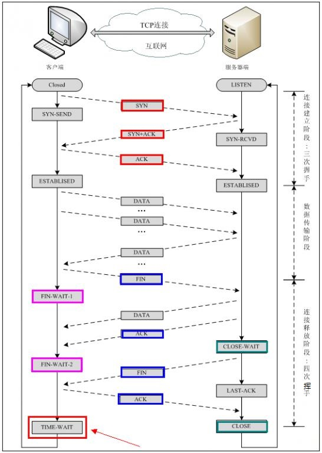

# TCP 与 UDP

## 1. TCP 协议

　　TCP （Transmission Control Protocal，传输控制协议）是面向连接、可靠的、基于字节流的通信协议，数据在传输前通过三次握手建立连接，传输完成后要断开连接，由于 TCP 是面向连接的所以只能用于端到端的通讯。

　　TCP 提供的是一种可靠的数据流服务，采用 “ 带重传的肯定确认 ” 技术来实现传输的可靠性，在收发时候时，都需要与对面建立可靠的连接。TCP 还采用一种称为 “ 滑动窗口 ” 的方式进行流量控制，所谓窗口实际表示接收能力，用以限制发送方的发送速度。

　　客户端在收发数据前要使用 connect() 函数和服务器建立连接。建立连接的目的是保证 IP 地址、端口、物理链路等正确无误，为数据的传输开辟通道。

　　TCP 报文首部格式：

1. 序号：Seq（Sequence Number）序号占 32 位，用来标识从计算机 A 发送到计算机 B 的数据包的序号，计算机发送数据时对此进行标记。
2. 确认号：Ack（Acknowledge Number）确认号占 32 位，客户端和服务器端都可以发送，Ack = Seq + 1。
3. 标志位：每个标志位占用 1 Bit，共有 6 个，分别为 URG、ACK、PSH、RST、SYN、FIN，具体含义如下：
   * URG：紧急指针（urgent pointer）有效。
   * ACK：确认序号有效。
   * PSH：接收方应该尽快将这个报文交给应用层。
   * RST：重置连接。
   * SYN：建立一个新连接。
   * FIN：断开一个连接。

　　TCP 协议的三次握手和四次挥手：

　　注：seq：“ sequance ” 序列号；ack：" acknowledge " 确认号；SYN：“ synchronize ” 请求同步标志；ACK：“ acknowledge ” 确认标志；FIN：" Finally " 结束标志。

### 1.1. 三次握手

　　三次握手（Three-way Handshaking）：建立一个 TCP 连接时，需要客户端和服务端总共发送 3 个包以确认连接的建立，在 Socket 编程中，这一过程由客户端执行 connect 来发起，具体流程图如下：

1. 第一次握手：TCP 协议会组建一个数据包，并将标志位 SYN 置为 1，标识该数据包是用来建立同步连接的。同时生成一个随机数字 J，填充 “ 序号（Seq）” 字段  Seq= J，标识该数据包的序号。完成这些工作，将该数据包发送给服务器端，客户端就进入了 SYN_SEND 状态，等待 Server 确认。

2. 第二次握手：服务器收到数据包，检测到已经设置了 SYN 标志位，就知道这是客户端发来的建立连接的 “ 请求包 ”。服务器端也会组建一个数据包，并将标志位 SYN 和 ACK 置为 1，填充 自诉案 Ack = J+1，随机产生一个值 Seq = K，并将数据包发送给 Client 已确认连接请求，Server 进入 SYN_RECV 状态，并位这次连接分配资源。

   SYN 标识该数据包用来建立连接，ACK 用来确认收到了刚才客户端发送的数据包。

3. 第三次握手：客户端收到数据包，检测到已经设置了 SYN 和 ACK 标志位，就知道这时服务器发来的 “ 确认包 ”。客户端会检测 “ 确认号（Ack）” 字段，看它的值是否为 J+1，如果是就说明连接建立成功，接着，客户端会继续组建数据包，并将标志位 ACK 设置为 1，表示客户端正确接收了服务器发来的 “ 确认包 ”。同时，将刚才服务器发来的数据包序号 K 加 1，用这个数字来填充 “确认号（Ack）” 字段。最后客户端将数据包发出，进入 ESTABLISED 状态，并分配资源，表示连接已经成功建立。

   服务器端收到数据包，检测到已经设置了 ACK 标志位，就知道这时客户端发来的 “ 确认包 ”。服务器会检测 “ 确认号（Ack）” 字段，看它的值是否为 K + 1，如果是就说明连接连接成功，服务器进入 ESTABLISED 状态。

　　至此，客户端和服务器都进入了 ESTABLISED 状态，完成了三次握手，连接建立成功，接下来客户端和服务器之间就可以传输数据了。

#### 1.1.1. 为什么要三次握手

　　在只有两次握手的情形下，假设 Client 想跟 Server 建立连接，但是却因为中途连接请求的数据报丢失了，故 Client 端不得不重新发送一遍；这个时候 Server 端仅收到一个连接请求，因此可以正常的建立连接。但是，有时候 Client 端重新发送请求不是因为数据包丢失了，而是有可能数据传输过程因为网络并发量很大在某节点被阻塞了，这种情形下 Server 端将先后收到 2 次请求，并持续等待两个 Client 请求向它发送数据，问题就在这里，Client 实际上只有一次请求，而 Server 端却有 2 个响应，极端的情况可能由于 Client 端多次重新发送请求数据而导致 Server 端最后建立了 N 多个响应在等待，因此造成极大的资源浪费！所以，“ 三次握手 ” 很有必要。

### 1.2. 四次挥手

　　建立连接非常重要，它是数据正确传输的前提；断开连接同样重要，它让计算机释放不再使用的资源。如果连接不能正常断开，不仅会造成数据传输错误，还会导致套接字不能关闭，持续占用资源，如果并发量高，服务器压力堪忧。

　　四次挥手：终止 TCP 连接，就是指断开一个 TCP 连接时，需要客户算和服务端总共发送 4 个包以确认连接的断开。在 Socket 编程中，这一过程由客户端或服务端任一方执行 close 来触发，具体流程图如下：

　　建立连接后，客户端和服务器都处于 ESTABLISED 状态。这时，假设客户端发起断开连接请求：

1. 第一次挥手：客户端向服务器发送 FIN 数据包，用来关闭客户端到服务器的数据发送，客户端进入 FIN_WAIT_1 状态。

   FIN 是 Finish 的缩写，表示完成任务需要断开连接。

2. 第二次挥手：服务器收到数据包后，检测到设置了 FIN 标志位，知道要断开连接，于是向客户端发送 “ 确认包 ”，确认包设置标志位 ACK 为 1，确认序号为收到序号+1（与 SYN 相同，一个 FIN 占用一个序号），服务器进入 LAST_ACK 状态。

   注意：服务器收到请求后并不是立即断开连接，而是先向客户端发送 “ 确认包 ”，告诉它知道了，需要准备一下才能断开连接。 

   这时服务器还是可以继续向客户端发送数据的。

   客户端收到 “ 确认包 ” 后进入 FIN_WAIT_2 状态，等待服务器准备完毕后发送 FIN 数据包。

3. 第三次挥手：等待片刻后，服务器准备完毕，可以断开连接，于是再主动向客户端发送 FIN 包，用于关闭服务器到客户端的数据传送，然后进入 LAST_ACK 状态。

4. 第四次挥手：客户端收到服务器的 FIN 包后，会再向服务器发送 ACK 包，确认序号为收到序号+1，告诉服务器断开连接吧，客户端然后进入 TIME_WAIT 状态。

   服务器收到客户端的 ACK 包后，就断开连接，关闭套接字，进入 CLOSED 状态，完成四次挥手。

　　另外也可能是同时发起主动关闭的情况：

#### 1.2.1. 为什么要四次挥手

　　试想一下，加入现在客户端想断开跟 Server 的所有连接该怎么做？第一步，先停止向 Server 端发送数据，并等待 Server 的回复。但事情还没完，虽然 Client 不往 Server 发送数据了但是因为之前已经建立好平等的连接了，所以此时 Server 也有主动权向 Client 发送数据，故 Server 端还得终止主动向 Client 发送数据，并等待 Client 的确认。其实就是保证双方的一个合约的完整执行。

#### 1.2.2. 为什么连接是三次握手，而关闭连接却是四次挥手

　　因为服务器在 LISTEN 状态下，收到建立连接请求的 SYN 报文后，把 ACK 和 SYN 放在一个报文里发送给客户端。而关闭连接时，当收到对方的 FIN 报文时，仅仅标识对方不再发送数据了但是还能接收数据，服务器也未必全部数据都发送给对方了，所以服务器可以立即 close，也可以发送一些数据给对方后，再发送 FIN 报文给对方来表示同意现在关闭连接，因此，服务器 ACK 和 FIN 一般都会分开发送。

#### 1.2.3. 关于 TIME_WAIT 状态的说明

　　客户端最后一次发送 ACK 包后进入 TIME_WAIT 状态，而不是直接进入 CLOSED 状态关闭连接，这是为什么呢？

　　TCP 是面向连接的传输方式，必须保证数据能够正确到达目标机器，不能丢失或出错，而网络是不稳定的，随时可能会毁坏数据，所以机器 A 每次向机器 B 发送数据包后，都要求机器 B “ 确认 ”，回传 ACK 包，告诉机器 A 收到了，这样机器 A 才能知道数据传送成功了。如果机器 B 没有回传 ACK 包，机器 A 会重新发送，直到机器 B 回传 ACK 包。

　　客户端最后一次向服务器回传 ACK 包时，有可能会因为网络问题导致服务器收不到，服务器会再次发送 FIN 包，如果这时客户端完全关闭了连接，那么服务器无论如何也收不到 ACK 包了，所以客户端需要等待片刻、确认对方收到 ACK 包后才能进入 CLOSED 状态，TCP 连接就关闭了。那么，要等待多久呢？

　　数据包在网络中是有生存时间的，超过这个时间还未到达目标主机就会被丢弃，并通知源主机。这称为报文最大生存时间（MSL，Maximum Segment Lifetime）。TIME_WAIT 要等待 2MSL 才会进入  CLOSED 状态。ACK 包到达服务器需要 MSL 时间，服务器重传 FIN 包也需要 MSL 时间，2MSL 是数据报往返的最大时间，如果 2MSL 后还未收到服务器重传的 FIN 包，就说明服务器已经收到了 ACK 包。

### 1.5. 使用 TCP 的协议

　　使用 TCP 的协议：FTP （文件传输协议）、Telnet（远程登录协议）、SMTP（简单邮件传输协议）、POP3（和 SMTP 协议，用于接收邮件）、HTTP 协议等。

## 2. UDP 协议

　　UDP（User Datagram Protocol） 用户数据报协议，是面向无连接的通讯协议，传输数据之前源端和终端不建立连接，所以可以实现广播发送。当它想传送时就简单地去抓取来自应用程序的数据，并尽可能快地把它扔到网络上。

　　在发送端，UDP 传送数据地速度仅仅是受应用程序生成数据的速度、计算机的能力和传输带宽的限制，在接收端，UDP 把每个消息段放在队列中，应用程序每次从队列中读一个消息段。

　　相比 TCP，UDP 通讯时不需要接收方确认，也无需建立连接，属于不可靠的传输，结构简单，但是无法保证正确性，可能会出现丢包现象，实际应用中要求程序员编码验证。

　　UDP 和 TCP 位于同一层，但它不管数据包的顺序、错误或重发。因此，UDP 不被应用于那些使用虚电路的面向连接的服务，UDP 主要用于那些面向查询-应答的服务，例如 NFS，相对于 FTP 或 Telent，这些服务需要交换的信息量较小。

　　每个 UDP 报文分 UDP 报头和 UDP 数据区两部分。UDP 报头由 4 个域组成，其中每个域个占用 2 个字节（16 位），具体如下：

1. 源端口号
2. 目的端口号
3. 数据报长度
4. 校验值

### 2.1. 使用 UDP 的协议

　　使用 UDP 协议包括：TETP（简单文件传输协议）、SNMP（简单网络管理协议）、DNS（域名解析协议）、NFS、BOOTP。

## 3. TCP 与 UDP 的区别

1. TCP 是面向连接的，可靠的字节流服务；
2. UDP 是面向无连接的，不可靠的数据报服务。　　

## 4. 参考文章

1. [计算机网络基础知识总结](https://www.runoob.com/w3cnote/summary-of-network.html)
2. [Socket 技术详解](https://www.jianshu.com/p/066d99da7cbd)