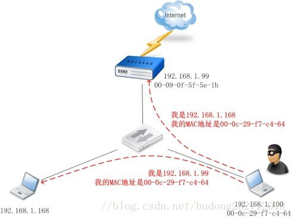

# 常见的网络攻击类型

　　网络攻击的方式主要分为四类：

1. 第一类是服务拒绝攻击，包括死亡之 ping（ping of death）、泪滴（teardrop）、UDP 洪水（UDP flood）、SYN 洪水（SYN flood）、Land 攻击、Smurf 攻击、Fraggle 攻击、电子邮件炸弹、畸形消息攻击等。
2. 第二类是利用型攻击，包括口令猜测、特洛伊木马、缓冲区溢出。
3. 第三类是信息收集型攻击，包括地址扫描、端口扫描、慢速扫描、体系结构探测、DNS 域转换、Finger 服务、LDAP 服务等。
4. 第四类是假消息攻击，主要包括：DNS 高速缓存污染、伪造电子邮件。

## 1. DOS 攻击

### 1.1. 攻击描述

　　DOS 攻击通过协议方式，或抓住系统漏洞，借助代理服务器模拟多个用户不停的对网站进行访问请求，集中对目标进行网络攻击，让目标计算机或网络无法提供正常的服务或资源访问，使目标系统服务系统停止响应甚至崩溃，例如疯狂 Ping 攻击。

### 1.2. 危害说明

　　服务器资源耗尽，停止响应；技术门槛较低，效果明显。

### 1.3. 处理方法

1. 扩展访问列表是防止 DOS 攻击的有效工具，例如 Show IP access-list。
2. 让路由器具备 TCP 拦截功能，在对方发送数据流时可以很好的监控和拦截。
3. 防止 DOS 攻击的根本是利用设备规则来合理的屏蔽持续的、高频度的数据冲击。
4. 对用户操作进行记录，高于一定频率则禁封访问 ip。

## 2. ARP 攻击

### 2.1. 攻击描述

　　通过伪造 IP 地址和 MAC 地址实现 ARP 欺骗，能够在网络中产生大量的 ARP 通信量使网络阻塞，能更改目标主机 ARP 缓存中的 IP-MAC 条目，造成网络中断或中间人攻击。

### 2.2. 危害说明

　　攻击者计算机不堪重负，网段中其他计算机联网时断时续（因为有时能收到真实的网关 ARP 信息）。网段所属的计算机不堪重负，其他计算机完全无法上网。

### 2.3. 处理方法

1. 安装 ARP 防火墙：360 安全卫士（内置）、金山贝壳 ARP 专杀、金山卫士。
2. 安装专门的杀毒软件：利用局域网 ARP 欺骗检测工具来确定 ARP 攻击源，然后利用 ARP 专杀工具进行杀毒。
3. 通过 “网络参数” - “LAN口参数” 来查找路由器的 MAC 地址和 IP 地址，在局域网中的每台电脑中实现静态 ARP 绑定。

## 3. XSS 攻击

### 3.1. 攻击描述

　　攻击者通过在链接中插入恶意代码，用户一旦点开链接，攻击者能够盗取用户信息。攻击者通常会用十六进制链接编码，提供可信度。网站在接收到包含而已代码的请求之后会产生一个看似合法实则包含恶意代码的页面。

### 3.2. 危害说明

　　攻击者通常会在有漏洞的程序中插入 JavaScript、VBScript、ActiveX 或 Flash 以欺骗用户。一旦得手，他们可以盗取用户名，修改用户设置，盗取/污染 cookie，做虚假广告等。

### 3.3. 处理方法

1. 网站开发者：验证所有输入数据，检测攻击；对所有输出数据进行适当的编码。
2. 用户：在浏览器设置中关闭 JavaScript。如果使用 IE 浏览器，将安全级别设置到 “高”。

　　在防护时应在客户端、服务器均做防护，因为客户端很容易绕过，攻击者找到后台接口之后仍然可以进行 XSS 注入。防护时要么对 <、>、script、div 等等字符直接屏蔽，要么对其进行编码转换。

## 4. SQL 注入

### 4.1. 攻击描述

　　通过把 SQL 命令插入到 Web 表单提交或输入域名或页面请求的查询字符串，最终达到欺骗服务器执行恶意的 SQL 命令，“#”、“ ’  ”、"-"、" ' or 1 = 1' " 等 sql 注入最常见。

### 4.2. 危害说明

　　数据库入侵，用户信息泄露，数据表被篡改，数据库被篡改比网页文件被篡改危害大得多。

### 4.3. 处理方式

1. 在客户端、服务器、数据库均进行 SQL 敏感字符过滤。
2. 限制 Web 应用程序所用的数据库访问账号权限。

　　在做防护时同样可以有直接屏蔽和 sql 转码两种方式，要么直接屏蔽掉含有 sql 敏感字符的传入并予以警告，要么对其 sql 敏感字符进行转码，用 &+ 自定义字母等字符进行替换。

## 5. 域名攻击

### 5.1. 攻击描述

　　通过攻击域名解析服务器（DNS），或伪造域名解析服务器（DNS）的方法，把目标网站域名解析到错误的地址，使得域名被盗或 DNS 域名劫持，主要用来阻止用户访问某些特定的网站，或者是将用户引导到广告页面。

### 5.2. 危害说明

　　失去域名控制权，域名会被绑定解析到黑客网站，被反解析权重会分散，引起搜索引擎、安全平台不信任从而降权标黑。

### 5.3. 处理方式

1. 选择大型知名域名注册商，填写真实信息，锁定域名禁止转移。
2. 保证域名注册邮箱安全；
3. 选择大型稳定域名解析商：锁定解析。

　　这种攻击如果是选用亚马逊、阿里云、腾讯云等知名云计算服务平台的云主机一般不会出现域名攻击，因为这些公司都把这些安全措施做好了，但是如果是自己搭建云服务器那就得注意了，特别是学校、企业等。

## 6. 嗅探扫描

### 6.1. 攻击描述

　　网络嗅探也叫网络监听，是将网络上传输的数据未经用户许可进行捕获并进行分析的一种行为。许多网络入侵往往伴随着网络嗅探行为，许多网络攻击也都借助于网络嗅探，如著名的会话劫持。

### 6.2. 危害说明

　　攻击者窃取数据包，而数据包中一般会包含很多重要的隐私信息。这些信息主要包括账号名称、口令密码信息、捕获专用的或者机密的信息、私人信息数据等。

### 6.3. 处理方式

1. 探测网卡是否处于混杂模式；通过防火墙，实时观看目前网络带宽的分布情况。
2. 数据加密技术：对账号、口令和那些敏感数据进行加密传输，网站中使用 https 最好。
3. 使用安全拓扑结构，但开销很大。

## 7. 病毒攻击

### 7.1. 攻击描述

　　黑客向宿主计算机中插入病毒，病毒通过复制对系统进行破坏，计算机病毒有许多感染方式，可以通过文件（宏病毒）、硬盘和网络等。

### 7.2. 危害说明

　　被攻击计算机直接被病毒侵害，系统无法正常运行甚至直接宕机。如果中了蠕虫病毒危害将会更大，同一个域的计算机或与被攻击计算机有数据交易的计算机都将可能被入侵，并且传播迅速不可控。

### 7.3. 处理方式

1. 开启网络防火墙；
2. 关闭不常用端口，只开启平时使用的端口，减少病毒攻击的可能；
3. 定时打补丁，修复计算机漏洞。

## 8. 参考文章
1. [常见的网络攻击方法](https://blog.csdn.net/budong282712018/article/details/80176488)

2. [常见的网络攻击方式与防护](https://blog.csdn.net/qq_36934826/article/details/82685912)