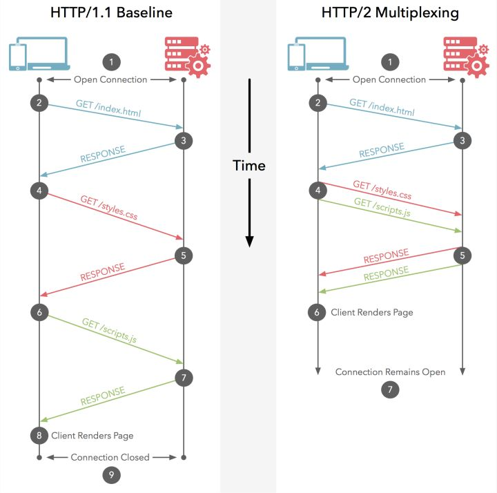
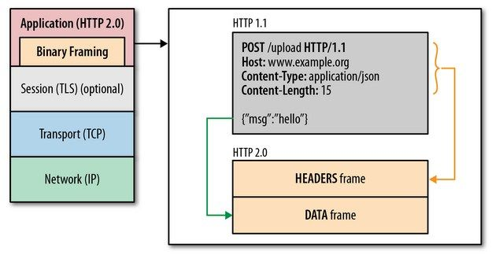
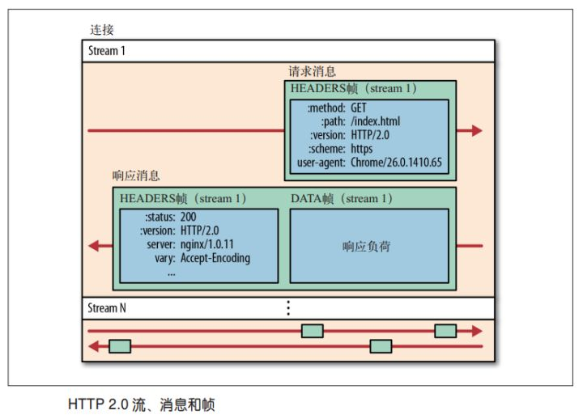
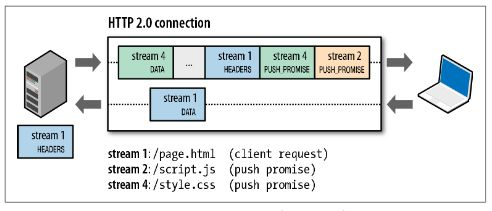

# 网络常见问题 2

# 1. HTTP 2.0

　　HTTP 2.0 的出现，相比于 HTTP 1.x，大幅度的提升了 web 性能。在与 HTTP/1.1 完全于以兼容的基础上，进一步减少了网络延迟。而对于前端开发人员来说，无疑减少了在前端方面的优化工作。

## 1.1. HTTP 2.0 的特点

### 1.1.1. 多路复用（Multiplexing）

　　多路复用允许同时通过单一的 HTTP/2 连接发起多重的请求-响应消息。

　　在 HTTP/1.1 协议中，浏览器客户端在同一时间，针对同一域名下的请求有一定数量限制。超过限制数目的请求会被阻塞。

　　这也是为何一些站点会有多个静态资源 CDN 域名的原因之一，拿 Twitter 为例，目的就是变相的解决浏览器针对同一域名的请求限制阻塞问题。

　　而 HTTP/2 的多路复用（Multiplexing）则允许同时通过单一的 HTTP/2 连接发起多重的请求-响应消息。

　　因此 HTTP/2 可以很容易的去实现多流并行而不用依赖建立多个 TCP 连接，HTTP/2 把 HTTP 协议通信的基本单位缩小为一个一个的帧，这些帧对应着逻辑流中的消息。并行地在同一个 TCP 连接上双向交换信息。

### 11.1.2. 二进制分帧

　　在不改动 HTTP/1.x 的语义、方法、状态码、URI 以及首部字段......的情况下，HTTP/2 是如何做到 [ 突破 HTTP 1.1 的性能限制，改进传输性能，实现低延迟和高吞吐量 ] 的？

　　关键之一就是在应用层（HTTP/2）和传输层（TCP or UDP） 之间增加一个二进制分帧层。

　　在二进制分帧层中，HTTP/2 会将所有传输的信息分割为更小的消息和帧（frame），并对它们采用二进制格式的编码，其中 HTTP 1.x 的首部消息会被封装到 HEADER frame，而相应的 Request Body 则封装到 DATA frame 里面。

　　HTTP/2 通信都在一个连接上完成，这个连接可以承载任意数量的双向数据流。

　　在过去，HTTP 性能优化的关键并不在于高宽带，而是低延迟。TCP 连接会随着时间进行自我 [调谐]，起初会限制连接的最大速度，如果数据成功传输，会随着时间的推移提供传输的速度。这种调谐被称为 TCP 慢启动。由于这种原因，让原本就具有突发性和段时性的 HTTP 连接变得十分低效。

　　HTTP/2 通过让所有数据流共用同一个连接，可以更有效地使用 TCP 连接，让高带宽也能真正地服务于 HTTP 的性能提升。

　　总结：

* 单连接多资源的方式，减少服务端的连接压力，内存占用更少，连接吞吐量更大。
* 由于 TCP 连接的减少而使网络拥塞状态得以改善，同时慢启动时间的减少，使拥塞和丢包恢复速度更快。

### 11.1.3. 首部压缩（Header Compression）

　　HTTP/1.1 并不支持 HTTP 首部压缩，为此 SPDY（网络协议，SPDY 并不是一种用于替代 HTTP 的协议，而是对 HTTP 协议的增强。新协议的功能包括数据流的多路复用、请求优先级，以及 HTTP 包头压缩。） 和 HTTP/2 应运而生，SPDY 使用的是通用的 DEFLATE 算法，而 HTTP/2 则使用了专门为首部压缩而设计的 HPACK 算法。

### 11.1.4. 服务端推送（Server Push）

　　服务端推送是一种在客户端请求之前发送数据的机制。在 HTTP/2 中，服务器可以对客户端的一个请求发送多个响应。Server Push 让 HTTP 1.x 时代使用内嵌资源的优化手段变得没有意义；如果一个请求是由主页发起的。这相当于在一个 HTML 文档内集合了所有的资源，不过与之相比，服务器推送还有一个很大的优势：可以缓存！也让在遵循同源的情况下，不同页面之间可以共享缓存资源成为可能。

HTTP/2 对现在的网页访问，有什么大的优化呢？体现在什么地方？https://www.zhihu.com/question/24774343/answer/96586977

HTTP/2 相比 1.0 有哪些重大改进？ https://www.zhihu.com/question/34074946

http/2.0简介 https://blog.csdn.net/lhZero_F/article/details/89356674

# 2. 介绍一下 https，CA证书客户端是如何校验的

　　HTTPS 超文本安全传输协议，是 SSL/TSL + HTTP 协议构建的具有安全性的传输协议，数据传输过程是加密的，安全性较好。

　　通过 TSL/SSL 协议的身份验证、信息加密和完整性校验的功能，从而避免信息窃听、信息篡改和信息劫持的风险。

　　TLS 与 SSL 在传输层对网络连接进行加密。

## 2.1. 客户端验证证书安全性过程

1. 当客户端收到这个证书之后，使用本地配置的权威机构的公钥对证书进行解密得到服务器的公钥和证书的数字签名，数字签名经过 CA 公钥解密得到证书信息摘要。
2. 然后证书签名的方法计算一下当前证书的信息摘要与收到的信息摘要作对比，如果一样，表示证书一定是服务器下发的，没有被中间人篡改过，因为中间人虽然有权威机构的公钥，能够解析证书内容并篡改，但是篡改完成之后中间人需要将证书重新加密，但是中间人没有权威机构的私钥，无法加密，强行加密只会导致客户端无法解密，如果中间人强行乱修改证书，就会导致证书内容和证书签名不匹配。

## 2.2. SSL 协议主要服务

1. 认证用户和服务器，确保数据发送到正确的客户机和服务器。
2. 加密数据以防止数据中途被窃取。
3. 维护数据的完整性，确保数据在传输过程中不被改变。

# 3. DNS 解析过程，如果服务器 ip 地址改变了，客户端怎么知道呢

通常，DNS 请求的顺序为：浏览器缓存 -> 操作系统缓存 ->host文件-> 本地 DNS 服务器缓存-> 根 DNS 服务器。

服务器 ip 地址改变后，获取缓存的 ip 地址将请求不到，就会到 DNS 服务器获取，并更新当前缓存。

# 4. HTTPS 过程 

1. 客户端发送 HTTPS 请求

   就是用户在浏览器里输入一个 https 网址，然后连接到 server 的 443 端口。

2. 服务端的配置

   采用 HTTPS 协议的服务器必须要有一套数字证书，可以自己制作，也可以向组织申请，区别就是自己颁发的证书需要客户端验证通过，才可以继续访问，而使用受信任的公司申请的证书申请的证书则不会弹出提示页面。

　　这套证书其实就是一对公钥和私钥。

3. 传送证书

   这个证书其实就是公钥，只是包含了很多信息，如证书的颁发机构、过期时间等等。

4. 客户端解析证书

   这部分工作是由客户端的 TLS （传输层安全协议）来完成的，首先会验证公钥是否有效，比如颁发机构、过期时间等等，如果发现异常，则会弹出一个警告框，提示证书存在问题。

   如果证书没有问题，那么就生成一个随机值，然后用证书对该随机值进行非对称加密。

5. 传送加密信息

   这部分传送的是用证书加密后的随机值，目的就是让服务端得到这个随机值，以后客户端和服务端的通信就可以通过这个随机值进行加密解密了。

6. 服务端解密信息

   服务端用私钥解密后，得到了客户端传过来的随机值（私用），然后把内容通过该值进行对称加密，所谓对称加密就是，将信息和私钥通过某种算法混合在一起，这样除非知道私钥，不然无法获取内容，而正好客户端和服务端都知道这个私钥，所以只要加密算法够彪悍，私钥够复杂，数据就够安全。

7. 传输加密后的信息

　　这部分信息是服务端用私钥加密后的信息，可以在客户端被还原。

8. 客户端解密信息

   客户端用之前生成的私钥解密服务端传过来的信息，于是获取了解密后的内容，整个过程第三方即使监听了数据，也束手无策。

## 4.1. 基本的运行过程

　　HTTPS 默认工作在 TCP 协议 443 端口，它的工作流程一般如以下方式：

1. TCP 三次同步握手
2. 客户端验证服务器数字证书
3. DH 算法协商对称加密算法的密钥、hash 算法的密钥
4. SSL 安全加密隧道协商完成
5. 网页以加密的方式传输，用协商的对称加密算法和密钥加密，保证数据机密性；用协商的 hash 算法进行数据完整性保护，保证数据不被篡改。

　　SSL/TLS 协议的基本思路是采用公钥加密法，也就是说，客户端先向服务器索要公钥，然后用公钥加密信息，服务器收到加密文件后，用自己的私钥解密。

1. 如何保证公钥不被篡改？

   解决方法：将公钥放在数字证书中。只要证书是可信的，公钥就是可信的。

2. 公钥加密计算量太大，如何减少耗用的时间？

   解决方法：每一次对话（seesion），客户端和服务器端都生成一个 “对话密钥”（session key），用它来加密信息。由于 “ 对话密钥 ” 是对称加密，所以运算速度非常快，而服务器公钥只用于加密 “ 对话密钥 ” 本身，这样就减少了加密运算的消耗时间。

## 4.2. SSL/TSL 协议的基本过程

　　SSL/TLS 协议的基本过程是这样的：

1. 客户端向服务器端索要并验证公钥。
2. 双方协商生成 “ 对话密钥 ”。
3. 双方采用 “ 对话密钥 ” 进行加密通信。

　　前两步，又称为 “ 握手阶段 ”（handshake）。

## 4.3. SSL、TLS 的握手过程

　　SSL 协议在握手阶段使用的是非对称加密，在传输节点使用的是对称加密，也就是说在 SSL 上传送的数据是使用对称密钥加密的。

　　因为非对称加密的速度缓慢，浪费资源。其实当客户端和主机使用非对称加密方式建立连接后，客户端和主机已经决定好了在传输过程使用的对称加密算法和关键的对称加密密钥，由于这个过程本身是安全可靠的，也即对称加密密钥是不可能被窃取盗用的，因此，保证了在传输过程中对数据进行对称加密也是安全可靠的，因为除了客户端和自己之外，不可能有第三方窃听并解密出对称加密密钥。如果有人窃听通信，它可以知道双方选择的加密方法，以及三个随机数中的两个。整个通话的安全，只取决于第三个随机数（pre-master secret）能不能被破解。

　　第三个随机数 c，又称 “ pre-master key ”。有了它以后，客户端和服务器就同时有了三个随机数，接着双方就用实现商定的加密方法，各自生成本次会话所用的同一把 " session key（会话密钥）"。

　　为什么一定要用三个随机数，来生成 “ 会话密钥 ”，SSL 协议不信任每个主机都能产生完全随机的随机数，如果随机数不随机，那么会话密钥就有可能被猜出来，一个伪随机可能完全不随机，可是三个伪随机就十分接近随机了，每增加一个自由度，随机性增加的可不是一。

　　客户端收到服务器第一次的回应以后，首先验证服务器证书。如果证书不是可信机构颁布、或者证书中的域名与实际域名不一致、或者证书已经过期，就会向访问者显示一个警告，由其选择是否还要继续通信。

　　服务器收到客户端的三个随机数之后，计算生成本次会话所用的 “ 会话密钥 ”。然后，向客户端最后发送下面信息：

1. 编码改变通知，表示随后的信息都将用双方商定的加密方法和密钥发送。
2. 服务器握手结束通知，表示服务器的握手阶段已经结束，这一项同时也是前面发送的所有内容的 hash 值，用于供客户端校验。

　　至此，整个握手阶段全部结束。接下来，客户端与服务器进入加密通信，就完全是使用普通的 HTTP 协议，只不过用 “ 会话密钥 ” 加密内容。

　　HTTPS 在传输数据之前需要客户端（浏览器）与服务端（网站）之前进行一次握手，在握手过程中将确立双方加密传输数据的密码信息。TLS/SSL 中使用了非对称加密、对称加密以及 HASH 算法。

### 4.3.1. 握手过程的具体描述如下

1. 浏览器（客户端）将自己支持的一套加密规则发送给网站（服务器）。
2. 网站（服务器）从中选出一组加密算法与 HASH 算法，并将自己的身份信息以证书的形式发回给浏览器（客户端）。证书里面包含了网站地址、加密公钥以及证书的颁发机构等信息。
3. 浏览器（客户端）获得网站证书之后浏览器（客户端）要做一下工作：
   * a. 验证证书的合法性（验证证书的机构是否合法，证书中包含的网站地址是否与正在访问的地址一致等），如果证书受信任，则浏览器栏里面会显示一个小锁头，否则会给出证书不受信的提示。
   * b. 如果证书受信任，或者是用户接受了不受信的证书，浏览器会生成一串随机数的密码，并用证书中提供的公钥加密。
   * c. 使用约定好的 HASH 算法计算握手消息，并使用生成的随机数对消息进行加密，最后将之前生成的所有信息发送给网站。
4. 网站（服务器）接收浏览器（客户端）发来的数据之后要做以下操作：
   * a. 使用自己的私钥将信息解密取出密码，使用密码解密浏览器发来的握手信息，并验证 HASH 是否与浏览器发来的一致。
   * b. 使用密码加密一段握手消息，发送给浏览器（客户端）。
5. 浏览器（客户端）解密并计算握手消息的 HASH，如果与服务段发来的 HASH 一致，此时握手过程结束，之后所有的通信数据将由之前浏览器（客户端）生成的随机密码并利用对称加密算法进行加密。

　　这里浏览器（客户端）与网站（服务器）互相发送加密的握手消息并验证，目的是为了保证双方都获得了一致的密码，并且可以正常地加密解密数据，为后续真正数据地传输做一次测试。

### 4.3.2. HTTPS 一般使用的加密与 HASH 算法如下

* 非对称加密算法：RSA、DSA/DSS
* 对称加密算法：AES、RC4、3DES
* HASH 算法：MD5、SHA1、SHA256

### 4.3.3. HTTPS 对应的通信时序图

### 4.3.4. SSL 建立连接过程

1. client 向 server 发送请求 https://baidu.com，然后连接到 server 的 443 端口，发送的信息主要是随机值 1 和客户端支持的加密算法。
2. server 接收到消息之后给予 client 响应握手信息，包括随机值 2 和匹配好的协商加密算法，这个加密算法一定是 client 发送给 server 加密算法的子集。
3. 随即 server 给 client 发送第二个响应报文是数字证书。传送证书，这个证书其实就是公钥，只是包含了很多信息，如证书的颁发机构、过期时间、服务端的公钥、第三方证书认证机构（CA）的签名、服务端的域名信息等内容。
4. 客户端解析证书，这部分工作是由客户端的 TLS 来完成的，首先会验证公钥是否有效，比如颁发机构、过期时间等等，如果发现异常，则会弹出一个警告框，提示证书存在问题。如果证书没有问题，那么就生成一个随机值（预主密钥）。
5. 客户端认证证书之后，接下来是通过随机值 1、随机值 2 和预主密钥组装会话密钥，然后通过证书的公钥加密会话密钥。
6. 传送加密信息，这部分传送的是用证书加密后的会话密钥，目的就是让服务端使用密钥解密得到随机值 1、随机值 2 和预主密钥。
7. 服务端解密得到随机值 1、随机值 2 和预主密钥，然后组装会话密钥，跟客户端会话密钥相同。
8. 客户端通过会话密钥加密一条消息发送给服务端，主要验证服务端是否正常接收客户端加密的消息。
9. 同样服务端也会通过会话密钥加密一条消息回传给客户端，如果客户端能够正常接受的话表明 SSL 层连接建立完成了。

客户端使用对称加密生成密钥对传输数据进行加密，然后使用非对称加密的公钥再对密钥进行加密，所以网络上传输的数据是被密钥加密的密文和用公钥加密后的秘密密钥，因此即使被黑客截取，由于没有私钥，无法获取到加密明文的密钥，便无法获取到明文数据。

# 5. http 1.0 、1.1 和 2.0 的区别 

## 5.1. HTTP 1.0

　　HTTP 协议老的标准是 HTTP/1.0，为了提高系统的效率，HTTP 1.0 规定浏览器与服务器只保持短暂的连接，浏览器的每次请求都需要与服务器建立一个 TCP 连接，服务器完成请求处理后立即断开 TCP 连接，服务器不跟踪每个客户也不记录过去的请求。但是，这也造成了一些性能上的缺陷，例如，一个包含有许多图像的网页文件中并没有包含真正的图像数据内容，而只是指明了这些图像的 URL 地址，当 WEB 浏览器访问这个网页文件时，浏览器首先要发出针对该网页文件的请求，当浏览器解析 WEB 服务器返回的该网页文档中的 HTML 内容时，发现其中的图像标签后，浏览器将根据标签中的 src 属性所指定的 URL 地址再次向服务器发出下载图像数据的请求。显然，访问一个包含有许多图像的网页文件的整个过程包含了多次请求和响应，每次请求和响应都需要建立一个单独的连接，每次连接只是传输一个文档和图像，上一次和下一次请求完全分离。即使图像文件都很小，但是客户端和服务器端每次建立和关闭连接却是一个相对比较费时的过程，并且会严重影响客户机和服务器的性能。当一个网页文件中包含 JavaScript 文件，CSS 文件等内容时，也会出现类似上述的情况。

　　同时，带宽和延迟也是影响一个网络请求的重要因素。在网络基础建设已经使得带宽得到极大的提升的当下，大部分时候都是延迟在于响应速度。基于此会发现，http1.0 被抱怨最多的就是**连接无法复用**，和 **head of line blocking** 这两个问题。理解这两个问题有一个十分重要的前提：客户端是依据域名来向服务器建立连接，一般 PC 端浏览器会针对单个域名的 server 同时建立 6～8 个连接，手机端的连接数则一般控制在 4～6 个。显然连接数并不是越多越好，资源开销和整体延迟都会随之增大。连接无法复用会导致每次请求都经历三次握手和慢启动。三次握手在高延迟的场景下影响较明显，慢启动则对文件类大请求影响较大。head of line blocking （队头阻塞）会导致带宽无法被充分利用，以及后续健康请求被阻塞。

　　head of line blocking(holb，队头阻塞)会导致健康的请求会被不健康的请求影响，而且这种体验的损耗受网络环境影响，出现随机且难以监控。为了解决 holb 带来的延迟，协议设计者设计了一种新的 pipelining 机制。pipelining （管线化,在等待上一个请求响应的同时，发送下一个请求。）只能适用于 http1.1，而且由于使用苛刻，很多浏览器厂商并不支持。

## 5.2. HTTP 1.1

　　为了克服 HTTP 1.0 的这个缺陷，HTTP 1.1 支持持久连接（ HTTP/1.1 的默认模式使用带流水线的持久连接 ），在一个 TCP 连接上可以传送多个 HTTP 请求和响应，减少了建立和关闭连接的消耗和延迟。一个包含有许多图像的网页文件的多个请求和应答可以在一个连接中传输，但每个单独的网页文件的请求和应答仍然需要使用各自的连接。HTTP 1.1 还允许客户端不用等待上一次请求结果返回，就可以发出下一次请求，但服务器端必须按照接收到客户端请求的先后顺序依次回送响应结果，以保证客户端能够区分出每次请求的响应内容，这样也显著地减少了整个下载过程所需要的时间。

　　在 http1.1，request 和 reponse 头中都有可能出现一个 connection 的头，此 header 的含义是当 client 和 server 通信时对于长链接如何进行处理。
在 http1.1 中，client 和 server 都是默认对方支持长链接的， 如果 client 使用 http1.1 协议，但又不希望使用长链接，则需要在 header 中指明 connection 的值为 close；如果 server 方也不想支持长链接，则在 response 中也需要明确说明 connection 的值为 close。不论 request 还是 response 的 header 中包含了值为 close 的 connection，都表明当前正在使用的 TCP 链接在当天请求处理完毕后会被断掉。以后 client 再进行新的请求时就必须创建新的 TCP 链接了。

　　HTTP 1.1 在继承了 HTTP 1.0 优点的基础上，也克服了 HTTP 1.0 的性能问题。HTTP 1.1 通过增加更多的请求头和响应头来改进和扩充 HTTP 1.0 的功能。如，HTTP 1.0 不支持 Host 请求头字段，WEB 浏览器无法使用主机头名来明确表示要访问服务器上的哪个 WEB 站点，这样就无法使用 WEB 服务器在同一个 IP 地址和端口号上配置多个虚拟 WEB 站点。在 HTTP 1.1 中增加 Host 请求头字段后，WEB 浏览器可以使用主机头名来明确表示要访问服务器上的哪个 WEB 站点，这才实现了在一台 WEB 服务器上可以在同一个 IP 地址和端口号上使用不同的主机名来创建多个虚拟 WEB 站点。HTTP 1.1 的持续连接，也需要增加新的请求头来帮助实现，例如，Connection 请求头的值为 Keep-Alive 时，客户端通知服务器返回本次请求结果后保持连接；Connection 请求头的值为 close 时，客户端通知服务器返回本次请求结果后关闭连接。HTTP 1.1 还提供了与身份认证、状态管理和 Cache 缓存等机制相关的请求头和响应头。HTTP/1.0 不支持文件断点续传，<code>RANGE:bytes</code> 是 HTTP/1.1 新增内容，HTTP/1.0 每次传送文件都是从文件头开始，即 0 字节处开始。<code>RANGE:bytes=XXXX</code> 表示要求服务器从文件 XXXX 字节处开始传送，这就是我们平时所说的断点续传！

## 5.3. HTTP 1.0 与 HTTP 1.1 的区别

1. **缓存处理**，在 HTTP1.0 中主要使用 header 里的 If-Modified-Since,Expires 来做为缓存判断的标准，HTTP1.1 则引入了更多的缓存控制策略例如 Entity tag，If-Unmodified-Since, If-Match, If-None-Match 等更多可供选择的缓存头来控制缓存策略。

2. **带宽优化及网络连接的使用**，HTTP1.0 中，存在一些浪费带宽的现象，例如客户端只是需要某个对象的一部分，而服务器却将整个对象送过来了，并且不支持断点续传功能，HTTP1.1 则在请求头引入了 range 头域，它允许只请求资源的某个部分，即返回码是 206（Partial Content），这样就方便了开发者自由的选择以便于充分利用带宽和连接。

3. **错误通知的管理**，在 HTTP1.1 中新增了 24 个错误状态响应码，如409（Conflict）表示请求的资源与资源的当前状态发生冲突；410（Gone）表示服务器上的某个资源被永久性的删除。

4. **Host 头处理**，在 HTTP1.0 中认为每台服务器都绑定一个唯一的 IP 地址，因此，请求消息中的 URL 并没有传递主机名（hostname）。但随着虚拟主机技术的发展，在一台物理服务器上可以存在多个虚拟主机（Multi-homed Web Servers），并且它们共享一个 IP 地址。HTTP1.1 的请求消息和响应消息都应支持 Host 头域，且请求消息中如果没有 Host 头域会报告一个错误（400 Bad Request）。

5. **长连接**，HTTP 1.1 支持长连接（PersistentConnection）和请求的流水线（Pipelining）处理，在一个 TCP 连接上可以传送多个 HTTP 请求和响应，减少了建立和关闭连接的消耗和延迟，在 HTTP1.1 中默认开启Connection： keep-alive，一定程度上弥补了 HTTP1.0 每次请求都要创建连接的缺点。

## 5.4. 移动 app 上的困难

　　一段时间内的连接复用对 PC 端浏览器的体验帮助很大，因为大部分的请求在集中在一小段时间以内。但对移动 app 来说，成效不大，app 的请求比较分散且时间跨度相对较大。所以移动端 app 一般会从应用层寻求其它解决方案，长连接方案或者伪长连接方案：

* 方案一：基于 tcp 的长链接

　　现在越来越多的移动端 app 都会建立一条自己的长链接通道，通道的实现是基于 tcp 协议。基于 tcp 的 socket 编程技术难度相对复杂很多，而且需要自己制定协议，但带来的回报也很大。信息的上报和推送变得更及时，在请求量爆发的时间点还能减轻服务器压力（ http 短连接模式会频繁的创建和销毁连接 ）。不止是 IM app 有这样的通道，像淘宝这类电商类 app 都有自己的专属长连接通道了。现在业界也有不少成熟的方案可供选择了，google 的 protobuf 就是其中之一。

* 方案二：http long-polling（推送）

　　客户端在初始状态就会发送一个 polling（轮寻）请求到服务器，服务器并不会马上返回业务数据，而是等待有新的业务数据产生的时候再返回。所以连接会一直被保持，一旦结束马上又会发起一个新的 polling 请求，如此反复，所以一直会有一个连接被保持。服务器有新的内容产生的时候，并不需要等待客户端建立一个新的连接。做法虽然简单，但有些难题需要攻克才能实现稳定可靠的业务框架：

　　和传统的 http 短链接相比，长连接会在用户增长的时候极大的增加服务器压力，

　　移动端网络环境复杂，像 wifi 和 4g 的网络切换，进电梯导致网络临时断掉等，这些场景都需要考虑怎么重建健康的连接通道。这种 polling 的方式稳定性并不好，需要做好数据可靠性的保证，比如重发和 ack 机制（ ACK 是一个对数据包的确认，当正确收到数据包后，接收端会发送一个 ACK 给发送端，里面会说明对那个数据包进行确认，每个数据包里都会有一个序列号，如果收到的数据包有误，或错序，还会申请重发，NAK 是一个否定的回答，ACK 是确定回答，这样保证数据的正确传输）。

　　polling 的 response 有可能会被中间代理 cache 住，要处理好业务数据的过期机制。long-polling 方式还有一些缺点是无法克服的，比如每次新的请求都会带上重复的 header 信息，还有数据通道是单向的，主动权掌握在 server 这边，客户端有新的业务请求的时候无法及时传送。

* 方案三：http streaming

　　同 long-polling 不同的是，server 并不会结束初始的 streaming 请求，而是持续的通过这个通道返回最新的业务数据。显然这个数据通道也是单向的。streaming 是通过在 server response 的头部里增加 ”Transfer Encoding: chunked” 来告诉客户端后续还会有新的数据到来。除了和 long－polling 相同的难点之外，streaming 还有几个缺陷：有些代理服务器会等待服务器的 response 结束之后才会将结果推送到请求客户端。对于 streaming 这种永远不会结束的方式来说，客户端就会一直处于等待 response 的过程中。业务数据无法按照请求来做分割，所以客户端每收到一块数据都需要自己做协议解析，也就是说要做自己的协议定制。streaming 不会产生重复的 header 数据。

* 方案四：web socket

　　WebSocket 和传统的 tcp socket 连接相似，也是基于 tcp 协议，提供双向的数据通道。WebSocket 优势在于提供了 message 的概念，比基于字节流的 tcp socket 使用更简单，同时又提供了传统的 http 所缺少的长连接功能。不过 WebSocket 相对较新，2010 年才起草，并不是所有的浏览器都提供了支持。各大浏览器厂商最新的版本都提供了支持。

## 5.5. HTTP 2.0（也是与 HTTP 1.1 的区别）

　　使用[HTTP2.o测试](https://http2.akamai.com/demo)便可看出 HTTP2.0 比之前的协议在性能上有很大的提升。下面总结了 HTTP2.0 协议的几个特性。

* **多路复用 (Multiplexing)**

　　多路复用允许同时通过单一的 HTTP/2 连接发起多重的请求-响应消息。在 HTTP/1.1 协议中浏览器客户端在同一时间，针对同一域名下的请求有一定数量限制。超过限制数目的请求会被阻塞。这也是为何一些站点会有多个静态资源 CDN 域名的原因之一，拿 Twitter 为例，[http://twimg.com](http://twimg.com/)，目的就是变相的解决浏览器针对同一域名的请求限制阻塞问题。而 HTTP/2 的多路复用(Multiplexing) 则允许同时通过单一的 HTTP/2 连接发起多重的请求-响应消息。因此 HTTP/2 可以很容易的去实现多流并行而不用依赖建立多个 TCP 连接，HTTP/2 把 HTTP 协议通信的基本单位缩小为一个一个的帧，这些帧对应着逻辑流中的消息。并行地在同一个 TCP 连接上双向交换消息。

* **二进制分帧**

　　HTTP/2 在 应用层 ( HTTP/2 ) 和传输层 ( TCP or UDP ) 之间增加一个二进制分帧层。在不改动 HTTP/1.x 的语义、方法、状态码、URI 以及首部字段的情况下，解决了 HTTP1.1 的性能限制，改进传输性能，实现低延迟和高吞吐量。在二进制分帧层中， HTTP/2 会将所有传输的信息分割为更小的消息和帧（frame），并对它们采用二进制格式的编码 ，其中 HTTP1.x 的首部信息会被封装到 HEADER frame，而相应的 Request Body 则封装到 DATA frame 里面。

　　HTTP/2 通信都在一个连接上完成，这个连接可以承载任意数量的双向数据流。在过去， HTTP 性能优化的关键并不在于高带宽，而是低延迟。TCP 连接会随着时间进行自我调谐，起初会限制连接的最大速度，如果数据成功传输，会随着时间的推移提高传输的速度。这种调谐则被称为 TCP 慢启动。由于这种原因，让原本就具有突发性和短时性的 HTTP 连接变的十分低效。HTTP/2 通过让所有数据流共用同一个连接，可以更有效地使用 TCP 连接，让高带宽也能真正的服务于 HTTP 的性能提升。

　　这种单连接多资源的方式，减少服务端的链接压力，内存占用更少，连接吞吐量更大；而且由于 TCP 连接的减少而使网络拥塞状况得以改善，同时慢启动时间的减少，使拥塞和丢包恢复速度更快。

* **首部压缩（Header Compression）**

　　HTTP/1.1 并不支持 HTTP 首部压缩，为此 SPDY 和 HTTP/2 应运而生， SPDY 使用的是通用的 DEFLATE 算法，而 HTTP/2 则使用了专门为首部压缩而设计的 HPACK 算法。

* **服务端推送（Server Push）**

　　服务端推送是一种在客户端请求之前发送数据的机制。在 HTTP/2 中，服务器可以对客户端的一个请求发送多个响应。Server Push 让 HTTP1.x 时代使用内嵌资源的优化手段变得没有意义；如果一个请求是由你的主页发起的，服务器很可能会响应主页内容、logo 以及样式表，因为它知道客户端会用到这些东西。这相当于在一个 HTML 文档内集合了所有的资源，不过与之相比，服务器推送还有一个很大的优势：可以缓存！也让在遵循同源的情况下，不同页面之间可以共享缓存资源成为可能。

# 6. 简述七层网络模型

　　TCP/IP 协议毫无疑问是互联网的基础协议，没有它就根本不可能上网，任何和互联网有关的操作都离不开 TCP/IP 协议。不管是 OSI 七层模型还是 TP/IP 的四层、五层模型，每一层中都要自己的专属协议，完成自己相应的工作以及与上下层级之间进行沟通。由于 OSI 七层模型为网络的标准层次划分，所以以 OSI 七层模型为例从下向上进行一一介绍。

　　TCP/IP 协议参考模型把所有的 TCP/IP 系列协议归类到四个抽象层中：

* 应用层：TETP、HTTP、SNMP、FTP、SMTP、DNS、Telnet 等。
* 传输层：TCP、UDP。
* 网络层：IP、ICMP、OSPF、EIGRP、IGMP。
* 数据链路层：SLIP、CSLIP、PPP、MTU。

　　每一抽象层建立在低一层提供的服务商，并且为高一层提供服务，看起来大概是这样子的。

　　会话层、表示层和应用层重点：

1. 数据传输基本单位为报文；
2. 包含的主要协议：FTP（文件传送协议）、Telnet（远程登录协议）、DNS（域名解析协议）、SMTP（邮件传送协议）、POP3（邮局协议）、HTTP 协议（Hyper Text Transfer Protocal）。

　　OSI 是一个理想的模型，一般的网络系统只涉及其中的几层，在七层模型中，每一层都提供一个特殊的网络功能，从网络功能角度观察：

* 下面 4 层（物理层、数据链路层、网络层和输出层）主要提供数据传输和交换功能，即以节点到节点之间的通信为主
* 第 4 层作为上下两部分的桥梁，是整个网络体系结构中最关键的部分
* 上 3 层（会话层、表示层和应用层）则以提供用户与应用程序之间的信息和数据处理功能为主。

　　简而言之，下 4 层主要完成通信子网的功能，上 3 层主要完成资源子网的功能。