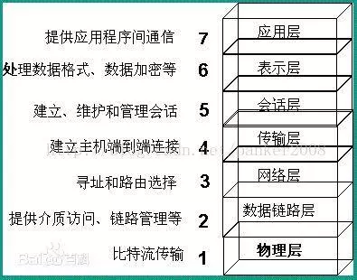
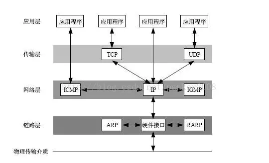
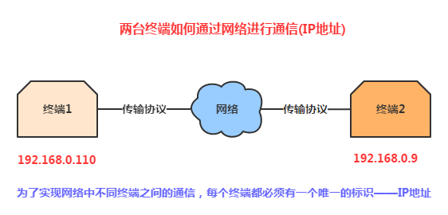

# 计算机网络基础知识

　　计算机网络学习的核心内容就是网络协议的学习。网络协议是为计算机网络中进行数据交换而建立的规则、标准或者说是约定的集合。因为不同用户的数据终端可能采取的字符集是不同的，两者需要进行通信，必须要在一定的标准上进行。

　　计算机网络协议同语言一样，多种多样。而 SRPA 公司于 1977 年到 1979 年推出了一种名为 ARPANET 的网络协议受到了广泛的热捧，其中最主要的原因就是它推出了人尽皆知的 TCP/IP 标准网络协议。目前 TCP/IP 协议已经成为 Internet 中的 “通用语言”。下面为不同计算机群之间利用 TCP/IP 进行通信的示意图。


## 1. 网络层次划分

　　为了使不同计算机厂家生产的计算机能够相互通信，以便在更大的范围内建立计算机网络，国际标准化组织（ISO）在 1978 年提出了 “开放系统互联参考模型”，即著名的 OSI/RM 模型（Open System Interconnection/Reference Model）。它将计算机网络体系结构的通信协议划分为七层，自下而上依次为：物理层（Physics Layer）、数据链路层（Data Link Layer）、网络层（Network Layer）、传输层（Transport Layer）、会话层（Session Layer）、表示层（Presentation Layer）、应用层（Application Layer）。其中第四层完成数据传输服务，上面三层面向用户。

　　除了标准的 OSI 七层模型以外，常见的网络层划分还有 TCP/IP 四层协议以及 TCP/IP 五层协议，它们之间的对应关系如下图所示：

 

### 1.1. OSI 七层网络模型

　　TCP/IP 协议毫无疑问是互联网的基础协议，没有它就根本不可能上网，任何和互联网有关的操作都离不开 TCP/IP 协议。不管是 OSI 七层模型还是 TP/IP 的四层、五层模型，每一层中都要自己的专属协议，完成自己相应的工作以及与上下层级之间进行沟通。由于 OSI 七层模型为网络的标准层次划分，所以以 OSI 七层模型为例从下向上进行一一介绍。




　　TCP/IP 协议参考模型把所有的 TCP/IP 系列协议归类到四个抽象层中：

* 应用层：TETP、HTTP、SNMP、FTP、SMTP、DNS、Telnet 等。
* 传输层：TCP、UDP。
* 网络层：IP、ICMP、OSPF、EIGRP、IGMP。
* 数据链路层：SLIP、CSLIP、PPP、MTU。

　　每一抽象层建立在低一层提供的服务商，并且为高一层提供服务，看起来大概是这样子的。



　　会话层、表示层和应用层重点：

1. 数据传输基本单位为报文；
2. 包含的主要协议：FTP（文件传送协议）、Telnet（远程登录协议）、DNS（域名解析协议）、SMTP（邮件传送协议）、POP3（邮局协议）、HTTP 协议（Hyper Text Transfer Protocal）。

　　OSI 是一个理想的模型，一般的网络系统只涉及其中的几层，在七层模型中，每一层都提供一个特殊的网络功能，从网络功能角度观察：

* 下面 4 层（物理层、数据链路层、网络层和输出层）主要提供数据传输和交换功能，即以节点到节点之间的通信为主
* 第 4 层作为上下两部分的桥梁，是整个网络体系结构中最关键的部分
* 上 3 层（会话层、表示层和应用层）则以提供用户与应用程序之间的信息和数据处理功能为主。

　　简而言之，下 4 层主要完成通信子网的功能，上 3 层主要完成资源子网的功能。

### 1.2. TCP/IP 四层模型


　　TCP/IP 是一组协议的代名词，它还包括许多协议，组成了 TCP/IP 协议簇。TCP/IP 协议簇分为四层，IP 位于协议簇的第二层（对应 OSI 的第三层），TCP 位于协议簇的第三层（对应 OSI 的第四层）。TCP/IP 通讯协议采用了 4 层的层级结构，每一层都呼叫它的下一层所提供的网络来完成自己的需求。

　　这 4 层分别为：

* 应用层：应用程序间沟通的层，如简单电子邮件传输（SMTP）、文件传输协议（FTP）、网络远程访问协议（Telnet）等。
* 传输层：在此层中，它提供了节点间的数据传输服务，如传输控制协议（TCP）、用户数据报协议（UDP）等，TCP 和 UDP 给数据包加入传输数据并把它传输到下一层中，这一层负责传送数据，并且确定数据已被送达并接收。
* 网络互连层：负责提供基本的数据封包传送功能，让每一块数据包都能够到达目的主机（但不检查是否被正确接收），如网际协议（IP）。
* 主机到网络层：对实际的网络媒体的管理，定义如何使用实际网络（如 Ethernet、Serial Line 等）来传送数据。

## 2. 物理层（Physical Layer）

　　设备之间的数据通信提供传输媒体及互连设备，为数据传输提供可靠的环境。激活、维持、关闭通信端点之间的机械特性、电气特性、功能特性以及过程特性。物理层确保原始的数据可在各种物理媒体上传输。

　　可以理解为网络传输的物理媒体部分，比如网卡、网线、集线器、中继器、调制解调器等！

　　在这一层，数据还没有被组织，仅作为原始的位流或电气电压处理，这一层的单位是：bit 比特。

## 3. 数据链路层（Data Link Layer）

　　数据链路层在物理层提供的服务的基础上向网络层提供服务，**其最基本的服务是将源自网络层来的数据可靠地传输到相邻节点的目标机网络层**。所以数据链路层在不可靠的物理介质上提供可靠的传输。

　　该层的作用包括：物理地址寻址、数据的成帧（帧是数据链路层的传送单位）、流量控制、数据的检错、重发等。

　　可以理解为数据通道，主要功能是如何在不可靠的物理线路上进行数据的可靠传递。

　　数据链路指的是：物理层要为终端设备间的数据通信提供传输媒体及其连接。媒体是长期的，连接是有生存期的。在连接生存期内，收发两端可以进行不等的一次或多次数据通信。每次通信都要经过建立通信联络和拆除通信联络两过程！这种建立起来的数据收发关系。

　　该层的设备有：网卡、网桥、网路交换机，另外这层的单位为：帧。

### 3.1. 有关数据链路层的重要知识点

1. 数据链路层为网络层提供可靠的数据传输；
2. 基本数据单位为帧；
3. 主要的协议：以太网协议；
4. 两个重要设备名称：网桥和交换机；

## 4. 网络层（Network Layer）

　　网络层的目的是将网络地址翻译成对应的物理地址，并决定如何将数据从发送方路由到接收方，具体功能包括寻址和路由选择以及连接的建立、保持和终止等。它提供的服务使传输层不需要了解网络中的数据传输和交换技术。简单来说网络层，那就是 ： 路径选择、路由及逻辑寻址 ，建立网络连接和为上层提供服务。

　　另外 IP 协议就在这一层。网络层中设计众多的协议，其中包括最重要的协议，也是 TCP/IP 的核心协议 -- IP 协议。IP 协议非常简单，仅仅提供不可靠、无连接的传送服务。

　　IP 协议的主要功能有：无连接数据报传输、数据报路由选择和差错控制。

　　与 IP 协议配套使用实现其功能的还有地址解析协议 ARP、逆地址解析协议 RARP、因特网报文协议 ICMP、因特网组管理协议 IGMP。

### 4.1. 有关网络层的重点

1. 网络层负责对子网间的数据包进行路由选择。此外，网络层还可以实现拥塞控制、网际互连等功能；
2. 基本数据单位为 IP 数据包；
3. 包含的主要协议：
   * IP 协议（Internet Protocal，因特网互联协议）；
   * ICMP 协议（Internet Control Message Protocal，因特网控制报文协议）；
   * ARP 协议（Address Resolution Protocol，地址解析协议）；
   * RARP 协议（Reverse Address Resolution Protocal，逆地址解析协议）。
4. 重要的设备：路由器。

### 4.2. ARP 协议

　　地址解析协议，即 ARP（Address Resolution Protocol），是根据 IP 地址获取物理地址的一个 TCP/IP 协议。

　　主机发送消息时将包含目标 IP 地址的 ARP 请求广播到网络上的所有主机，并接收返回消息，以此确定目标的物理地址；收到返回消息后将该 IP 地址和物理地址存入本地 ARP 缓存中并保留一定时间，下次请求时直接查询 ARP 缓存以节约资源。

　　地址解析协议是建立在网络上各个主机互相信任的基础上的，网络上的主机可以自主发送 ARP 应答消息，其他主机收到应答报文时不会检测该报文的真实性就会将其计入本机 ARP 缓存；由此攻击者就可以向某一主机发送伪 ARP 应答报文，使其发送的消息无法达到预期的主机或达到错误的主机，这就构成了一个 ARP 欺骗。

　　ARP 命令可用于查询本机 ARP 缓存中 IP 地址和 MAC 地址的对应关系、添加或删除静态对应关系等。

#### 4.2.1. ARP 工作流程举例

　　主机 A 的 IP 地址为 192.168.1.1，MAC 地址为 0A-11-22-33-44-01；

　　主机 B 的 IP 地址为 192.168.1.2，MAC 地址为 0A-11-22-33-44-02;

　　当主机 A 要与主机 B 通信时，地址解析协议可以将主机 B 的 IP 地址（192.168.1.2）解析成主机 B 的 MAC 地址，以下为工作流程：

1. 根据主机 A 上的路由表内容，IP 确定用于访问主机 B 的转发 IP 地址是 192.168.1.2。然后 A 主机在自己的本地 ARP 缓存中检查主机 B 的匹配 MAC 地址。
2. 如果主机 A 在 ARP 缓存中没有找到映射，它将询问 192.168.1.2 的硬件地址，从而将 ARP 请求帧广播到本地网络上的所有主机。源主机 A 的 IP 地址和 MAC 地址都包括在 ARP 请求中。本地网络上的每台主机都接收到 ARP 请求并且检查是否与自己的 IP 地址匹配。如果主机发现请求的 IP 地址与自己的 IP 地址不匹配，它将丢弃 ARP 请求。
3. 主机 B 确定 ARP 请求中的 IP 地址与自己的 IP 地址匹配，则将主机 A 的 IP 地址和 MAC 地址映射添加到 ARP 缓存中。
4. 主机 B 将包含其 MAC 地址的 ARP 回复消息直接发送回主机 A。
5. 当主机 A 收到从主机 B 发送的 ARP 回复消息时，会用主机 B 的 IP 和 MAC 地址映射更新 ARP 缓存。本机缓存是有生存期，生存期结束后，将再次重复上面的过程。主机 B 的 MAC 地址即一旦确定，主机 A 就能向主机 B 发送 IP 通信了。

### 4.3. RARP 协议

　　逆地址解析协议，即 RARP，功能和 ARP 协议相对，其将局域网中某个主机的物理地址转换为 IP 地址。

　　比如局域网中有一台主机只知道物理地址而不知道 IP 地址，那么可以通过 RARP 协议发出征求自身 IP 地址的广播请求，然后由 RARP 服务器负责回答。

#### 4.3.1. RARP 协议工作流程

1. 给主机发送一个本地的 RARP 广播，在此广播包中，声明自己的 MAC 地址并且请求任何收到此请求的 RARP 服务器分配一个 IP 地址；
2. 本地网段上的 RARP 服务器收到此请求后，检查其 RARP 列表，查找该 MAC 地址对应的 IP 地址；
3. 如果存在，RARP 服务器就给源主机发送一个响应数据包并将此 IP 地址提供给对方主机使用；
4. 如果不存在，RARP 服务器对此不做任何的响应。

## 5. 传输层（Transport Layer）

　　第一个端到端，即主机到主机的层次。传输层负责将上层数据分段并提供端到端、可靠的或不可靠的传输。

　　此外，传输层还要处理端到端的差错控制和流量控制问题。传输层的任务是根据通信子网的特性，最佳的利用网络资源，为两个端系统的会话层之间，提供建立、维护和取消传输连接的功能，负责端到端的可靠数据传输。

　　在这一层，信息传送的协议单元称段或报文。网络层只是根据网络地址将源结点发出的数据包传送给到目的结点，而传输层则负责将数据可靠的传送到相应的端口。

　　向上面的应用层提供通信服务，面向通信部分的最高层，同时也是用户功能中的最底层。

　　接收会话层数据，在必要时将数据进行分割，并将这些数据交给网络层，并且保证这些数据段有效的到达对端。

### 5.1. 有关网络层的重点

1. 传输层负责将上层数据分段并提供端到端、可靠的或不可靠的传输以及端到端的差错控制和流量控制问题。
2. 包含的主要协议：TCP 协议（Transmission Control Protocol，传输控制协议）、UDP 协议（User Datagram Protocal，用户数据报协议）；
3. 重要设备：网关。
4. 传递的协议单元：段或报文。

### 5.2. TCP 协议

　　TCP（Transmission Control Protocol，传输控制协议）是一种面向连接的、可靠的、基于字节流的通信协议，通过三次握手建立连接，通讯完成时要断开连接，由于 TCP 是面向连接的所以只能用于端到端的通讯。建立连接的目的是保证 IP 地址、端口、物理链路等正确无误，为数据的传输开辟通道。

　　TCP 提供的是一种可靠的数据流服务，采用 “ 带重传的肯定确认” 技术来实现传输的可靠性。TCP 还采用一种称为 “ 滑动窗口 ” 的方式进行流量控制，所谓窗口实际表示接收能力，用以限制发送方的发送速度。

　　TCP 报文首部格式：


　　TCP 协议的通信过程：


　　注：seq：“sequance” 序列号；ack："acknowledge" 确认号；SYN：“synchronize” 请求同步标志；ACK：“acknowledge” 确认标志；FIN："Finally" 结束标志。

　　使用 TCP 的协议：FTP （文件传输协议）、Telnet（远程登录协议）、SMTP（简单邮件传输协议）、POP3（和 SMTP 协议，用于接收邮件）、HTTP 协议等。

### 5.3. UDP 协议

　　UDP 用户数据报协议，是面向无连接的通讯协议，UDP 数据包括目的端口号和源端口号信息，由于通讯不需要连接，所以可以实现广播发送。

　　UDP 通讯时不需要接收方确认，属于不可靠的传输，可能会出现丢包现象，实际应用中要求程序员编码验证。

　　UDP （User Datagram Protocol）用户数据包协议，非连接的协议，传输数据之前源端和终端不建立连接，当它想传送时就简单地去抓取来自应用程序的数据，并尽可能快地把它扔到网络上。在发送端，UDP 传送数据地速度仅仅是受应用程序生成数据的速度、计算机的能力和传输带宽的限制；在接收端，UDP 把每个消息段放在队列中，应用程序每次从队列中读一个消息段。相比 TCP 就是无需建立连接，结构简单，但是无法保证正确性，容易丢包。

　　UDP 和 TCP 位于同一层，但它不管数据包的顺序、错误或重发。因此，UDP 不被应用于那些使用虚电路的面向连接的服务，UDP 主要用于那些面向查询-应答的服务，例如 NFS。相对于 FTP 或 Telent。这些服务需要交换的信息量较小。

　　每个 UDP 报文分 UDP 报头和 UDP 数据区两部分。报头由四个 16 位长（2 字节）字段组成，分别说明该报文的源端口、目的端口、报文长度以及校验值。UDP 报头由 4 个域组成，其中每个域个占用 2 给子节，具体如下：

1. 源端口号
2. 目的端口号
3. 数据报长度
4. 校验值

　　使用 UDP 协议包括：TETP（简单文件传输协议）、SNMP（简单网络管理协议）、DNS（域名解析协议）、NFS、BOOTP。

　　TCP 与 UDP 的区别：TCP 是面向连接的，可靠的字节流服务；UDP 是面向无连接的，不可靠的数据包服务。　

## 6. 会话层

　　会话层管理主机之间的会话进程，即负责在网络中的两节点之间建立、管理、终止进程之间的会话。建立通信链接，保持会话过程通信链接的畅通，同步两个节点之间的对话，决定通信是否被中断以及通信中断时决定从何处重新发送，即不同机器上的用户之间会话的建立及管理。会话层还利用在数据中插入校验点来实现数据的同步。

## 7. 表示层

　　表示层对来自应用层的数据或信息进行解释，对各种语法赋予相应的含义，并按照一定的格式传送给会话层，以保证一个主机应用层信息可以被另一个主机的应用程序理解。表示层的数据转换包括数据的加密、压缩、格式转换等。

　　其主要功能是 “ 处理用户信息的表示问题，如编码、数据格式转换和加密解密、压缩解压缩 ” 等。

## 8. 应用层

　　OSI 参考模型的最高层，为操作系统或网络应用程序提供访问网络服务的接口。它在其他 6 层工作的基础上，负责完成网络中应用程序与网络操作系统之间的联系，建立与结束使用者之间的联系，并完成网络用户提出的各种网络服务及应用所需的监督、管理和服务等各种协议。此外，该层还负责协调各个应用程序间的工作。

　　应用层为用户提供的服务和协议有：文件服务、目录服务、文件传输服务（FTP）、远程登录服务（Telnet）、电子邮件服务（E-mail）、打印服务、安全服务、网络管理服务、数据库服务等等。

### 8.1. DNS 协议

　　DNS 是域名系统（DomainNameSystem）的缩写，该系统用于命名组织到域层次结构中的计算机和网络服务，可以简单地理解为将 URL 转换为 IP 地址。

　　域名是由圆点分开一串单词或缩写组成地，每一个域名都对应一个唯一的 IP 地址，在 Internet 上域名与 IP 地址之间是一一对应的，DNS 就是进行域名解析的服务器。

　　DNS 命名用于 Internet 等 TCP/IP 网络中，通过用户友好的名称查找计算机和服务。

### 8.2. HTTP 协议

　　超文本传输协议（HTTP，HyperText Transfer Protocol）是互联网上应用最为广泛的一种网络协议。所有的 WWW 文件都必须遵守这个标准。

#### 8.2.1. HTTP 协议包括的请求

1. GET：请求读取由 URL 所标志的信息。
2. POST：给服务器添加信息（如注释）。
3. PUT：在给定的 URL 下存储一个文档。
4. DELETE：删除给定的 URL 所标志的资源。

#### 8.2.2. POST 与 GET 的区别

1. GET 是从服务器上获取数据，POST 是向服务器传输数据。
2. GET 是把参数数据队列加到提交表单的 Action 属性所指向的 URL 中，值和表单内各个字段一一对应，在 URL 中可以看到。
3. GET 传送的数据量小，不能大于 2 KB；POST 传送的数据量较大，一般被默认为不受限制。
4. 根据 HTTP 规范，GET 用于信息获取，而且应该是安全的和幂等的。

　　所谓安全的意味着该操作用于获取信息而非修改信息。换句话说，GET 请求一般不应产生副作用。就是说，它仅仅是获取资源信息，就像数据库查询一样，不会修改、增加数据，不会影响资源的状态。

　　幂等的意味着对同一 URL 的多个请求应该返回同样的结果。

### 8.3. DHCP 协议

　　DHCP 动态主机设置协议（Dynamic Host Configuration Protocol）是一个局域网的网络协议，使用 UDP 协议工作，主要有两个用途：给内部网络或网络服务供应商自动分配 IP 地址，给用户或者内部网络管理员作为对所有计算机作中央管理的手段。

## 9. IP 地址



　　为了实现网络中不同终端之间的通信，每个终端都必须有一个唯一的标识 -- IP 地址。

### 9.1. 端口

1. 用于区分不同的应用程序
2. 端口号的范围为 0-65535，其中 0-1023 为系统的保留端口，程序尽可能别使用这些端口。
3. IP 地址和端口号组成了 Socket，Socket 是网络运行程序间双向通信链路的终结点，是 TCP 和 UDP 的基础。
4. 常用协议使用的端口：HTTP:80，FTP:21，TELNET：23。


### 9.2. 网络地址

　　IP 地址由网络号（包括子网号）和主机号组成，网络地址的主机号为全 0，网络地址代表着整个网络。

### 9.3. 广播地址

　　广播地址通常称为直接广播地址，是为了区分受限广播地址。

　　广播地址与网络地址的主机号正好相反，广播地址中，主机号为全 1。当向某个网络的广播地址发送消息时，该网络内的所有主机都能收到该广播消息。

### 9.4. 组播地址

　　D 类地址就是组播地址。

　　A、B、C、D 类地址：

1. A 类地址以 0 开头，第一个字节作为网络号，地址范围为： 0.0.0.0 ~ 127.255.255.255；
2. B 类地址以 10 开头，前两个字节作为网络号，地址范围是：128.0.0.0 ~ 191.255.255.255；
3. C 类地址以 110 开头，前三个字节作为网络号，地址范围是：192.0.0.0 ~ 223.255.255.255；
4. D 类地址以 1110 开头，地址范围是 224.0.0.0 ~ 239.255.255.255，D 类地址作为组播地址（一对多的通信）；
5. E 类地址以 1111 开头，地址范围是 240.0.0.0 ~ 255.255.255.255，E 类地址为保留地址，供以后使用。

　　注：只有 A、B、C 有网络号和主机号之分，D 类地址和 E 类地址没有划分网络号和主机号。

### 9.5. 255.255.255.255

　　该 IP 地址指的是受限的广播地址。受限广播地址与一般广播地址（直接广播地址）的区别在于，受限广播地址只能用于本地网络，路由器不会转发以受限广播地址为目的地址的分组；一般广播地址即可在本地广播，也可跨网段广播。例如：主机 192.168.1.1/30 发送一般广播数据包后，另外一个网段 192.168.1.5/30 也能收到该数据包；若发送受限广播数据包，则不能收到。

　　注：一般的广播地址（直接广播地址）能够通过某些路由器（当然不是所有的路由器），而受限的广播地址不能通过路由器。

### 9.6. 0.0.0.0

　　常用于寻找自己的 IP 地址，例如在 RARP、BOOTP 和 DHCP 协议中，若某个未知 IP 地址的无盘机想要自己的 IP 地址，它就以 255.255.255.255 为目的地址，向本地范围（具体而言是被各个路由器屏蔽的范围内）的服务器发送 IP 请求分组。

### 9.7. 回环地址

　　127.0.0.0/8 被作为回环地址，回环地址表示本机的地址，常用于对本机的测试，用的最多的是 127.0.0.1。

### 9.8. A、B、C 类私有地址

　　私有地址（private address）也叫专用地址，它们不会在全球使用，只具有本地意义。

　　A 类私有地址：10.0.0.0/8。范围是：10.0.0.0 ~ 10.255.255.255。

　　B 类私有地址：172.16.0.0/12，范围是：172.16.0.0 ~ 172.31.255.255。

　　C 类私有地址：192.168.0.0/16，范围是：192.168.0.0 ~ 192.168.255.255。

## 10. 子网掩码及网络划分

　　随着互联网应用的不断扩大，原先的 IPv4 的弊端就逐渐暴露出来，即网络号占位太多，而主机号位太少，所以其能提供的主机地址也越来越稀缺，目前除了使用 NAT 在企业内部利用保留地址自行分配以外，通常都对一个高类别的 IP 地址进行再划分，以形成多个子网，提供给不同规模的用户群使用。

　　这里主要是为了在网络分段情况下有效地利用 IP 地址，通过对主机号的高位部分取作为子网号，从通常的网络位界限中扩展或压缩子网掩码，用来创建某类地址的更多子网。但创建更多的子网时，在每个子网上的可用主机地址数目会比原先减少。

### 10.1. 什么是子网掩码？

　　子网掩码是标志两个 IP 地址是否同属于一个子网的，也是 32 位二进制地址，其每一个为 1 代表该位的网络位，为 0 表示主机位。它和 IP 地址一样也是使用点式十进制来表示的。如果两个 IP 地址在子网掩码的按位与的计算下所得结果相同，即表明它们共属于同一子网中。

　　在计算子网掩码时，要注意 IP 地址中的保留地址，即 “0” 地址和广播地址，它们是指主机地址或网络地址全为 “0” 或 “1” 时的 IP 地址，它们代表着本地网络地址和广播地址，一般是不能被计算在内的。

### 10.2. 子网掩码的计算

　　对于无须再划分成子网的 IP 地址来说，其子网掩码非常简单，即按照其定义即可写出：如果 B 类 IP 地址为 10.12.3.0，无需再分割子网，则该 IP 地址的子网掩码 255.255.0.0。如果它是一个 C 类地址，则其子网掩码为 255.255.255.0。其他类推。

### 10.3. 有关子网掩码和网络划分常见的面试考题

　　一个 IP 地址还需要将其高位主机位再作为划分出的子网网络号，剩下的是每个子网的主机号，这时该如何进行每个子网的掩码计算。

#### 10.3.1. 利用子网数来计算

　　在求子网掩码之前必须先搞清楚要划分的子网数目，以及每个子网内的所需主机数目。

1. 将子网数目转化为二进制来表示；

   如欲将 B 类 IP 地址 168.195.0.0 划分成 27 个子网：27 = 11011； 

2. 取得该二进制的位数，为 N；

   该二进制为五位数，N=5；

3. 取得该 IP 地址的类子网掩码，将其主机地址部分的前 N 位置 1 即得出该 IP 地址划分子网的子网掩码。

   将 B 类地址的子网掩码 255.255.0.0 的主机地址前 5 位置 1，得到 255.255.248.0。

#### 10.3.2. 利用主机数来计算

　　如欲将 B 类 IP 地址 168.195.0.0 划分成若干子网，每个子网内有主机 700 台。

1. 将主机数目转换为二进制来表示；

   700 = 1010111100

2. 如果主机数小于或等于 254（注意去掉保留的两个 IP 地址），则取得该主机的二进制位数，为 N，这里肯定 N<8。如果大于 254，则 N>9，这就是说主机地址将占据不止 8 位；

   该二进制为十位数，N=10;

3. 使用 255.255.255.255 来将该 IP 地址的主机地址位数全部置为 1，然后从后向前将 N 为全部置为 0，即为子网掩码值。

   将该 B 类地址的子网掩码 255.255.0.0. 的主机地址全部置为 1，得到 255.255.255.255，然后再从后向前将后 10 位置为 0，即为：11111111.11111111.11111100.00000000，即 255.255.252.0。这就是该欲划分成主机为 700 台的 B 类 IP 地址 168.195.0.0 的子网掩码。

#### 10.3.3. 根据每个网络的主机数量进行子网地址的规划和计算子网掩码

　　比如一个子网有 10 台主机，那么对于这个子网需要的 IP 地址是：10+1+1+1 = 13。

　　注意：加的第一个 1 是指这个网络连接时所需的网关地址，接着的两个 1 分别是指网络地址和广播地址。

　　因为 13 小于 16（16 等于 2 的 4 次方），所以主机位为 4 位。而 256 -16 = 240，所以该子网掩码为 255.255.255.240。

　　如果一个子网有 14 台主机，不少人常犯的错误是：依然分配具有 16 个地址空间的子网，而忘记了给网关分配地址。这样就错误了，因为 14+1+1+1 = 17，17 大于 16，所以只能分配具有 32 个地址（32 等于 2 的 5 次方）空间的子网。这时子网掩码为 255.255.255.224。

## 11. 路由选择协议

　　常见的路由选择协议有：RIP 协议、OSPF 协议。

　　RIP 协议：底层是贝尔曼福特算法，它选择路由的度量标准（metric）是跳数，最大跳数是 15 跳，如果大于 15 跳，它就会丢弃数据包。

　　OSPF 协议：Open Shortest Path First，开放式最短路径优化，底层是迪杰特拉算法，是链路状态路由选择协议，它选择路由的度量标准是带宽、延迟。

## 12. TCP/IP 协议

　　TCP/IP 协议是 Internet 最基本的协议、Internet 国际互联网络的基础，是一个协议簇，里面包含很多协议的。之所以命名为 TCP/IP 协议，因为 TCP 、IP 协议是两个很重要的协议，就用它两命名了。它是为广域网（WANs）设计的。

　　而 TCP 负责发现传输的问题，一有问题就发出信号，要求重新传输，直到所有数据安全正确地传输到目的地。 IP 是给因特网的每一台联网设备规定一个地址。

　　UDP （User Data Protocol，用户数据报协议）是与 TCP 相对应的协议。它也是属于 TCP/IP 协议族的一种。

　　下图表明了这些协议的关系：


　　TCP/IP 协议族包括运输层、网络层、链路层。

　　IP 层接收由更底层（网络接口层，例如以太网设备驱动程序）发来的数据包，并把该数据包发送到更高层 -TCP 或 UDP 层；相反，IP 层也把从 TCP 或 UDP 层接收来的数据包传送到更底层。IP 数据包是不可靠的，因为 IP 并没有做任何事情来确认数据包是否按顺序发送的或者有没有被破坏，IP 数据包中含有发送它的主机的地址（源地址）和接收他的主机的地址（目的地址）。

　　TCP/IP 提供点对点的连接机制，将数据应该如何封装、定址、传输、路由以及在目的地如何接收，都加以标准化。它将软件通信过程抽象化为四个抽象层，采取协议堆栈的方式，分别实现出不同通信协议。协议族下的各种协议，依其功能不同，被分别归属到这四个层次结构之中，常被视为是简化的七层 OSI 模型。它们之间好比送信的线路和驿站的作用，比如要建议送信驿站，必须要了解送信的各个细节。　

## 13. NAT 协议

　　NAT 网络地址转换（Network Address Translation）属接入广域网（WAN）技术，是一种将私有（保留）地址转化为合法 IP 地址的转换技术，它被广泛应用于各种类型 Internet 接入方式和各种类型的网络中。原因很简单，NAT 不仅完美地解决了 IP 地址不足的问题，而且还能够有效地避免来自网络外部的攻击，隐藏并保护网络内部的计算机。

## 14. 网络时延

　　RTT(Round-Trip Time)：往返时延，在计算机网络中它是一个重要的性能指标，它表示从发送端发送数据开始，到发送端收到来自接收端的确认（接收端收到数据后便立即发送确认），总共经历的时延。

　　通常，时延由发送时延、传播时延、排队时延、处理时延四个部分组成。

### 14.1. 发送时延

　　发送时延是节点将数据分组发送到传播媒介所需要的时间，也就是从分组的第一个比特开始发送算起，到最后一个比特发送完毕所需要的时间。显然，发送时延与网络接口 / 信道的传输速率成反比，与数据分组的长度成正比。

### 14.2. 传播时延

　　传播时延是电磁波在信道中传播一定距离所需要花费的时间，传播时延和信道的传输速率无关，而是取决于传输媒介的长度，以及某种物理形式的信号在传输媒介中的传播速度。

　　如电磁波在自由空间的传播速度是光速，即 3x105 km/s。电磁波在网络传输媒体中的传播速度比在自由空间中的传播速度要略低一些，在铜线中的传播速度约为 2.3x105 km/s，在光纤中的传播速度约为 2.0x105 km/s。

### 14.3. 排队时延

　　排队时延是分组在所经过的网络结点的缓存队列所经历的时延，排队时延的长短主要取决于网络中当时的通信量，当网络的通信流量大时，排队时间就长，极端情况下，当网络发生阻塞导致分组丢失时，该结点的排队时延视为无穷大。

　　此外，在有优先级算法的网络中，排队时延还取决于数据的优先级和结点的队列调度算法。

### 14.4. 处理时延

　　处理时延是分组在中间结点的存储转发过程中而进行的一些必要的处理所花费的时间，这些处理包括提取分部的首部，进行差错校验，为分组寻址和选路等。

　　网络端到端的时延是几种时延的总和，其计算公式是：总时延=传播时延+发送时延+排队时延+处理时延。

　　根据网络的不同情况，有时有些时延可以忽略不计，如在局域网中，传播时延很小可以忽略不计，当网络没有拥塞时，分组在各个结点的排队时延可以忽略不计。

　　往返时延（Round-Trip Time,RRT）是一个重要的性能指标，它表示从发送方发送数据开始，到发送方收到来自接收方的确认，总共经历的时延。对于负责的网络，往返时延要包括各中间结点的处理时延和转发数据时的发送时延。

## 15. 在浏览器输入网址后执行的全部过程

　　现在假设如果在客户端浏览器中输入 http://www.baidu.com ，而 baidu.com 为要访问的服务器，下面详细分析客户端为了访问服务器而执行的一系列关于协议的操作：

1. 客户端浏览器通过 DNS 解析到 www.baidu.com 的 IP 地址 220.181.27.48，通过这个 IP 地址找到客户端到服务器的路径。客户端浏览器发起一个 HTTP 会话到 220.161.27.48，然后通过 TCP 进行封装数据包，输入到网络层。
2. 在客户端的传输层，将 HTTP 会话请求分成报文段，添加源和目的端口，如服务器使用 80 端口监听客户端的请求，客户端由系统随机选择一个端口如 5000，与服务器进行交换，服务器把相应的请求返回给客户端的 5000 端口，然后使用 IP 层的 IP 地址查找目的端。
3. 客户端的网络层不用关心应用层或者传输层的东西，主要做的是通过查找路由表确定如何达到服务器，期间可能经过多个路由器，这些都是由路由器来完成的工作，就是通过查找路由表决定通过哪个路径达到服务器。
4. 客户端的链路层，包通过链路层发送到路由器，先在本地 ARP 缓存中查找 IP 对应的 MAC 地址 ，如果没有则通过邻居协议查找给定 IP 地址的 MAC 地址，然后发送 ARP 请求查找目的地址，如果得到回应后（会将结果缓存一份），就可以使用 ARP 的请求应答交换的 IP 数据包进行传输了，然后发送 IP 数据到到达服务器的地址。

## 16. Java 中对于网络提供的几个关键类

　　针对不同的网络通信层次，Java 提供的网络功能有四大类：

* InetAddress：用于标识网络上的硬件资源。
* URL：统一资源定位符，通过 URL 可以直接读取或者写入网络上的数据。
* Socket 和 ServerSocket：使用 TCP 协议实现网络通信的 Socket 相关的类。
* Datagram：使用 UDP 协议，将数据保存在数据报中，通过网络进行通信。

### 16.1. InetAddress 的使用例子

　　示例代码：

```java
public class InetAddressTest {
    public static void main(String[] args) throws Exception{
        //获取本机InetAddress的实例：
        InetAddress address = InetAddress.getLocalHost();
        System.out.println("本机名：" + address.getHostName());
        System.out.println("IP地址：" + address.getHostAddress());
        byte[] bytes = address.getAddress();
        System.out.println("字节数组形式的IP地址：" + Arrays.toString(bytes));
        System.out.println("直接输出InetAddress对象：" + address);
    }
}
```

## 17. 参考文章
1. [计算机网络基础知识总结](https://www.runoob.com/w3cnote/summary-of-network.html)
2. [Socket学习网络基本准备](https://www.runoob.com/w3cnote/android-tutorial-socket-intro.html)
3. [什么是RTT？计算机网络里的东西](https://zhidao.baidu.com/question/58798218.html)