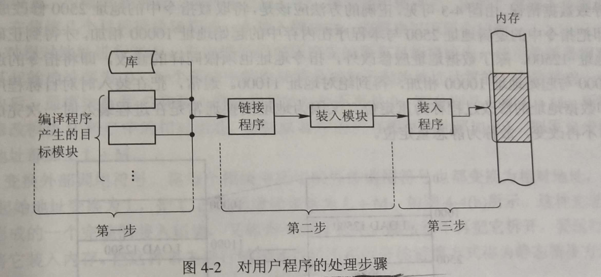
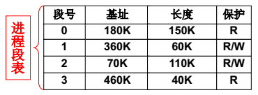
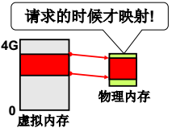

#  内存管理

　　内存管理也被称作存储器管理。

### 5.1. 存储器的层次

　　在存储层次中，层次越高（越接近 CPU），存储介质的访问速度越快，价格越高，存储容量也越少。


* 主存储器：简称内存或主存，是计算机系统中的主要部件，用来保存进程运行时的程序和数据，也称可执行存储器。
* 寄存器：寄存器与处理机的速度，寄存器的字长一般是 32 或是 64 位。
* 高速缓存：介于寄存器和主存储器之间的存储器，主要用来备份内存中常用的数据，以减少处理机对内存的访问次数，这样可以大幅的提高速度。
* 磁盘缓存：由于磁盘的 I/O 速度远低于内存的速度，所以用磁盘缓存来暂时存放一些磁盘数据和信息，它本身并不是一种实际存在的存储器，而是利用内存中的部分存储空间暂时存访一些信息。

### 5.2. 程序的装入和链接



### 5.3. 连续分配存储管理方式

* 地址重定位：指将逻辑地址变换成物理地址的过程。分为静态重定位和动态重定位。
* 存储管理方案：分区存储管理（固定分区、可变分区、可重定位分区）、分页存储管理（将一个进程的地址空间划分为若干个大小相等的区域，成为页，相应地，将主存空间划分成与页相同大小的若干个物理块，称为块。至少需要两次访问主存）、分块存储管理、段页式存储管理（地址结构：段号+段内页号+页内地址）、虚拟存储管理。

　　可变分区请求和释放主要算法：最佳适应算法、最差适应算法、首此适应算法，循环首次适应算法。

　　快表：在页式存储管理中将当前最活跃的少数几页的物理块号保存在高速存储器中，用以提高页式存储管理的性能。（不能两次访问主存）

　　页面置换算法：最佳置换算法（最长时间内不再被访问的页面置换出去）、先进先出置换算法、最近最少未使用置换算法、最近未用置换算法。


　　要解决的两个问题：

1. 每个进程代码中使用的地址可能相同。解决思路：对代码中的地址重定向（加个基地址）。
2. 物理内存可能比较小，不能同时放很多进程进来。解决思路：把要运行的代码移到内存，暂时不用的代码移到磁盘，即交换（swap），内存置换。

### 分段

　　一个程序分成多个段（每个段特性不同为了方便管理，例如代码段只读、数据段等等），当然这都是逻辑上的。

　　管理段的结构叫做段表，段表保存在进程的 PCB 中。



### 页表

　　把程序按段分对程序员是友好的，但是如果物理存储也按段存，则会导致大块的内存碎片，例如现在需要分个 10M 的段但是连续的存储空间只有 8M/9M/5M 三个。解决办法：（将段打散存到页中）不要对内存仅从连续的分配，将内存划分成 1 页 1 页 ，按页分配，一页 4kb 大小，最多浪费的也就 4kb。这样不会有内存碎片，也不会出现没有符合要求大小的内存可以申请的情况，因为可以打散了分散到一页一页中。

　　整个系统的页表就是多级页表（这个整个系统的多级页表简单来说就是把物理地址都进行了按页划分，保存了每页的基地址（对应下图中的页框号））。程序向系统申请内存时，系统就会把哪几个页框号分给程序的某个段，程序再把它段 0 中的第 3 页数据放到页框 6 中。


　　说明：进程需要有自己的 “ 页表 ”，里面映射的双方是程序的逻辑地址中的页号和系统分给这段程序的页框号。

#### 段页结合的内存管理

　　实际在内存管理中的段页结合如下图，页号加偏移称为虚拟地址，MMU 负载从虚拟地址到物理地址的转换，同时页负责权限检查。


　　上面解决了每个进程代码中使用的地址可能相同，系统给每个进程分配基地址，进程保存在 PCB 中。

#### 请求调页内存换入

　　CPU 对数据进行请求时，才会进行映射（虚拟内存到物理内存）。



　　例如进程 1 正在运行，进行映射拿数据，查页表发现页框号中没有数据或有进程 2 的数据，则需要页表调入内存。


#### 内存换出

　　有页表需要调入，那么谁调出。

　　页面置换算法：

1. 最佳置换算法（Optimal）：一种理论的算法，选择淘汰的页面是以后一定不再使用的页面（理想化的），该算法无法实现，只能作为其他算法好坏的一个评价对比。

2. 先进先出（FIFO）算法：总是最先淘汰最先进去的页面，该算法容易实现。缺点：通常程序调入内存的西安候顺序和程序执行的先后顺序不一致，导致缺页率高。

3. 最近最久未使用算法 LRU：算法赋予每个页面一个访问字段，用来记录上次页面被访问到现在所经历的时间 t，每次置换的时候把 t 值最大的页面置换出去（实现方面可以采用寄存器或者栈的方式实现）。

4. 时钟算法 clock（也被称为是最近未使用算法 NRU）：页面设置一个访问位 R，并将页面链接为一个环形队列，页面被访问的时候访问位设置 R 为 1。页面置换的时候，如果当前指针所指页面访问 R 为 0，那么置换，否则将其置为 0，循环直到遇到一个访问位为 0 的页面。

   但是这个方法优缺点：缺页比较少的时候（最近没有使用淘汰中的 “最近” 太长了）。所有的 R 都为 1（很少变成 0），每次都要转一圈才能找到换出去的页，退化成 FIFO，效率不高。

   改进：双指针，一个快，一个慢，像时钟一样（定时清除 R 位）（更像 clock），快时钟做 R 的清 0 定时清 0，等到慢指针转到这里的时候 R=0，说明在定时时间片内没有被访问，该页可以被替换了。


## 虚拟内存

　　虚拟内存的目的是为了网物理内存扩充成更大的逻辑内存，从而让程序获得更多的可用内存。

　　为了更好的管理内存，操作系统将内存抽象成地址空间。每个程序拥有自己的地址空间，这个地址空间被分割成多个块，每个块称为一页。这些页被映射到物理内存，但不需要映射到连续的物理内存，也不需要所有页都必须再物理内存中。当程序引用到不再物理内存中的页时，由硬件执行必要的映射，将缺失的部分装入物理内存并重新执行失败的指令。

　　从上面的描述可以看出，虚拟机内存允许程序不用将地址空间中的每一页都映射到物理内存，也就是说一个程序不需要全部调入内存就可以运行，这使得有限的内存运行大程序成为可能。例如有一台计算机可以产生 16 位地址，那么一个程序的地址空间范围是 0-64k。该计算机只有 32 KB 的物理内存，虚拟内存技术允许该计算机运行一个 64K 大小的程序。


## 分页系统地址映射

　　内存管理单元（MMU）管理着地址空间和物理内存的转换，其中的页表（Page table）存储着页（程序地址空间）和页框（物理地址空间）的映射表。

　　一个虚拟地址分成两个部分，一部分存储页面号，一部分存储偏移量。

　　下图的页表存放着 16 个页，这 16 个页需要用 4 个比特位来进行索引定位。例如对于虚拟地址（0010 0000 0000 0100），前 4 位是存储页面号 2，读取表项内容为（1101），页表项最后一位表示是否存在于内存中，1 表示存在。后 12 位存储偏移量。这个页对应的页框的地址位（110 0000 0000 0100）。


## 页面置换算法

　　在程序运行过程中，如果要访问的页面不在内存中，就发生缺页中断从而将该页调入内存中。此时如果内存已无空闲空间，系统必须从内存中调出一个页面到磁盘对换区中腾出空间。

　　页面置换算法和缓存淘汰策略类似，可以将内存看成磁盘的缓存。在缓存系统中，缓存的大小有限，当有新的缓存达到时，需要淘汰一部分已经存在的缓存，这样才有空间存访新的缓存数据。

　　页面置换算法的主要目标是使页面置换频率子最低（也可以说缺页率最低）。

### 1. 最佳-OPT,Optimal replacement algorithm

　　所选择的被换出的页面将是最长时间内不再被访问，通常可以保证获得最低的缺页率。

　　是一种理论上的算法，因为无法知道一个页面多长时间不再被访问。

　　举例：一个系统为某进程分配了三个物理块，并有如下页面引用序列：

```　　
7,0,1,2,0,3,0,4,2,3,0,3,2,1,2,0,1,7,0,1
```

　　开始运行时，先将 7,0,1 三个页面装入内存。当进程要访问页面 2 时，产生缺页中断，会将页面 7 换出，因为页面 7 再次被访问的时间最长。

### 2. 最近最久未使用-LRU,Least Recently Used

　　虽然无法知道将来要使用的页面情况，但是可以知道过去使用页面的情况。LRU 将最近最久未使用的页面换出。

　　为了实现 LRU，需要在内存中维护一个所有页面的链表。当一个u二面被访问时，将这个页面移到链表表头。这样就能保证链表表尾的页面时最近最久为访问的。

　　因为每次访问都需要更新链表，因此这种方式实现的 LRU 代理很高。

```
4,7,0,7,1,0,1,2,1,2,6
```


### 3. 最近未使用-NRU,Not Recently Used

　　每个页面都有两个状态位：R 和 M，当页面被访问时设置页面的 R=1，当页面被修改时设置 M=1。其中 R 位会定时被清零。可以将页面分成以下四类：

* R=0，M=0
* R=0，M=1
* R=1，M=0
* R=1，M=1

　　当发生缺页中断时，NRU 算法随机地从类编号最小地非空类中挑选一个页面将它换出。

　　NRU 优先换出已经被修改地脏页面（R=0，M=1），而不是被频繁使用地干净页面（R=1，M=0）。

### 4. 先进先出-FIFO,First In First Out

　　选择换出地页面时最先进入的页面。

　　该算法会将那些经常被访问的页面换出，导致缺页率升高。

### 5. 第二次机会算法

　　FIFO 算法可能会把经常使用的页面置换出去，为了避免这一问题，对该算法做一个简单的修改：

　　当页面被访问（读或写）时设置该页面的 R 位为 1。需要替换的时间，检查最老页面的 R 位。如果 R 位是 0，那么这个页面既老又没有被使用，可以立即置换掉；如果是 1，就将 R 位清 0，并把该页面放到链表的尾端，修改它的装入时间使它就像刚装入的一样，然后继续从链表的头部开始搜索。


## 6. 时钟 -Clock

　　第二次机会算法需要在链表中移动页面，降低了效率。时钟算法使用环形链表将页面连接起来，再使用一个指针指向最老的页面。


## 分段

　　虚拟内存采用的是分页技术，也就是将地址空间划分成固定大小的页，每一页再与内存进行映射。

　　下图为一个编译器在编译过程中建立的多个表，有 4 个表是动态增长的，如果使用分页系统的一维地址空间，动态增长的特点会导致覆盖问题的出现。


　　分段的做法是把每个表分成段，一个段构成一个独立的地址空间。每个段的长度可以不同，并且可以动态增长。

## 段页式

　　程序的地址空间划分成多个拥有独立地址空间的段，每个段上的地址空间划分成大小相同的页。这样即拥有分段系统的共享和保护，又拥有分页系统的虚拟内存功能。

## 分页与分段的比较

1. 对程序员的透明性：分页透明，但是分段需要程序员显式划分每个段。
2. 地址空间的维度：分页是一维地址空间，分段是二维的。
3. 大小是否可以改变：页的大小不可变，段的大小可以动态改变。
4. 出现的原因：分页主要用于实现虚拟内存，从而获得更大的地址空间；分段主要是为了使程序和数据可以被划分为逻辑上独立的地址空间并且有助于共享和保护。

## 参考文章

1. [操作系统基础知识总结整理](https://blog.csdn.net/Song_JiangTao/article/details/79670805)
2. [操作系统基础知识总结（重要）](https://www.cnblogs.com/xdyixia/p/9274909.html)
3. [计算机操作系统](https://github.com/CyC2018/CS-Notes/blob/master/notes/计算机操作系统 - 目录.md)
