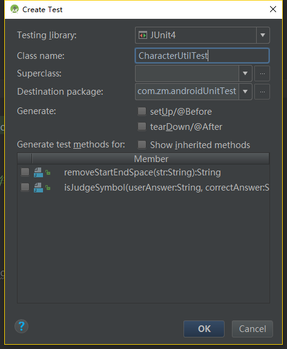
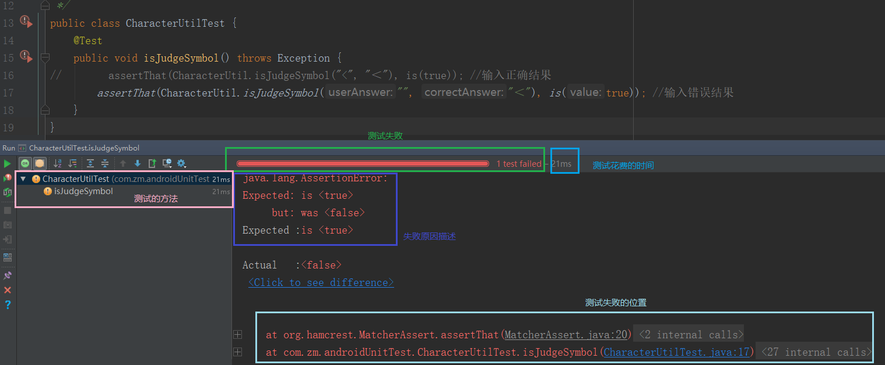

# Android单元测试

## Android单元测试介绍

#### 简单介绍
　　单元测试是应用程序测试策略中的基本测试，通过对代码进行单元测试，一方面可以轻松地验证单个单元的逻辑是否正确，另一方面在每次构建之后运行单元测试，可以快读捕获和修复因代码更改（重构、优化等）带来的回归问题。

#### 为什么要进行单元测试？
* 提高稳定性，能够明确地了解是否正确的完成开发；
* 快速反馈 bug ，跑一遍单元测试用例，定位 bug ；
* 在开发周期中尽早通过单元测试检查 bug ，最小化技术债，越往后可能修复 bug 的代价会越大，严重的情况下会影响项目进度；
* 为代码重构提供安全保障，在优化代码时不用担心回归问题，在重构后跑一遍测试用例，没通过说明重构可能是有问题的，更加易于维护。

#### 单元测试要测什么
* 列出想要测试覆盖的正常、异常情况，进行测试验证；
* 性能测试，例如某个算法的耗时等等。

## JUnit 注解
| Annotation | 描述 |
|--------|--------|
| @Test publish void method | 定义所在方法为单元测试方法 |
| @Test(expected=Exception.class) public void method() | 测试方法若没有抛出 Annotation 中的 Exception 类型（子类型也可以）-> 失败 |
| @Test(timeout=100) public void method() | 性能测试，如果方法耗时超过 100 毫秒 -> 失败 |
| @Before public void method() | 这个方法在每个测试之前执行，用于准备测试环境（如：初始化类，读输入流等），在一个测试类中，每个 @Test 方法的执行都会触发一次调用。 |
| @After publish void method() | 这个方法在每个测试之后执行，用于清理测试环境数据，在一个测试类中，每个 @Test 方法的执行都会触发一次调用。 |
| @BeforeClass public static void method() | 这个方法在所有测试开始之前执行一次，用于做一些耗时的初始化工作（如，连接数据库），方法必须是 static 。 |
| @AfterClass public static void method() | 这个方法在所有测试结束之后执行一次，用于清理数据（如：断开数据连接），方法必须是 static 。 |
| @Ignore或者@Ignore(“太耗时”) public void method | 忽略当前测试方法，一般用于测试方法还没准备好，或者太耗时之类的。 |
| @FixMethodOrder(MethodAorters.NAME_ASCENDING) public class TestClass{} | 使得该测试类中的所有测试方法都按照方法名的字母顺序执行，分别指定 3 个值，DEFAULT、JVM、NAME_ASCENDING。 |
## 单元测试的分类

#### 本地测试

##### 使用

###### 添加依赖
```
dependencies {
...
    implementation 'com.android.support:appcompat-v7:26.1.0'
    testImplementation 'junit:junit:4.12'
    androidTestCompile 'com.android.support:support-annotations:26.1.0'
...
}
```

###### 测试代码存放的位置
```
app/src
   |-- androidTest/java（仪器化单元测试、 UI 测试）
   |-- main/java（业务代码）
   |-- test/java（本地单元测试）
```

###### 测试
　　可以自己手动在相应目录创建测试类， AS 也提供了一种快捷方式：选择对应的类 -> 将光标停留在类名上 -> 按下 ALT + ENTER -> 在弹出的弹窗中选择 Create Test 。

　　选择 Create Test 选项之后，弹出下面框：

* Testing library: 测试库
* Class Name: 测试类名
* Superclass：超类
* Destination package：指定包
* Generate：setUp/@Before：会生成一个带 @Before 注解的 setUp() 空方法； tearDown/@After 则会生成一个带 @After 的空方法。
* Generate test methods for：选择下面框中需要测试的方法。Show inherited methods：是否显示继承的方法。

　　我这边只勾选了isJudgeSysmbol(userAnswer:String,correctAnswer:String)方法测试，剩下的选项都没有修改，点击了OK。
　　在测试文件夹中就能看到测试类了：

　　图片左侧的两个绿色图标在测试类写好之后就能点击运行测试。
　　**测试通过.**如图在 isJudgeSysmbol 中写入参数和正确的返回结果，测试结果通过。

　　**测试未通过.**如图在 isJudgeSysmbol 中写入参数和不正确的返回结果，测试结果未通过。



#### 仪器化测试

## 总结

## 参考文章
https://www.jianshu.com/p/aa51a3e007e2


个人添加：
gradlew test也是可以运行单元测试，但是输出的内容很多，需要自己在输出中找出自己想看的测试结果，很麻烦，不是很建议。

```
android {
   defaultConfig {
        ...
        versionCode 1
        versionName "1.0"
        testInstrumentationRunner "android.support.test.runner.AndroidJUnitRunner"
    }
...
    testOptions.unitTests.all {
        testLogging {
            events 'passed', 'skipped', 'failed', 'standardOut', 'standardError'
            outputs.upToDateWhen { false }
            showStandardStreams = true
        }
    }
}

dependencies {
    ...
    androidTestCompile 'com.android.support:support-annotations:27.1.1'
    androidTestCompile 'com.android.support.test:runner:1.0.2'
    androidTestCompile 'com.android.support.test:rules:1.0.2'
}

```

```
package cn.dream.exerciseanalysis.util;

import android.content.Context;

import org.junit.Test;
import org.junit.runner.RunWith;
import org.mockito.Mock;
import org.mockito.junit.MockitoJUnitRunner;

import cn.dream.exerciseanalysis.R;

import static org.junit.Assert.*;
import static org.hamcrest.core.Is.is;
import static org.mockito.Mockito.when;

/**
 * 字符工具类测试
 * Author: zhangmiao
 * Date: 2018/9/22
 */
@RunWith(MockitoJUnitRunner.class)
public class CharacterUtilTest {

    @Test
    public void isJudgeSymbol() {
        assertThat(CharacterUtil.isJudgeSymbol("", "＜"), is(false));
    }

    private static final String FAKE_STRING = "ExerciseAnalalysis";

    @Mock
    Context mMockContext;

    @Test
    public void readStringFromContext_localizedString() {
        //模拟方法调用的返回值，隔离对Android系统的依赖
        when(mMockContext.getString(R.string.app_name)).thenReturn(FAKE_STRING);
        assertThat(mMockContext.getString(R.string.app_name), is(FAKE_STRING));
        when(mMockContext.getPackageName()).thenReturn("cn.dream.exerciseanalysis");
        System.out.println(mMockContext.getPackageName());
    }

}
```
