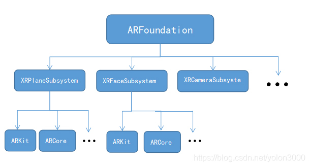

# 4.ARFoundation之路-AR子系统

ARFoundation 的体系架构是建立在一系列的子系统（subsystem）之上，这个架构的好处类似于接口（Interface），将界面与具体的实现进行分离，用户只需要面向接口编程，而无需关注具体的算法实现（ 这个具体的算法提供者就叫 Provider，Provider 这里指实现具体算法的包或者插件）。同时，这种分离的另一个好处是同一个接口可以有两个或多个具体实现，反过来说就是 ARFoundation 只定义了接口界面，而由 Provider 提供具体的实现，因此，其具有极强的适应性。如人脸跟踪，ARFoundation 定义了 FaceTracking 子系统界面，ARCore 可以提供 Android 平台的具体实现，ARKit 可以提供 iOS 平台的具体实现，Hololens 可以提供 Hololens 眼镜的具体实现等等，这样，在同一体系架构下可以提供无限的具体实现可能性，最后，ARFoundation 在编译特定平台应用的时候就可以直接调用该特定平台的具体实现，从而实现一次开发，多平台部署的目的。ARFoundation 的体系架构如下图所示。



类似于继承，当 Provider 具体实现特定接口（子系统）时，可以根据其平台本身的特性提供优化，并可以提供更多功能。由于硬件或者软件生态的巨大差异，A 平台具备的功能 B 平台不一定提供，为了让开发者了解这种差异，ARFoundation 要求 Provider 提供子系统描述符（SubsystemDescriptor），SubsystemDescriptor 描述了 Provider 对特定子系统提供的能力范围。有了这个描述符，开发人员就可以通过遍历看特定的功能某特定平台是否提供，为功能开发提供依据。

## AR 子系统的概念

Subsystem 是一个与平台无关的接口，其定义了对特定功能的界面，与 AR 相关的 subsystems 隶属于 UnityEngine.XR.ARSubsystems 命名空间。ARFoundatoin 中的 subsystem 只定义了功能接口而没有具体实现，具体实现由 Provider 在其他包或者插件中提供。ARFoundation 目前提供了以下 12 种 subsystem，具体包括 Session、Raycasting、Camera、Plane Detection、Depth、Image Tracking、Face Tracking、Environment Probes、Object Tracking、Human Body Tracking 2D、Human Body Tracking 3D、Human Segmentation Image。

由于具体的 subsystems 是由 Provider 在其他包或者插件中提供，因此，如果不引入相应的包或者插件，应用编译会失败，在编译到具体平台时就一定要在工程中引入相应的包或者插件。同时引入两个或者多个平台的包或插件是没有问题的，因为 ARFoudation 会根据具体的编译平台选择对应的包或插件。引入插件的方法是在 Window > Package Manager 中打开“包管理窗口”，然后在左侧的包中选择相应的包或者插件，目前 ARFoundation 的 Provider 包括 ARCore XR Plugin 和 ARKit XR Plugin 两种。

## AR 子系统使用

所有的 subsystems 都有一样的生命周期：创建（Created）、开始（Started）、停止（Stopped）、销毁（Destroyed），每一个 subsystem 都有一个对应的 SubsystemDescriptor，可以使用 SubsystemManager 遍历其能够提供的功能，一旦得到可用的 subsystemdescriptor 后，就可以使用 Create() 方法创建这个 subsystem，这也是构建 subsystem 的唯一方式（实现使用中，很多时候由 SubsystemManager 负责了这个过程，但有时我们也需要自己来实现这个过程）。

```c#
XRPlaneSubsystem CreatePlaneSubsystem()
{
    // 得到所有可用的plane subsystems:
    var descriptors = new List<XRPlaneSubsystemDescriptor>();
    SubsystemManager.GetSubsystemDescriptors(descriptors);
    // 遍历获取一个支持boundary vertices的功能
    foreach (var descriptor in descriptors)
    {
        if (descriptor.supportsBoundaryVertices)
        {
            // 创建plane subsystem
            return descriptor.Create();
        }
    }
    return null;
}
```

## 可跟踪子系统

跟踪子系统（Tracking subsystem）是在物理环境中检测和跟踪某类信息的 subsystem，如平面跟踪和图像跟踪。跟踪子系统跟踪的事物被称为可跟踪对象（Trackable），如平面子系统检测平面，因此平面是可跟踪对象。

在 ARFoundation 中，每一类跟踪子系统都提供一个名为 getchanges() 的方法，此方法的目的是检索有关它所管理的可跟踪对象的信息数据，getchanges() 获取自上次调用 getchanges() 以来添加、更新和移除的所有可跟踪对象信息，通过该方法可以获取到发生变化的可跟踪对象相关信息并进行后续操作。

每个可跟踪对象都由标识符 ID（TrackableId，一个 128 位的 GUID 值）唯一标识，即所有的可跟踪对象都是独立可辨识的，我们可以通过这个 TrackableId 获取到该可跟踪对象。

subsystem 可以添加、更新或移除可跟踪对象。只有添加到 subsystem 中的可跟踪对象才可以被更新或移除，因此在移除可跟踪对象时需要先检查该对象是否在 subsystem 的跟踪中，如果尝试更新或移除尚未添加的可跟踪对象则会引发一个运行时错误。同样，未添加或已移除的可跟踪对象无没更新也无法再次移除。

为方便使用，在 ARFoundation 中，每一类跟踪子系统的 Manager 类（如 ARPlaneManager ）通常都提供一个 xxxChanged（如 planesChanged）事件，我们可以通过其 xxxChangedEventArgs（如 ARPlanesChangedEventArgs）参数获取到 added、updated、removed 可跟踪对象进行后续处理。
