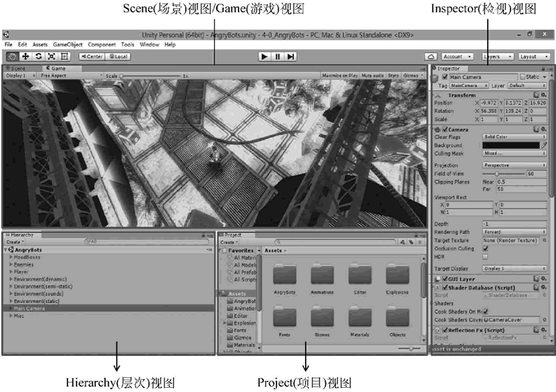
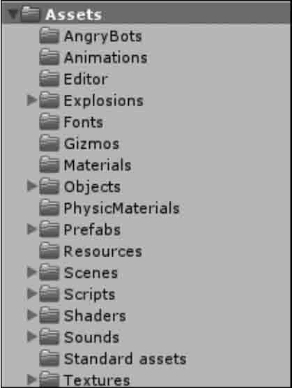

Unity 3D 拥有强大的编辑界面，游戏开发者在创建游戏过程中可以通过可视化的编辑界面创建游戏。
Unity 3D 的基本界面非常简单，主要包括菜单栏、工具栏以及五大视图，几个窗口就可以实现几乎全部的编辑功能，方便游戏开发者在较短时间内掌握相应的基础操作方法。

## 2.1. Unity 3D 界面布局

Unity 3D 主界面如下图所示，Unity 3D 的基本界面布局包括工具栏、菜单栏以及 5 个主要的视图操作窗口，这5个视图为 Hierarchy（层次）视图、Project（项目）视图、Inspector（检视）视图、Scene（场景）视图和 Game（游戏）视图。

## 2.2. Unity 3D Hierarchy 视图

[Unity 3D](http://c.biancheng.net/unity3d/) 的 Hierarchy 视图包含了每一个当前场景的所有游戏对象（GameObject）。

### 视图布局

Unity 3D 的 Hierarchy 视图中，对象是按照字母的顺序排列的，因此，游戏开发者在游戏制作过程中需要避免文件重名，养成良好的命名习惯。

同时，在 Hierarchy 视图中，游戏开发者可以通过对游戏对象建立父子级别的方式对大量对象的移动和编辑进行更加精确和方便的操作。

## 2.3. Unity 3D Project 视图

[Unity 3D](http://c.biancheng.net/unity3d/) 的 Project 视图显示资源目录下所有可用的资源列表，相当于一个资源仓库，用户可以使用它来访问和管理项目资源。
每个 Unity 3D 的项目包含一个资源文件夹，其内容将呈现在 Project 视图中。

## 2.4. Unity 3D Inspector 视图

[Unity 3D](http://c.biancheng.net/unity3d/) 的 Inspector 视图用于显示当前选定的游戏对象的所有附加组件（脚本属于组件）及其属性的相关详细信息。

## 2.5. Unity 3D Scene View 视图

[Unity 3D](http://c.biancheng.net/unity3d/) 的 Scene 视图是交互式沙盒，是对游戏对象进行编辑的可视化区域，游戏开发者创建游戏时所用的模型、灯光、相机、材质、音频等内容都将显示在该视图中。

### 视图布局

Unity 3D 的 Scene 视图用于构建游戏场景，游戏开发者可以在该视图中通过可视化方式进行游戏开发，并根据个人的喜好调整 Scene 视图的位置。

## 2.6. Unity 3D Game View 视图

[Unity 3D](http://c.biancheng.net/unity3d/) 中的 Game 视图用于显示最后发布的游戏的运行画面，游戏开发者可以通过此视图进行游戏的测试。

## 2.7. Unity 3D 菜单栏及快捷键详解

菜单栏是 [Unity 3D](http://c.biancheng.net/unity3d/) 操作界面的重要组成部分之一，其主要用于汇集分散的功能与板块，并且其友好的设计能够使游戏开发者以较快的速度查找到相应的功能内容。

Unity 3D 菜单栏包含 File（文件）、Edit（编辑）、Assets（资源）、GameObject（游戏对象）、Component（组件）、Window（窗口）和 Help（帮助）7 组菜单。

### File 菜单

File 菜单主要用于打开和保存场景项目，同时也可以创建场景。

### Edit 菜单

Edit 菜单用于场景对象的基本操作（如撤销、重做、复制、粘贴）以及项目的相关设置。

### Assets 菜单

Assets 菜单主要用于资源的创建、导入、导出以及同步相关的功能。

### GameObject 菜单

GameObject 菜单主要用于创建、显示游戏对象。

### Component 菜单

Component 菜单主要用于在项目制作过程中为游戏物体添加组件或属性。

### Window 菜单

Window 菜单主要用于在项目制作过程中显示 Layout（布局）、Scene（场景）、Game（游戏）和 Inspector（检视）等窗口。

### Help 菜单

Help 菜单主要用于帮助用户快速学习和掌握 Unity 3D，提供当前安装的 Unity 3D 的版本号。

## 2.9. Unity 3D 创建简单的几何模型

[Unity 3D](http://c.biancheng.net/unity3d/) 是一个强大的游戏开发引擎。在游戏开发中使用的模型常常是从外部导入的，Unity 3D 为了方便游戏开发者快速创建模型，提供了一些简单的几何模型，其中包括立方体、球体、圆柱体、胶囊体等。

## 2.10. Unity 3D Assets 游戏资源目录管理

资源管理最直观的体现在于对文件的归类与命名。在 [Unity 3D](http://c.biancheng.net/unity3d/) 中，所有游戏相关文件都被放置在 Assets 文件夹下，如下图所示，常见文件夹的内容如下表所示。

| 文件夹     | 内 容                 |
| ------- | ------------------- |
| Models  | 模型文件，其中包括自动生成的材质球文件 |
| Prefabs | 预制体文件               |
| Scene   | 场景文件                |
| Scripts | 脚本代码文件              |
| Sounds  | 音效文件                |
| Texture | 贴图文件                |

同时，在一个 Unity 3D 项目中，通常会有大量的模型、材质以及其他游戏资源，所以需要将游戏资源归类到不同文件夹做分类管理。

## 2.11. Unity 3D 导入资源包

[Unity 3D](http://c.biancheng.net/unity3d/) 游戏引擎中有很多资源包，可支持多种主流媒体资源格式，包括模型、材质、动画、图片、音频、视频等，为游戏开发者提供了相当大的便利，也使其开发的游戏作品具有较高的可玩性和丰富的游戏体验。

游戏的资源包分为两种，一种是系统资源包，另一种是外部资源包，游戏开发者可以根据实际情况选择导入不同的资源包。

## 2.12. Unity 3D 导出资源包

项目中的一些资源可以重复使用，只需要将资源导出，在另一个项目中导入即可。
资源导出的方法是：执行 Assets→Select Dependencies 菜单命令，选中与导出资源相关的内容，然后执行 Assets→Export Package 菜单命令。

## 2.13. Unity 3D 资源下载

[Unity 3D](http://c.biancheng.net/unity3d/) 为用户提供了丰富的下载资源，其官方网址为 [https://www.assetstore.unity3d.com/](https://www.assetstore.unity3d.com/)，也可以在 Unity 3D 中执行 Window→Asset Store 菜单命令直接访问 Unity 资源商店（Asset Store）。

