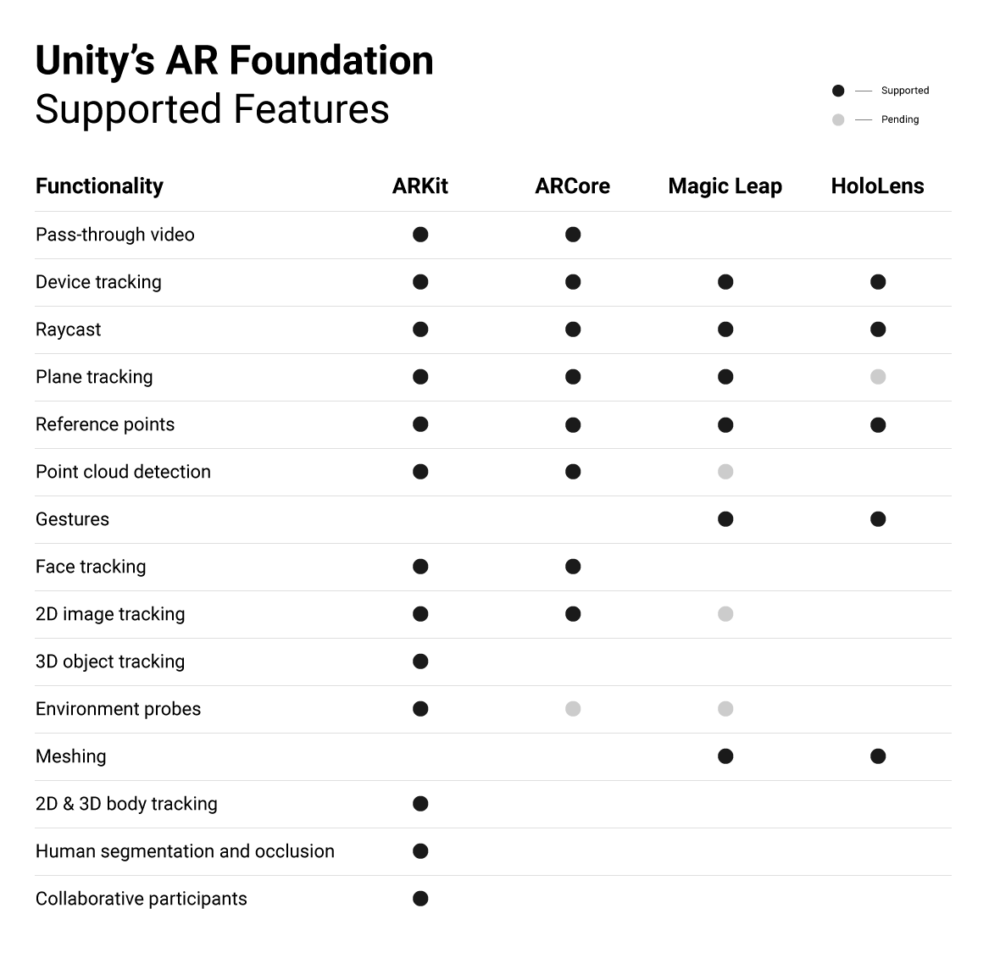

# Unity AR 开发入门

学习资料地址：[Unity AR 开发入门 - Unity 手册](https://docs.unity3d.com/cn/2021.2/Manual/AROverview.html)

为了实现 AR 开发入门，Unity 建议使用 AR Foundation 为 Unity 支持的手持式 AR 设备和可穿戴 AR 设备创建应用程序。

AR Foundation 允许您在 Unity 中以多平台方式使用增强现实平台。该软件包可提供一个供 Unity 开发者使用的界面，但并未自行实现任何 AR 功能。

AR Foundation 支持以下功能：

| **功能**       | **描述**                                                                                                                                            |
| ------------ | ------------------------------------------------------------------------------------------------------------------------------------------------- |
| 设备跟踪         | 跟踪设备在物理空间中的位置和方向。                                                                                                                                 |
| 射线投射         | 通常用于确定虚拟内容的显示位置，即射线（通过原点和方向来定义）与 AR 设备检测和/或跟踪到的真实世界特征相交的位置。Unity 的一些内置功能允许在 AR 应用程序中使用射线投射。                                                       |
| 平面检测         | 检测水平和垂直表面（例如咖啡桌、墙壁）的大小和位置。这些表面被称为“平面”。                                                                                                            |
| 参考点          | 跟踪平面和特征点随时间变化的位置。                                                                                                                                 |
| 点云检测         | 检测所捕获的摄像机图像中在视觉上明显不同的特征，并使用这些点来了解设备相对于周围世界的位置。                                                                                                    |
| 手势           | 根据人的手，将手势识别为输入事件。                                                                                                                                 |
| 面部跟踪         | 访问面部标志（这是检测到的面部的网格化表示）以及混合形状信息（可以将这些信息馈入到面部动画绑定中）。面部管理器 (Face Manager) 可以配置用于面部跟踪的设备，并为每个检测到的面部创建游戏对象。                                            |
| 2D 图像跟踪      | 检测环境中的特定 2D 图像。跟踪图像管理器 (Tracked Image Manager) 自动创建游戏对象来表示所有识别到的图像。可以根据是否存在特定图像来更改 AR 应用程序。                                                       |
| 3D 对象跟踪      | 将真实世界对象的数字表示形式导入到 Unity 应用程序中，并在环境中检测这些对象。跟踪对象管理器 (Tracked Object Manager) 为每个检测到的物理对象创建游戏对象，从而使应用程序可以根据是否存在特定的真实世界对象而改变。                         |
| 环境探针         | 检测环境特定区域中的光照和颜色信息，这有助于使 3D 内容与周围环境无缝融合。环境探针管理器 (Environment Probe Manager) 使用此信息在 Unity 中自动创建立方体贴图。                                               |
| 网格           | 生成与物理空间相对应的三角形网格，因此更能够与物理环境的表示形式进行交互和/或在视觉上覆盖细节。                                                                                                  |
| 2D 和 3D 身体跟踪 | 提供摄像机取景框中识别的人体的 2D（屏幕空间）或 3D（世界空间）表示。在 2D 检测中会使用包含 17 个关节的层级视图以屏幕空间坐标来表示人体。在 3D 检测中会使用包含 93 个关节的层级视图以世界空间变换组件来表示人体。                               |
| 人体分段         | 人体子系统 (Human Body Subsystem) 为应用程序提供人体模板和深度分段图像。模板分段图像针对每个像素确定该像素是否包含一个人物。对于与识别到的人物相关的每个像素，深度分段图像包含与设备的估计距离。将这些分段图像一起使用可以使渲染的 3D 内容被真实世界的人体逼真地遮挡。 |
| 遮挡           | 将到物理世界中对象的距离应用于渲染的 3D 内容，从而实现物理对象与虚拟对象的逼真混合。                                                                                                      |
| 参与者跟踪        | 在共享 AR 会话中跟踪其他设备的位置和方向。                                                                                                                           |

## AR 平台支持

AR Foundation 不会自行实现任何 AR 功能，而是会定义一个多平台 API，允许开发者使用多个平台通用的功能。

AR Foundation 可跨不同平台支持以下功能：

