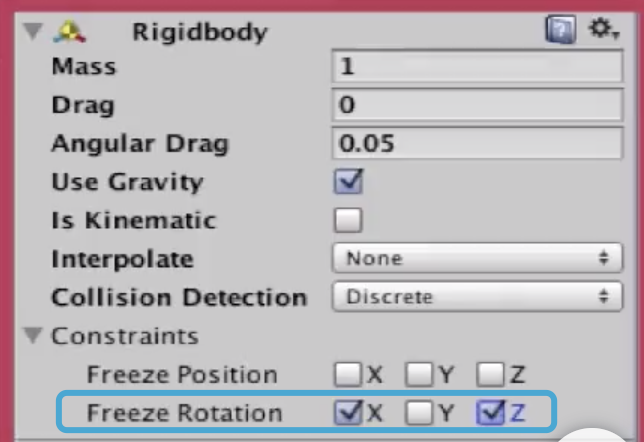

## 游戏入门与unity介绍

### 游戏的要素

* 逻辑

  * 游戏的玩法，控制。

  * 包括：逻辑逻辑（游戏的玩法、用户的输入）、AI（NPC 互动、自动寻路、追逐敌人）、物理运算（碰撞检测、重力、惯性、速度等物理计算）。

* 显示

  * 展示游戏内容，过程，逻辑的结果。

  * 包括：动画系统（控制动画的播放）、底层渲染（告诉硬件怎么完成显示）。

* 声音

  * 相对独立，由单独的团队完成。

### 游戏团队中的角色

* 策划：设计游戏的玩法

* 美术：制作游戏需要的美术资源

* 程序员：编写游戏逻辑，整合一切。

### 游戏引擎的作用

* 减少我们的工作

* 减少重复的开发

* 降低游戏开发的门槛

### Unity 具有的模块

* AI

* 渲染

* 物理运算

* 声音

* 动画系统

* 资源管理

* 跨平台

* 系统构架

## Unity 工程简介

* Scene 场景视图：布置游戏

* Hierarchy 分层视图

* Project 工程视图

* Game 游戏视图

* Inspector 属性视图

## 场景和 GameObject

GameObject 由多个 Component 影响。

Prfabs 相当于模版。

Prfabs 作用：

1. 重复利用。

2. 同时修改。

## 美术资源管理

如果资源没有使用，则不会被打到包里，如果使用，则会打包到包里。

## 场景布局概览-Unity3D 角色控制

Mesh Renderer：是否展示

Mesh Renderer-Materials：展示的材质

Materials-shader：针对 GPU 的渲染模式。

## 脚本基础-Unity3D 角色控制

### 脚本基础

* Unity 里可以使用 C# 和 UnityScript

* 在 Unity 里面凡是能挂在 GameObject 上的都是 Component

* Script 也可以作为一个 Component

* Script 要想挂在 GameObject 上就必须继承 MonoBehaviour

### Unity 如何通过脚本来驱动游戏

* Instantiate() 创建 GameObject

* 通过 Awake() 和 Start() 来做初始化

* Update，LateUpdate 和 FixedUpdate 更新逻辑

* 用 OnGUI 绘制 UI

* OnCollisonEnter 等进行物理计算

* OnPreCall 等来控制渲染

### 如何更新逻辑

* 场景启动时调用所有脚本的 Awake()

* 调用所有脚本的 Start()

* 调用 Update（一帧调一次）

* 调用 LateUpdate（一帧调一次）

* 调用 FixedUpdate（一帧调几次）

### 对象销毁

* 调用 Destory 销毁 GameObject

* 销毁对象时调用 onDestory

### 脚本间通信

* 通过 GetComponment 来找到其他脚本

* 通过 GameObject.Find 来找到其他物体

## 应用脚本控制物体运动-Unity3D 角色控制

* Time.deltaTime：距离上一帧的时间

* FixedUpdate：一般做物理运算的时候用

* LateUpdate：所有的 update 调用完就会调用，做摄像机跟随

* Awake() & Start() 做初始化

* Update、LateUpdate、FixedUpdate 更新逻辑

* GetComponent 找到其他脚本

* Gameobject.Find 找到其他物体

## 响应用户输入-Unity3D角色控制

### 如何进行游戏输入

* 在 Edit -> Project Settings -> Input 设置游戏输入

* 在脚本中利用 Input 类来检测输入状态

* Input.GetAxis 返回的值是 -1 到 1 之间，0 表示没有输入

## 动画导入-Unity3D 角色控制

fbx 材料->Rig-> Animation Type：动画类型，Legacy(不推荐使用) 与 Mecanim（包括 Generic 与 Humanoid 人体形态动画）

fbx 材料->Animation 动画

## 动画应用-Unity3D 角色控制

状态的切换使用状态机来实现。用脚本设置动画的值，状态机会检测值的变化而触发动画。

状态机中的状态 Any State：代表任何状态，可以作为起点，不能作为终点。

## 动态生成和销毁物体-Unity3D 角色控制

* 动态生成物体，就是把一个 prefab 做成模板，在运行时调用 Instantiate 函数用 prefab 生成一个实例（GameObject）放在场景中，如果不需要的时候就调用 Destory 函数将 GameObject 销毁掉 。

## 应用缓存管理物体-Unity3D 角色控制

### 动态生成物体

#### 优点

* 可以灵活的控制场景

* 可以马上看到效果

#### 缺点

* 性能开销大

优化：设置缓存。

## Collider-Unity3D 角色互动

Collider 碰撞框：用来检测物体是否发生了接触。

* Box Collder：方形碰撞框

  * Is Trigger 勾选，触发 OnTriggerEnter（开始接触），OnTriggerStay（持续接触），OntriggerExit（结束接触）三个方法。

  * 添加 Rigidbody 属性（带来物理运算），就不会触发 OnTrigger 系列方法，而是触发 还会触发 OnCollisionEnter，OnCollisionStay，OnCollisionExit 三个方法。

* Sphere Collder：圆形碰撞框

* Mesh Collder：根据物体的形状形成碰撞框

## Rigidbood简介（上）-Unity3D角色互动

* 如果不想人物穿墙，添加 Rigidbody 属性即可。而且限制绕 X 和 Y 轴旋转。

* 加了 Rigidbody 物体会受到物理系统的控制。
  * Mass：质量
  * Dray：阻力
  * Angular Dray：转圈时受到的阻力
  * Use Gravity：受重力的影响
  * Is Kinematic：是否受运动学
  * Interpolate：差值算法，抖动才会需要用到
  * Collision Detection：碰撞检测用哪种方法，默认时 Discrete
  * Constraints：
    * Freeze Postion：冻结方向，在该方向上不受物理控制
    * Freeze Rotation：冻结角度
* Rigidbody.AddForce()：给物体施加一个力，物体自己运动起来。

## 应用 Rigidbody 实现物体旋转-Unity3D 角色互动

* Rigidbody.angularVelocity：设置一个角速度。

## NPC 的 AI - Unity3D 角色互动

* 多个 Collder，靠近就会有反应，玩家进入最近的 Collder，表示进入火力圈，就可以发火了。
* 用 tag 区分是不是玩家
* NavMesgAgent：Unity 提供的路径导航。

## 导航网格的设置-Unity 3D 角色互动

* 寻路算法，unity 提供了导航。
* 实现导航
  1. 设置导航网格，Window->NavMesh
  2. 设置 Nav Mesh Agent
  3. 调用 Nav Mesh Agent 的方法设置路径

* NavMesgAgent.SetDestination()：设置终点，会自动寻路前往。
* NavMesgAgent.Stop()：停止前往。
* NavMesgAgent.Resume()：之前停止了，现在恢复继续。

## 血量变化-Unity3D 角色互动

* Health 表示血量，GameController：控制角色死亡等。

## 简介 UI 系统--锚点

* UI 使用 Rect Transform 属性控制位置、大小等。
  * Anchors：锚点，在布局自适应上非常有用。

## 简介 UI 系统---击杀和挨揍

* 两个 button 重叠，会根据在 canvas 的顺序，在前面的先画，在后面的后画（靠下）。

### 暂停菜单

* Button-OnClick 设置按钮点击事件。

* Application.LoadLevel(0)：重新绘制界面，也就是重新开始。
* Time.timeScale：控制游戏的快进或慢放，为 0 表示静止不动。