# HAL 框架与 Stub 开发

# 1. 复习：C 语言

* EIT 造形的基础：

  < 基类/子类 > 结构就是两个 class 的组合

* EIT 造形的接口：

  也是一种纯粹抽象类（pure abstract class）

## 1.1. 复习：C 语言的结构（struct）

* 定义结构形态。商品有牌子﹐定义型态就像描述一件商品的品牌。例如：

  ```
  struct smile
  {
  char sna;
  char size;
  float price;
  };
  ```

  这说明了﹕smile 结构内含 3 项数据 ── 两项字符数据﹐另一项浮点数数据。

* 接着，根据所定义之结构来宣告结构变量。宣告结构变量就像「订」礼盒。例如﹕

  ```
  struct smile x, y;
  ```

## 1.2. 复习：结构指针（Pointer）

* 宣告结构指针﹐来指向结构变量。例如﹕

```c
/* cx-02.c */
#include <stdio.h>
#include <string.h>
struct smile { 
char sna; 
float price; 
};
int main(void)
{
struct smile x;
struct smile *px;
px = &x;
px->sna = 'R';
px->price = 26.8;
printf( "Sna=[%c], Price=%.1f", x.sna, x.price );
return 0;
}
```

*  px 是 struct smile 型态的指针﹐x 是 struct smile 型态的变量﹐px 可以指向 x 变量。

* “&” 运算能把 x 变量的地址存入 px 中﹐使得 px 指向 x 变量。 

* 指令：

  ```c
  px->sna = 'R';
  px->price = 26.8;
  ```

* 把数据存入结构(变量)里。

## 1.3. 复习：动态内存分配

* 「动态」(Dynamic) 的意思是﹕待程序执行时 (Run-Time) 才告诉计算机共需要多少内存空间﹐计算机依照需要立即分配空间﹐裨储存数据。
* malloc() 和 free() 是最常用的动态内存分配函数。如果在执行时需要空间来储存数据﹐宜使用 malloc() 函数。用完了就用 free() 释放该空间。
* typedef 指令定义的新型态。

## 1.4. 以 C 结构表达类（class），并创建对象(object)

### 认识 c 函数指针

* struct 里不能定义函数本身，但能定义函数指针 (function pointer) 属性。

  ```c
  typedef struct cc {
  	int id;
  	void (*hello)();
  } CC;
  ```

  这个 hello 就是一个函数指针属性了。

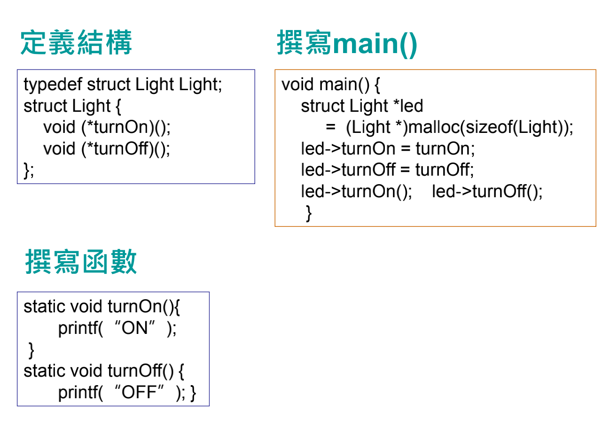

## 1.5. C 的函数表（function）概念

* 把函数部分独立出来，成为一个函数表(function table) 。

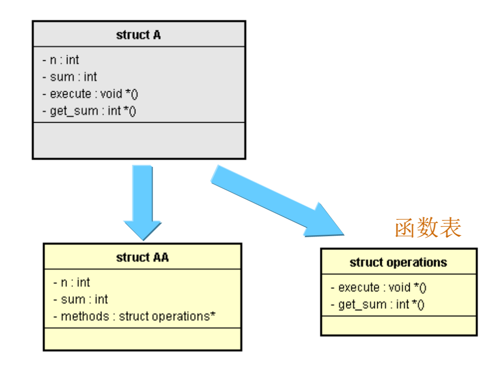

* 两者之间是一种 Whole-Part 组合 (Aggregation) 关系；而不是继承 (Inheritance) 关系。

# 2. 认识 HAL 的框架

* 函数指针(function pointer)指有函数定义，而没有代码；其相当于抽象函数 (abstract function)。


* 基于上述的 \<E&I\>定义，我们如何写 \<T\>呢?


* 基于上述的 \<E&I\> 定义，我们如何写 \<T\> 呢? 

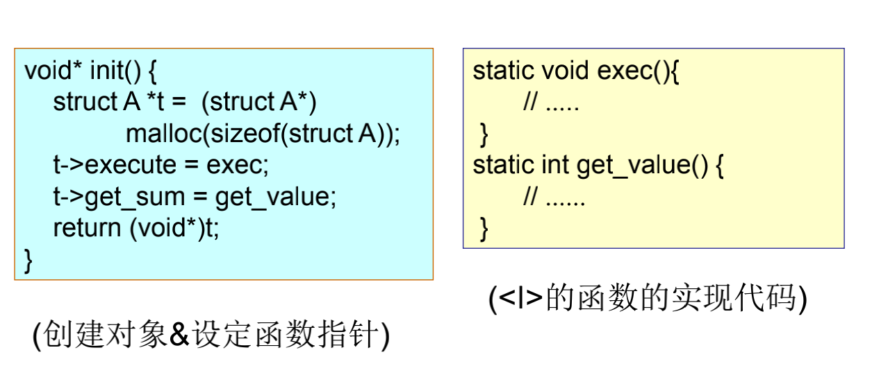

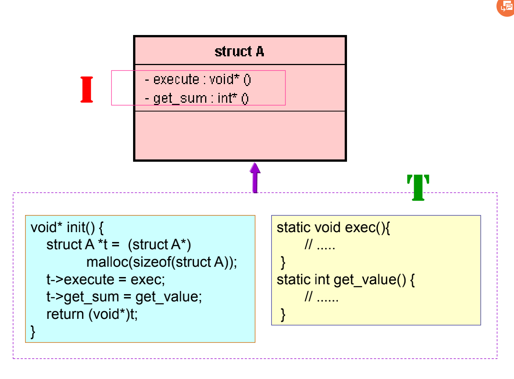

## HAL 的框架

* HAL 框架里只有 3 个主要的 struct 结构。 
* 其中的 hw_module_methods_t 是从 hw_module_t 独立出来的 < 函数表定义 >。


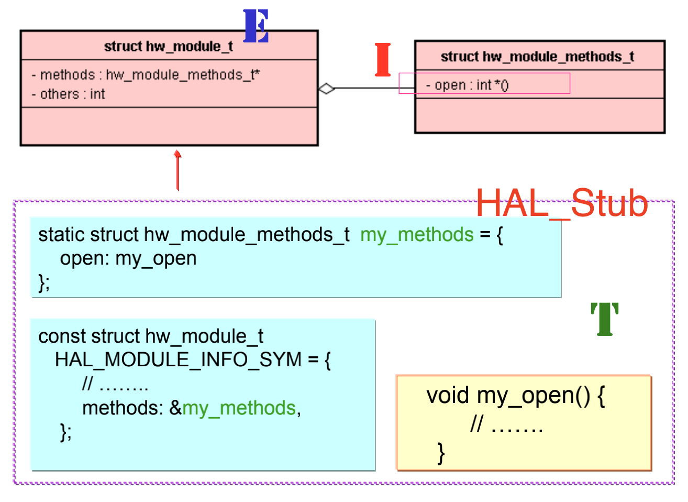

* 写好了上述的 HAL-Stub 代码，就能编译 & 连结成为 *.so 文檔。
* 载入*.so 文檔，执行这些 HAL-Stub 代码，在 run-time 就创建对象，并设定函数指针，如下图：

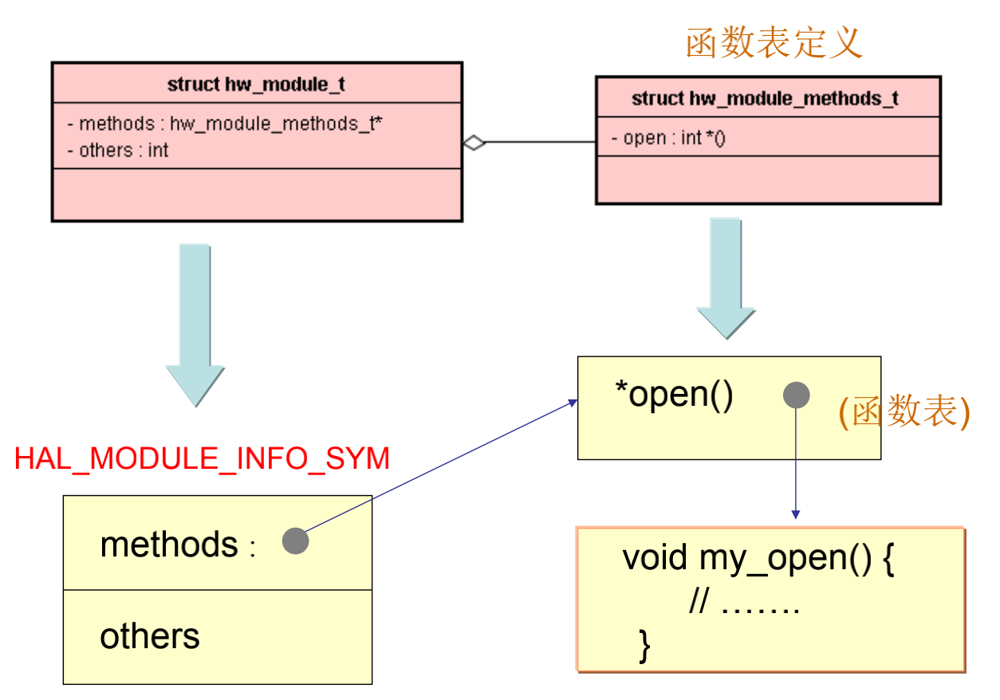

* 在 HAL 框架里，定义了如下：

```c
#define HAL_MODULE_INFO_SYM HMI 
#define HAL_MODULE_INFO_SYM_AS_STR "HMI"
```


### Client 使用 HAL 的第 1 个步骤

* HAL 框架提供了一个公用的函数：

```c
hw_get_module(const char *id, const 
struct hw_module_t **module)
```

* 这个函数的主要功能是根据模块 ID(module_id) 去查找注册在当前系统中与 id 对应的硬件对象，然后载入 (load) 其相应的 HAL 层驱动模块的 *so 文件。
* 從 *.so 里查找 ”HMI” 这个符号，如果在 so 代码里有定义的函数名或变量名为 HMI，返回其地址。


* 從 *.so 里查找 ”HMI” 这个符号，如果在 so 代码里有定义的函数名或变量名为 HMI，返回其地址。

### Client 使用 HAL 的第 2 个步骤


# 3. Client 如何使用 HAL 框架呢？

## 扩充 hw_device_t

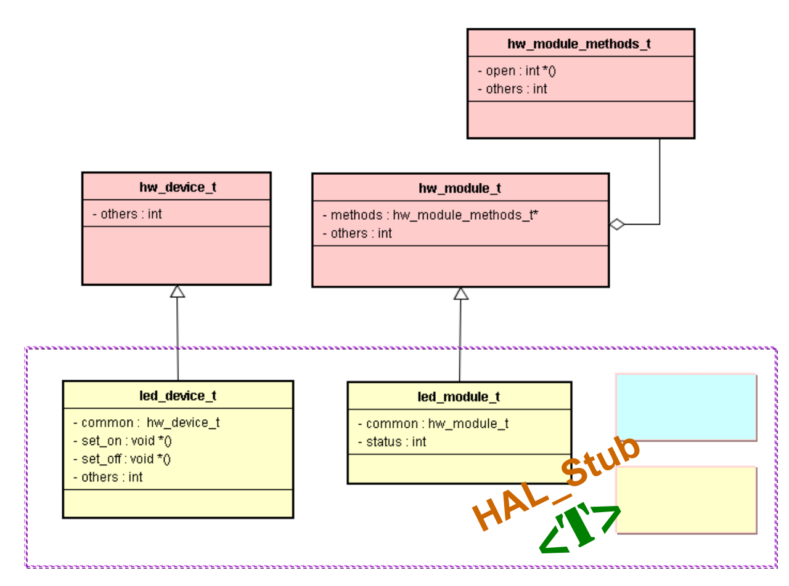


```c
struct led_module_t {
struct hw_module_t common;
int status;
};
```

```c
struct led_device_t {
struct hw_device_t common;
int (*set_on)(struct led_device_t *dev);
int (*set_off)(struct led_device_t *dev);
};
```

```c
static int led_device_close(struct hw_device_t* device){
struct led_device_t* ldev = 
(struct led_device_t*)device;
if (ldev) free(ldev);
return 0;
}
```

```c
static int led_set_on(struct led_device_t *dev){
// …….
return 0;
}
static int led_set_off(struct led_device_t *dev){
// …….
return 0;
}
```

```c
static int led_open(const struct hw_module_t* module, const char* name,
struct hw_device_t** device)
{
struct led_device_t *dev;
LOGD("led_device_open");
dev = (struct led_device_t*)malloc(sizeof(struct led_device_t));
memset(dev, 0, sizeof(struct led_device_t));
dev->common.tag = HARDWARE_DEVICE_TAG;
dev->common.version = 0;
dev->common.module = (struct hw_module_t*)module;
dev->common.close = led_device_close; // …… 
dev->set_on= led_set_on;
dev->device.set_off= led_set_off;
*device = (struct hw_device_t*)dev;
return 0;
}
```

```c
static struct hw_module_methods_t my_methods = {
open: led_open
};
```

```c
const struct led_module_t HAL_MODULE_INFO_SYM = {
common: {
tag: HARDWARE_MODULE_TAG, 
version_major: 1,
version_minor: 0,
id: LED_HARDWARE_MODULE_ID,
name: “Test LED Stub",
author: “Test Project Team",
methods: &my_methods, 
}
status: -1,
};
```

## 谁来创建 led_device_t 的对象呢？

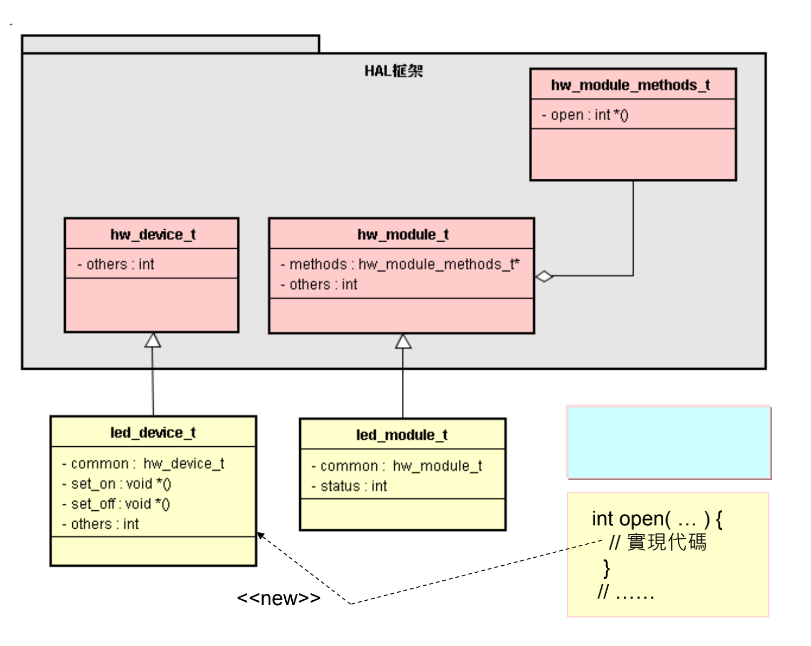


```c
static int led_open(const struct hw_module_t* module, const char* name,
struct hw_device_t** device)
{
struct led_device_t *dev;
dev = (struct led_device_t*)malloc(sizeof(struct led_device_t));
memset(dev, 0, sizeof(struct led_device_t));
dev->common.tag = HARDWARE_DEVICE_TAG;
dev->common.version = 0;
dev->common.module = (struct hw_module_t*)module;
dev->common.close = led_device_close; // …… 
dev->set_on= led_set_on;
dev->device.set_off= led_set_off;
*device = (struct hw_device_t*)dev;
return 0;
}
```

* 写好了上述的 HAL-Stub 代码，就能编译 & 连结成为 *.so 文檔。
* 载入*.so 文檔，执行这些 HAL-Stub 代码，在 run-time 就创建对象，并设定函数指针，如下图：

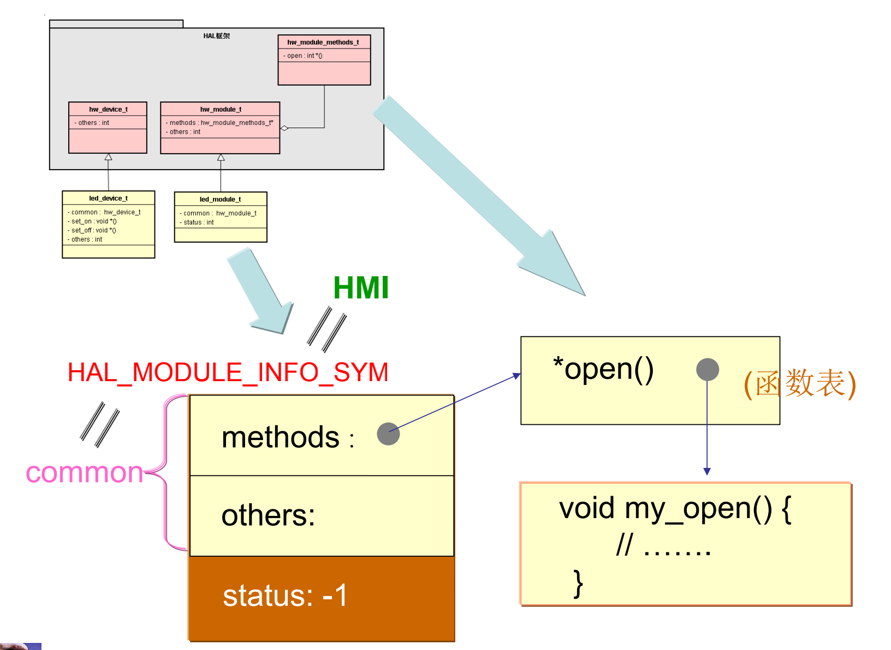

## Client 使用 HAL 的第 1 个步骤

* HAL 框架提供了一个公用的函数：

```c
hw_get_module(const char *id, const 
struct hw_module_t **module)
```

* 这个函数的主要功能是根据模块 ID(module_id) 去查找注册在当前系统中与 id 对应的硬件对象，然后载入 (load) 其相应的 HAL 层驱动模块的 *so 文件。
* 從 *.so 里查找 ”HMI” 这个符号，如果在 so 代码里有定义的函数名或变量名为 HMI，返回其地址。


* 從 *.so 里查找 ”HMI” 这个符号，如果在 so 代码里有定义的函数名或变量名为 HMI，返回其地址。

## Client 使用 HAL 的第 2 个步骤


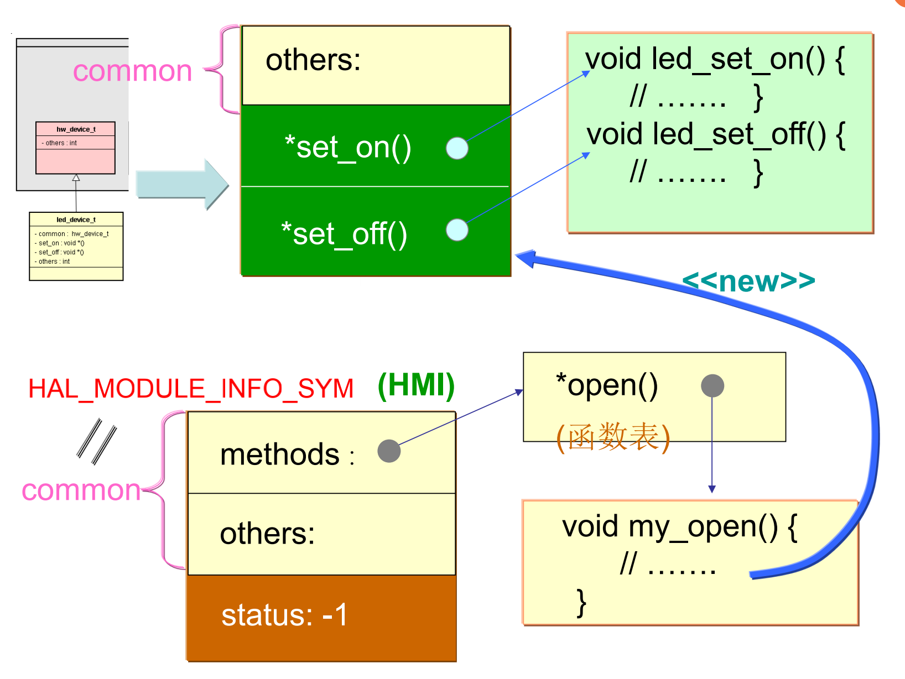

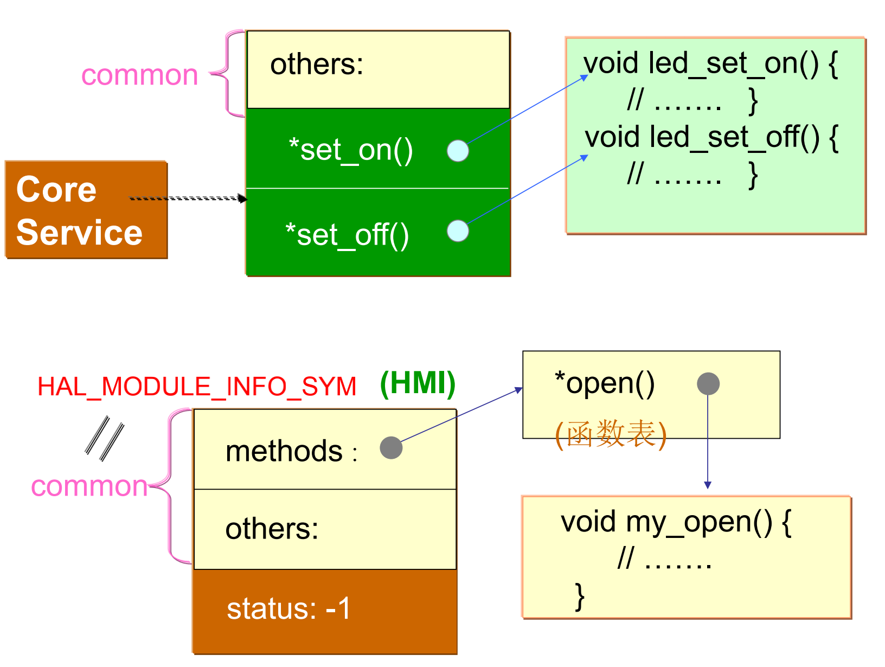


```c
static int led_open(const struct hw_module_t* module, const char* name,
struct hw_device_t** device)
{
struct led_device_t *dev;
dev = (struct led_device_t*)malloc(sizeof(struct led_device_t));
memset(dev, 0, sizeof(struct led_device_t));
dev->common.tag = HARDWARE_DEVICE_TAG;
dev->common.version = 0;
dev->common.module = (struct hw_module_t*)module;
dev->common.close = led_device_close; // …… 
dev->set_on= led_set_on;
dev->device.set_off= led_set_off;
*device = (struct hw_device_t*)dev;
return 0;
}
```

* 

## Client 使用 HAL 的第 3 个步骤

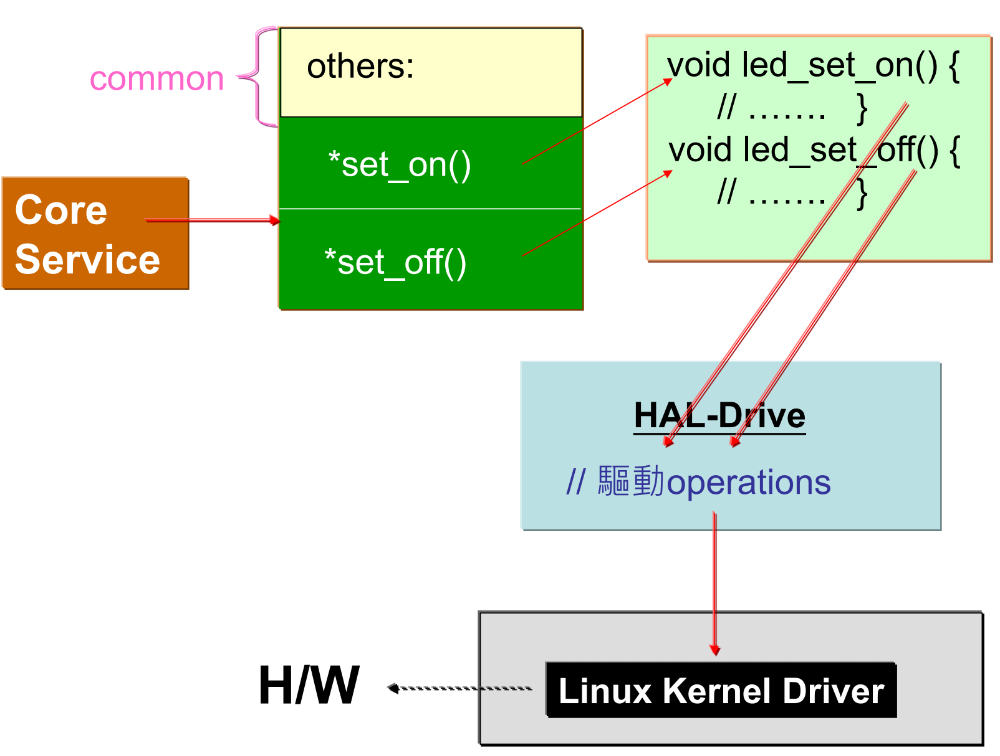


# 4. HAL 插件（Stub）的代码范例

* Client 使用 HAL 的第 1 个步骤
* Client 使用 HAL 的第 2 个步骤
* Client 使用 HAL 的第 3 个步骤

# 5. JNI Native Client 的代码范例


# 6. 观摩 Android 的实际 HAL-Stub 范例

-- 用来初始化 FrameBuffer 的 gralloc library

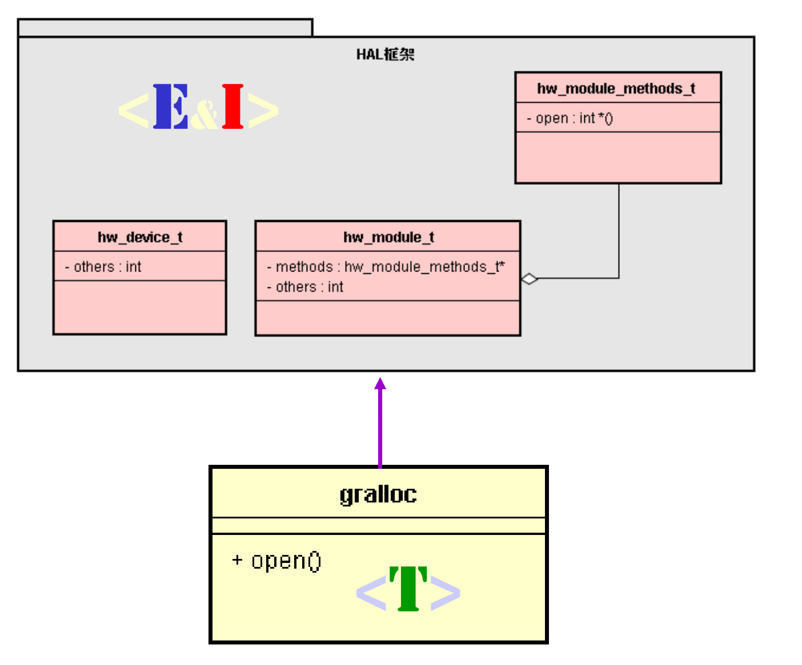

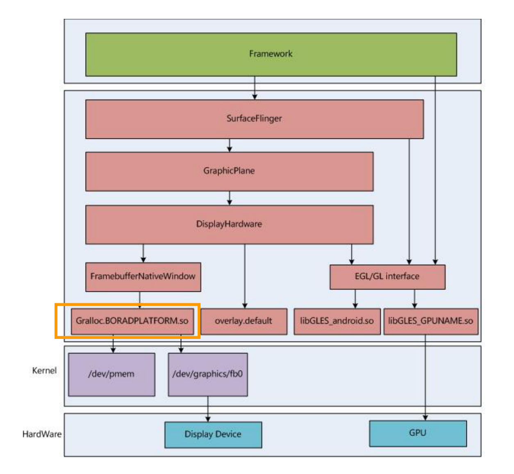

* gralloc library 模塊的範例是 HAL gralloc.msm7x30.so。
* 繪圖 framebuffer 的初始化需要通过 HAL gralloc.msm7x30.so 来完成与底层硬件驱动的适配。
* 不同的 vendor 可能会实现自己的 gralloc library。
* Android 通过 hw_module_t 框架来使用 gralloc library，它为 framebuffer 的初始化提供了需要的 gralloc.msm7x30.so 业务。
* gralloc library 的 Stub 结构体被命名为 HAL_MODULE_INFO_SYM(HMI)。
* 例如，HAL_MODULE_INFO_SYM 定义于 hardware/msm7k/libgrallocqsd8k/galloc.cpp。

