# 观摩：Android 端云整合与分工策略

# 1. API：架构师分工决策的呈现

## 古典 API，传统分工

* 古典 Client/Server 架构的 API 呈现于 Client 与 Server 之间，成为两端分工生产 ( 或开发 ) 的界线。
* 这种「古典 API，传统分工」模式，如下：

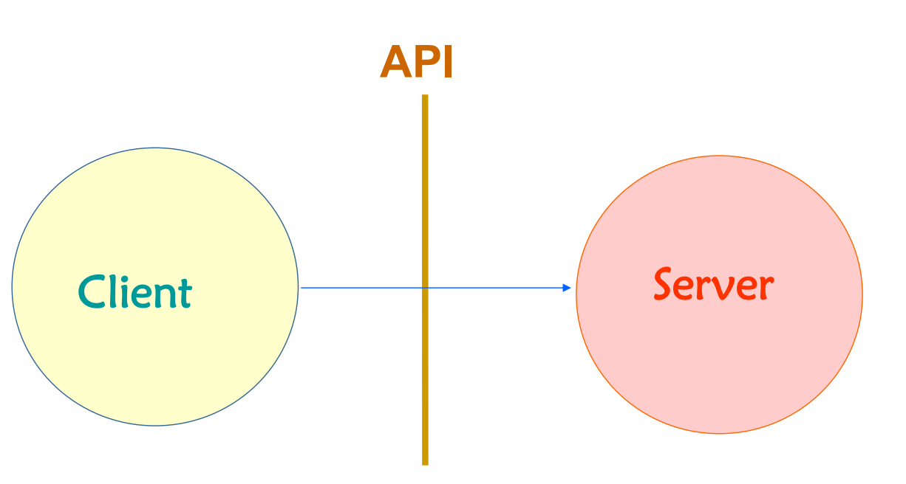

* 这种 API 不利于 Server 端团队 ( 或企业 ) 。 
* 对于 Server 端团队而言，这是被动型 API，缺乏主控权，经常沦为 Client 端所指挥的小弟或小妹，而成为救火队。
* 如果 Server 端企业想成为 < 强龙 >，就必须想办法掌握 API 的话语权。

## 重新定位 API

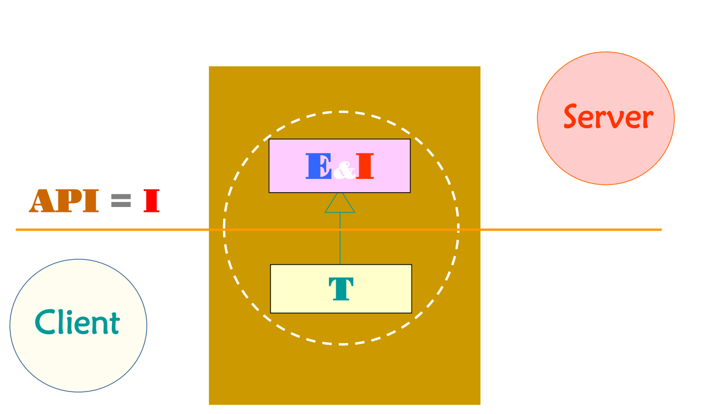

* EIT 造形放在 Server 端还是 Client 端呢？

  答案是：两边都放，两边同步改变 API 定位、改变分工界线。

## 将 EIT 造形运用于服务端

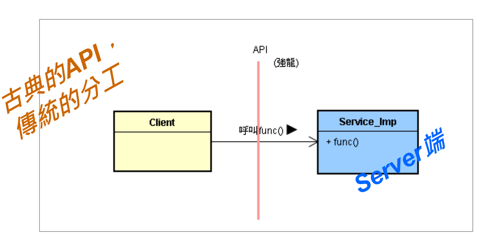

* 其中，Service_Imp 提供服务给 Client，使得 Server 端受制于 Client 端，Server 端对 Client 端没有主导力量。于是， Server 端常常成为救火队而疲于奔命。
* 此时，Server 端开发自己的 <E&I>，来提升自己的主导力量，就不必再疲于奔命了。如下图：


* Server 端获得了更大的主导权，就会大胆地开放子类别给更多的 Client 端人员去开发了。随着 Client 端的数量愈多，其地位就愈高，日益成为云平台的强龙了。
* 成为云平台的强龙了，将同样策略应用到终端上，顺势征服终端，就能为真命天子：云 ( 大 ) 强龙了。

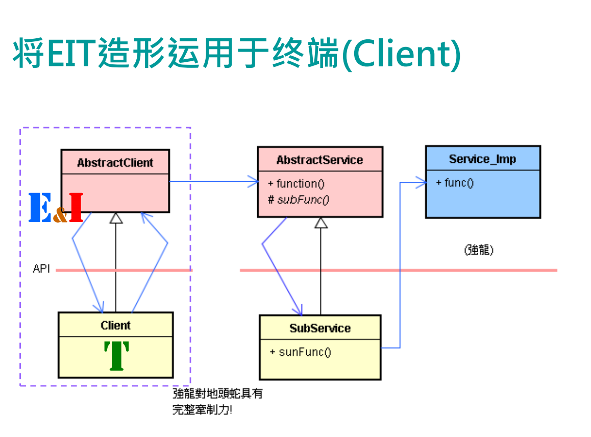

* 无论是在 Server 端，还是 Client 端，取得全面性的主导权，因而大胆地在两端都开放出插件。
* 例如，Google 把这种策略应用到它的 GAE 云端和 Android 手机终端上。

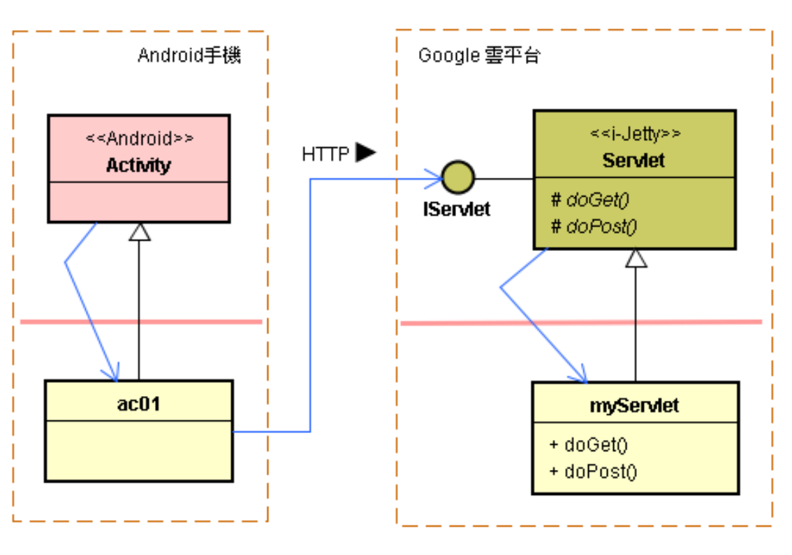

* 应用于云端向终端的信息推送，例如股票分析、车联网服务；以及手机多人游戏等等。
* 基于新的 API 定位 ( 也是新的分工界线 )，强龙在两端都写 <E&I>；而地头蛇在两端都写 \<T>。 

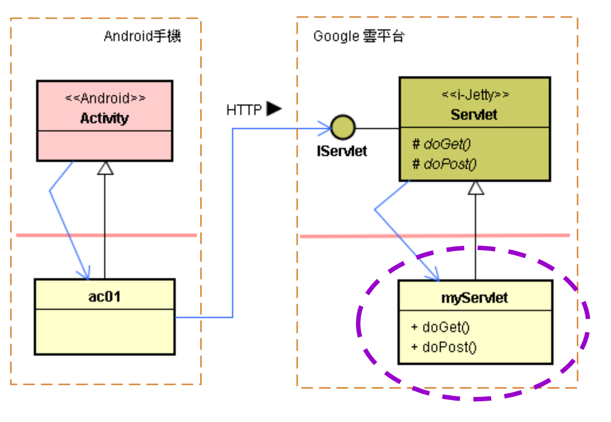

# 2. GAE 云平台的 API

## 以 Google 的 GAE 云平台为例

* GAE ( Google AppEngine ) 是 Google 的云服务引擎，第三方应用开发者能开发 App，然后放在 Google 服务器上执行，不需担心频宽、系统负载、安全维护等问题，一切由 Google 代管。 
* GAE 平台的系统架构如下图：

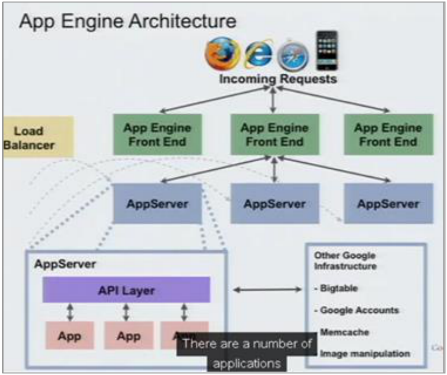

* 从上图可看到，从手机、PC、MID 等众多端设备上，都能随时上网发出要求 (Incoming Requests) 来存取 GAE 上的服务。
* 在 GAE 后台的 AppServer 里，GAE 提供了 API ( 即 API Layer ) 来衔接你的云端应用程序。

## GAE 与 Android 之关系

* Android 是当今手机的主要软件平台。从 AppEngine 云平台的角度而观之，手机只是云平台所连接出去的众多端设备之一，所以 Android 是与 GAE 相连结的众多端平台之一。
* 相对地，从 Android 行动端平台的角度而观之， GAE 只是 Android 端所连接出去的众多云平台之一。
* GAE 云平台提供了 HttpServlet 框架，此框架 EIT 造形来提供主动型的 \<I>。
* 这 GenericServlet 是 EIT 造形里的 \<E>。基于主动型API，可加上子类 \<T>。
*  其中，GenericServlet 基类的 service() 函数就扮演 \<I>的角色，执行时，它会反向调用到子类的 service() 函数，然后继续呼叫到其 doGet() 或 doPost() 函数；形成了两层 EIT 造形了。

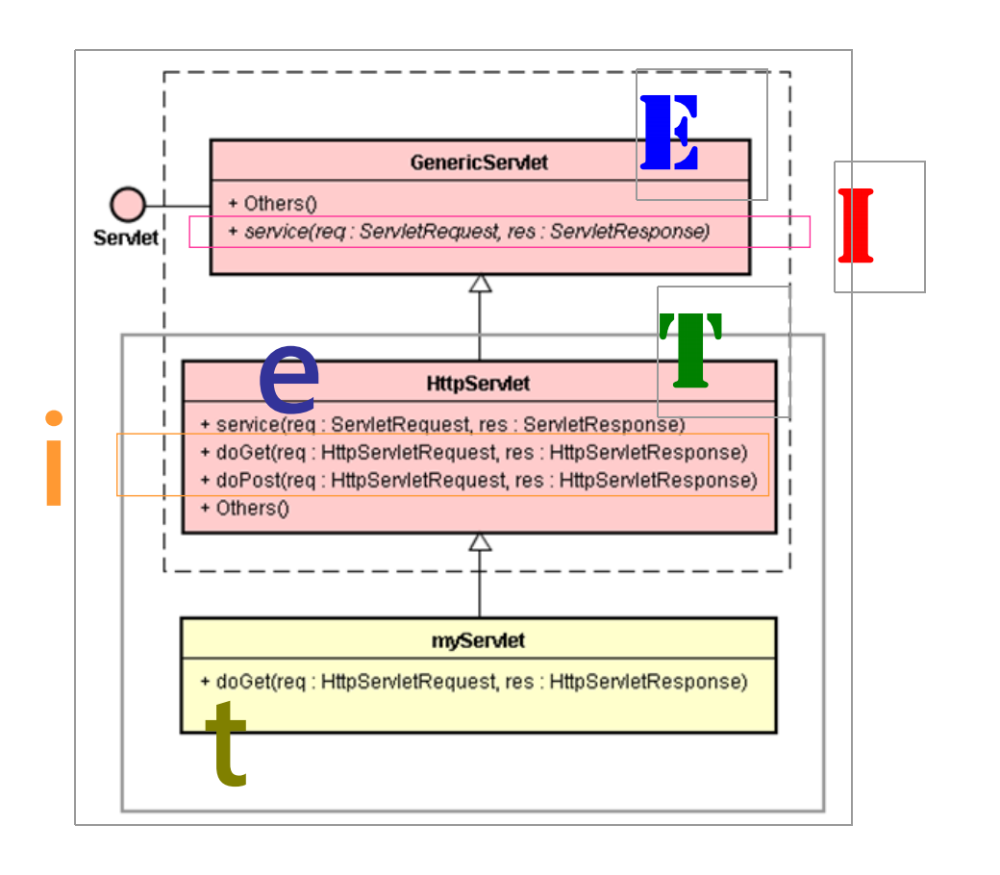

## 范例代码

### 地头蛇写 GAE 云的 \<T> 代码

```java
/*---- myServlet.java ----*/
// …………
public class myServlet extends HttpServlet {
	private static final long serialVersionUID = 1L;
	public void doGet(HttpServletRequest req, HttpServletResponse resp)throws IOException {
		String strCode = req.getParameter("code");
		String sv1 = req.getParameter("value1"); 
		String sv2 = req.getParameter("value2");
		int code = Integer.valueOf(strCode);
		int v1 = Integer.valueOf(sv1); 
		int v2 = Integer.valueOf(sv2);
		int v = 0;
		if( code == 0 ) v = v1 + v2;
		else v = v1 * v2;
		String result = String.valueOf(v);
		resp.setContentType("text/plain");
		resp.getWriter().println(result);
	} 
}
```

### 地头蛇写手机端的 \<T> 代码

```java
/*---- ac01.java ----*/
// ………
public class ac01 extends Activity implements OnClickListener {
	// …………
	@Override
	public void onCreate(Bundle savedInstanceState) {
		//…………. 
  }
  
	public void onClick(View v) { 
		if(v.getId()== 101) 
			this.invokeServlet();
		else if(v.getId() == 102) finish();
	}
  
	private void invokeServlet(){
		pdg = ProgressDialog.show(this,"please wait…","GAE accessing…",true);
		h = new EHandler();
		new Thread(){
			public void run(){
				DefaultHttpClient httpclient = new DefaultHttpClient();
				String u = APP_NAME + ".appspot.com";
				ArrayList<NameValuePair> params = new ArrayList <NameValuePair>();
				params.add(new BasicNameValuePair("code", "1"));
				params.add(new BasicNameValuePair("value1", "55"));
				params.add(new BasicNameValuePair("value2", "100"));
				HttpResponse response = null;
				try { 
          HttpGet httpget = new HttpGet(URIUtils.createURI("https",u, -1, "/my",
                                                           URLEncodedUtils.format(params, "UTF-8"), null));
					// 呼叫GAE的Servlet
					response = httpclient.execute(httpget);
				} catch (Exception e) { e.printStackTrace(); }
				if( response.getStatusLine().getStatusCode()!= HttpStatus.SC_OK){ 
          status = "doGet Error!"; 
          return; 
        }
				status = "doGet OK.";
				// 读取回传的内容
				InputStream is;
				byte[] buffer = new byte[4096];
				try { 
          is = response.getEntity().getContent();
          is.read(buffer, 0, 4096);
        } catch (Exception e) { e.printStackTrace(); }
				res_value = new String(buffer);
				pdg.dismiss();
        h.sendEmptyMessage(0);
      }
    }.start();
  }
//----------------------------------------------------------------------------------
	class EHandler extends Handler {
		public EHandler(){ 
      super(Looper.getMainLooper()); 
    }
    public void handleMessage(Message msg) {
      setTitle(status);
      tv.setText("response: " + res_value);
    }
  }
}
```

* 这 ac01 调用 myServlet 去做两个整数的相加或相乘。共传送 3 个参数给 myServlet 程序。如果第 1 参数的值为 0，就将后续两个参数值相加；反之，如果 1 参数的值为 1，就将两个值相乘。并将其值回传给 Android 应用程序，显示于画面上。

## 结语

* 以上展现了新型 API 与分工界线：
  * 两端都写 <E&I> 的 Google 成为强龙。
  * 两端都写 \<T> 的 App 开发者，成为地头蛇。
  * 强龙定义 API ( 即 \<I> )，拥有端云整合架构的话语权。

# 3. 在 GAE 云平台上使用 Proxy-Stub 设计模式

* 以吃角子老虎机游戏为例

## 前言

* 跨端 & 云的 Proxy-Stub 模式

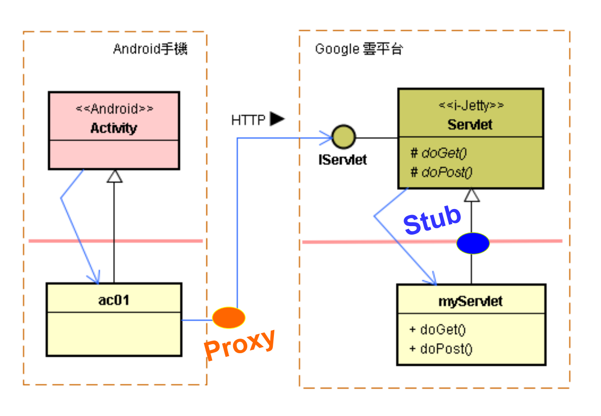

## 以吃角子老虎机游戏为例

* 水果盘拉霸机 ( Slot Machine，简称 SM ) 又称为老虎机、角子机或吃角子老虎机。它是大家常玩的游戏机，其造型有许多种，例如下图：


* 在本范例里，将 Android 手机上拉霸机游戏软件联结到 GAE 云平台上。
* 这游戏软件可分为两部分：
  1. 游戏 (Game) 端部分，也就是 Android 手机端的应用程序。
  2. 柜台 (Console) 端部分，也就是 GAE 云层 Servlet 程序。

### 玩法

* 其玩法是先输入投注金额 (Bet)，按下 \<SPIN> 按钮 ( 开始加速滚动 )，游戏端就将**目前余额**和**押注金额**传送给 GAE 的柜台端程序。
* 等待柜台端程序计算出中奖金额后，将**新余额**和**奖项级别**回传给 Android 游戏端 ( 滚动开始减速 )，并更新游戏端画面。
* 其中，Android 游戏端程序 (ac01.java) 发送 HTTP 来调用 GAE 云层的 Servlet 接口，如下图所示：

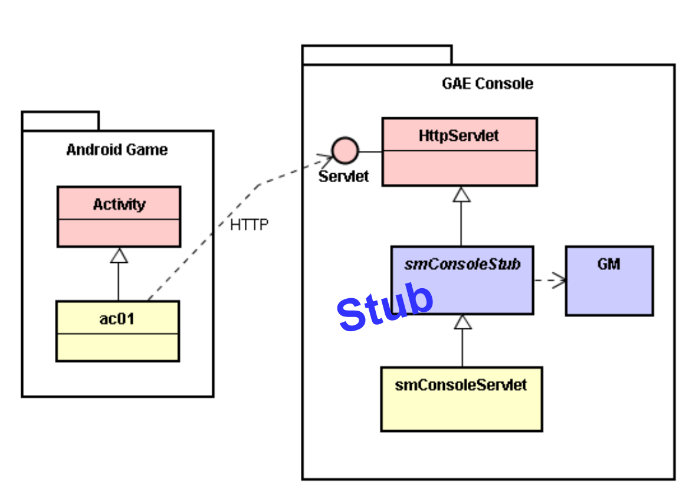

* Android 游戏端透过 HTTP 和 Servlet 接口来传送三种讯息给 GAE 云层。这三种讯息为：
  1. 当玩家启动 Android 游戏端时，发送 "Init:" 讯息给 GAE 云层。GAE 就从 DB 里读取玩家的余额 ( 即上回的余额 )，并回传给游戏端。
  2. 按下 \<SPIN> 按钮时，发送 “Bett:amount,bet” 讯息给 GAE 云层，要求 GAE 云层决定奖项级别，计算奖金和新余额，然后回传。
  3. 欲结束时，按下 \<Exit> 按钮发送 "Fini:amount" 讯息给 GAE 云层。GAE 云层接到讯息，将余额存入 DB。

## GAE 云端 Stub 的设计图

* GAE 云端 Stub 程序包含两部份：ServletStub 模块和 GM 模块。 
* GM ( 全名是 Game Machine ) 类别是 Console 端应用程序的决策核心，例如决定游戏获奖的奖项，计算奖金等都是 GM 负责的任务。至于 ServletStub 则是负责与 Android 游戏端的沟通任务。


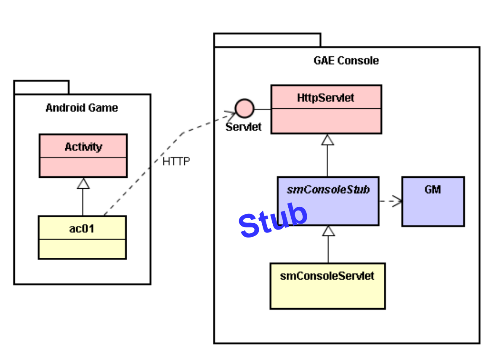

## Stub 类的角色与功能

* 当 Android 游戏端 ( 简称 SM ) 呼叫 HttpServlet 类的 Servlet接口时，会转而调用 **smConsoleStub** 类的 doGet() 函数，此 doGet() 转而调用 process() 函数去解析来自 Android 游戏端的讯息，然后调用 GM 类的函数，或调用应用程序的 onInitialAmount() 和 onFinished() 函数。

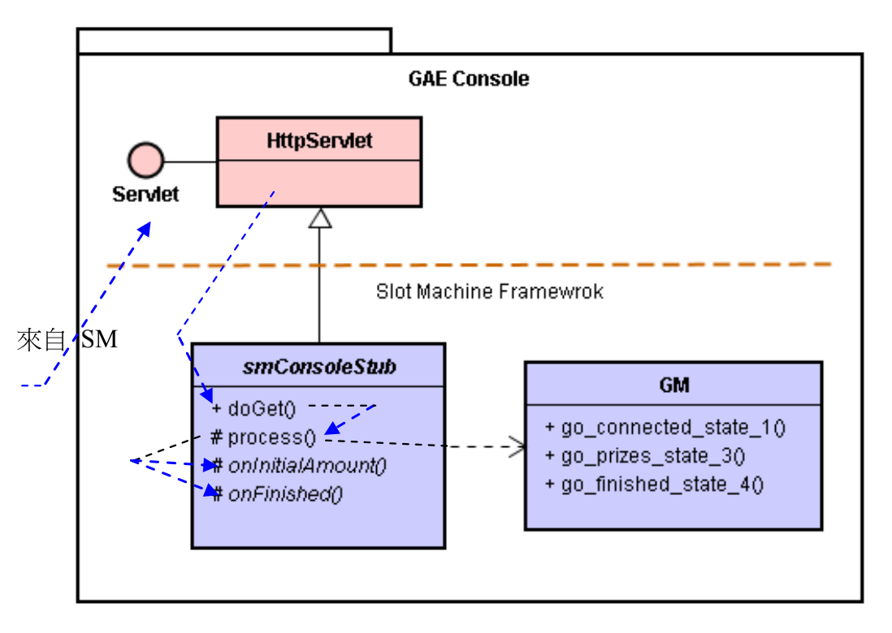

* 此 Stub 类 ( 即 smConsoleStub 类 ) 设计者决定了它与游戏端沟通的讯息格式 (Format)，例如游戏端必须使用 "Init:" 讯息格式、"Bett:" 讯息格式和 "Fini:" 讯息格式。
* 一旦 Stub 类设计者决定了沟通接口，则 App 开发者就遵循这些接口。
* 同时，也决定了它与子类别间的接口，也就是决定了 onInitialAmount() 和 onFinished() 函数的名称及参数格式。例如下图：

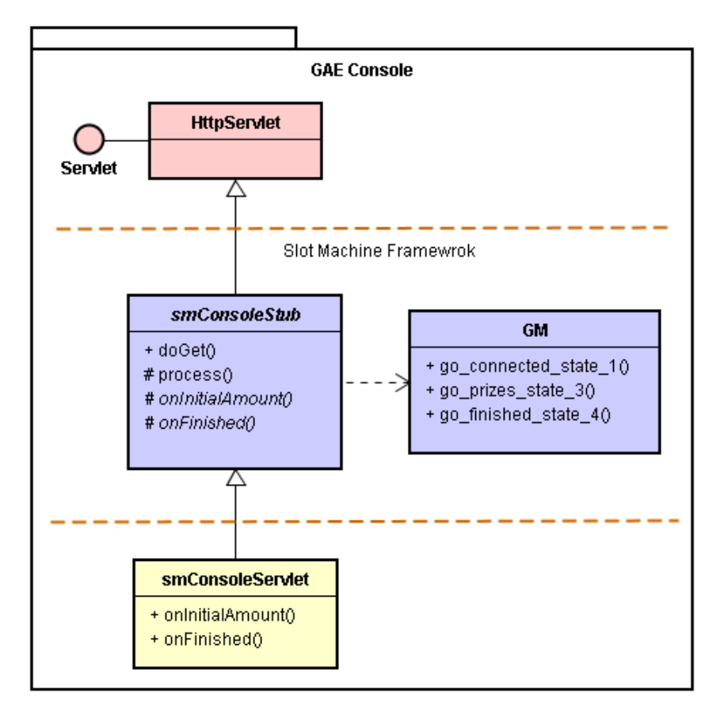

* 其中，smConsoleServlet 子类就遵循 smConsoleStub 类的接口而实作 onInitialAmount() 和 onFinished() 两个抽象函数。


* 这 Stub 部分包含两个类：GM 类和 smConsoleStub 类。

## Stub 范例代码

```java
/*---- GM.java ----*/
package GameFramework;
import java.util.Random;
public class GM {
public String state_var;
public int current_amount = -1;;
public int current_rank = -1;
public Boolean status = null;
public GM() { this.go_state_0(); }
public void go_state_0(){ state_var = "0"; }
public void go_connected_state_1(int amt){
if(! state_var.contains("0")){ 
status = false;
return; 
}
state_var = "1";
current_amount = amt;
this.go_state_2(); 
}
public void go_state_2(){
state_var = "2";
status = true;
}
public void go_prizes_state_3(int amt, int bet){
if(! state_var.contains("2")){ 
status = false; return; }
state_var = "3";
// 計算獎金
RC obj = new RC();
current_rank = obj.getRandomInt(0, 1000);
int prize = current_rank * bet; 
if(prize > 0) amt += bet;
current_amount = amt + prize;
this.go_state_2();
}
public void go_finished_state_4(){
if(! state_var.contains("2")){ 
status = false; return; }
state_var = "4";
this.go_state_2(); 
}
public class RC{ 
public int getRandomInt(int min,int max) { 
try { Thread.sleep(2); 
} catch (InterruptedException ex) { ex.printStackTrace(); } 
Random randomizer =
new Random(System.currentTimeMillis()); 
int k = randomizer.nextInt(max-min+1)+min; 
if(k < 500) return 0; 
if(k<750) return 1; 
if(k<875) return 2; 
if(k<938) return 3; 
if(k<969) return 4;
if(k<984) return 5; 
if(k<994) return 6; 
if(k<1000) return 7;
return 0; } 
}}
```

* 此 RC 类是依据随机值 (Random) 而换算出获奖的奖项 (Rank)，其实各家游戏场都有不一样的奖项决定规则，而且随时都可能更换新的奖项规则。上述 RC 类只是一个简单范例而已。

```java
/*---- smConsoleStub.java ----*/
// ……..
public abstract class smConsoleStub extends HttpServlet { 
private GM gm = null;
private User user = null; 
private String strResult;
protected void doGet( HttpServletRequest req, 
HttpServletResponse resp) 
throws ServletException, IOException { 
UserService userService =
UserServiceFactory.getUserService();
user = userService.getCurrentUser();
gm = new GM(); 
String gm_state = null; 
HttpSession session = req.getSession();
Object obj = session.getAttribute("gmState");
if(obj != null ){
gm_state = (String)obj;
gm.state_var = gm_state; }
String strCode = req.getParameter("code");
String sv1 = req.getParameter("value1");
String sv2 = req.getParameter("value2");
int code = Integer.valueOf(strCode);
if(code == 0) {
process(sv1);
if(gm.status == false) strResult = "Fail:99,99"; }
else strResult = Test(sv1, sv2);
session.setAttribute("gmState", gm.state_var);
resp.setContentType("text/plain");
resp.getWriter().println(strResult);
}
private void process(String msg){
char cmd = msg.charAt(0);
if(cmd == 'I'){ 
gm.go_state_0();
gm.go_connected_state_1(onInitialAmount(user));
String strAmt = String.valueOf(gm.current_amount);
strResult = "Init:" + strAmt + ",99";
}
if(cmd == 'B'){
int idx = msg.indexOf(",");
String str_a = msg.substring(5, idx);
String str_b = msg.substring(idx+1);
int amt = Integer.parseInt(str_a); 
int bet = Integer.parseInt(str_b);
gm.go_prizes_state_3(amt, bet);
String strAmt = String.valueOf(gm.current_amount);
strResult = "Bett:" + strAmt + "," 
+ String.valueOf(gm.current_rank);
}
if(cmd == 'F'){
int idx = msg.indexOf(",");
String str_amt = msg.substring(5, idx);
int amt = Integer.parseInt(str_amt);
boolean ret = onFinished(user, amt);
if(ret){
gm.go_finished_state_4();
strResult = "Fini:99,99"; }
else strResult = "Fail:99,99";
}}
private String Test(String sv1, String sv2) { return "***"; }
abstract protected int onInitialAmount(User user);
abstract protected boolean onFinished( User user,
int final_amount);
}
```

* Android 游戏机端传送 HTTP 讯息给 GAE 云层，就转而調用上述的 doGet() 函数。此时诞生一个 GM 对象，并从 session 取得 "gmState" 的值，并将此值存入 GM 对象里，设定了 GM 对象的状态值。
* 接着，转而調用 process() 函数来解析讯息内容，在依据内容而調用 GM 对象的函数或应用子类的函数，最后回传讯息给游戏机端。
* 架构师的决策：选择另一种 Stub 设计方案。
* 在上述方案一里，Stub 设计师决定了 Android 游戏端与云层之间沟通讯息的格式，而 App 开发者遵循之，而不能制定自己喜欢的讯息格式。
* 如果想让 App 开发者能自行决定上述的讯息格式，就可更改框架设计如下图：

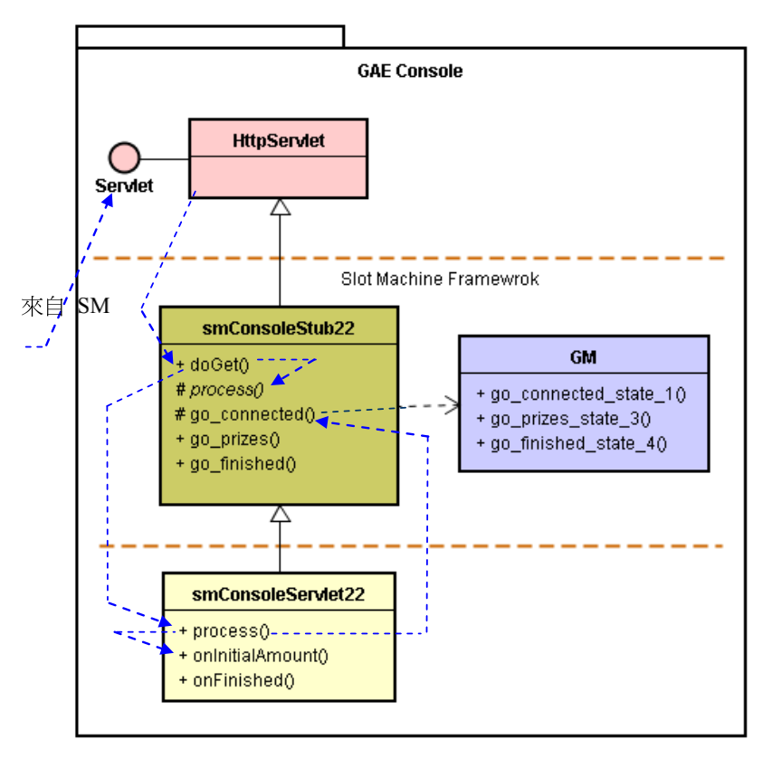

* 在此新方案里，smConsoleStub22 类别的 process() 是抽象函数，让 App 的 smConsoleServlet22 子类来实作之。
* smConsoleStub22 类别只是将讯息转达给 App 子类 smConsoleServlet22 而已，并不决定讯息格式，也不解析讯息。
* 而是由 smConsoleServlet22 子类的 process() 函数来解析讯息。
* 由于 Android 游戏端的 ac01 类和 GAE 云的 smConsoleServlet22 子类都属于 App，由 ac01 类与 smConsoleServlet22 子类之间的沟通讯息格式，是 App 开发者可以自订了。
* Android 游戏机端传送 HTTP 讯息给 GAE 云层，就转而呼叫上述的 doGet() 函数。此时诞生一个 GM 对象，并从 session 取得 “gmState” 的值，并将此值存入 GM 对象里，设定了 GM 对象的状态值。
* 接着，转而呼叫 process() 函数来解析讯息内容。
* process() 函数解析到 Android 游戏端传来 “Init:” 讯息时，就先呼叫 smConsoleStub22 的 onInitialAmount() 去 DB 里读取玩家的余额，然后呼叫父类 smConsoleStub22 的 go_connected() 函数，转而呼叫 GM 的 go_connected_state_1() 而将余额传送给 GM。 
* 随后，将余额回传给 Android 游戏端，显示于画面上。

## 结语

* 以上 Stub 小框架里的 GM 类是 < 壁虎 Body >， 而 smConsoleStub 类是 < 壁虎 Tail >；可以展现弃尾求生的效果，所以是一种跨 ( 云 ) 平台的架构设计模式。

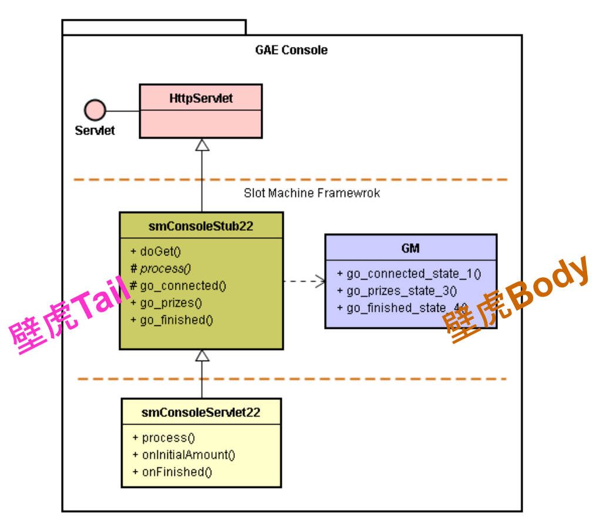