# 观摩：ContentProvider 架构与 DB 引擎移植方法

# 1. 如何保护 DB 引擎的变动自由度？

## 前言

* 复习：主动型 vs 被动型 API

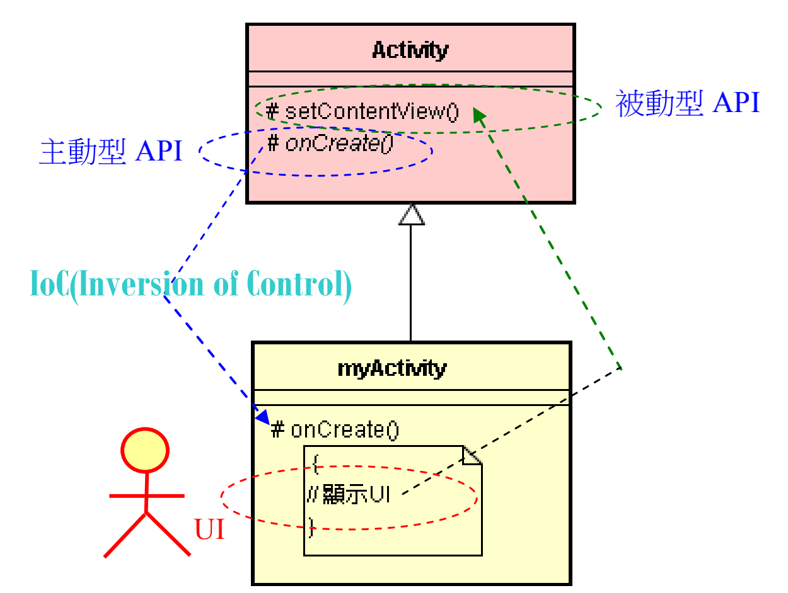

## API 的分类

* API 这个名词，有 3 个密切关联的动词：
  * 定义(Define)
  * 实作(Implement)
  * 呼叫(Invoke or Call)
* 根据这 3 个角度，可将 API 区分为「 主动型 」与「 被动型 」两种。 

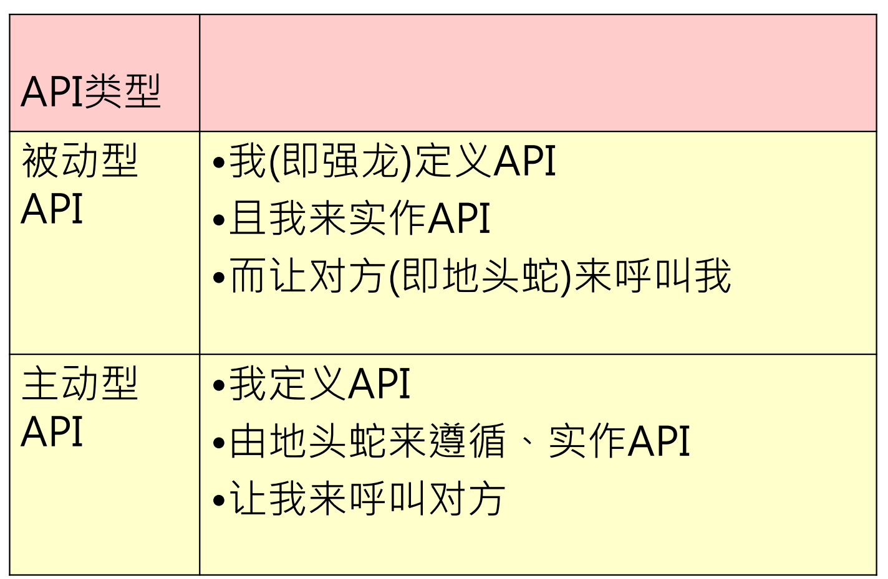

## 保护 DB 引擎的变动自由度

* 毫无保护的情形：让各 Client 毫无限制地使用 DB 引擎的接口。
* 这种接口，就 DB 引擎而言，都属于被动型 API，受制各 Client 端，严重伤害 DB 引擎的变动自由度，局限了 DB 引擎的成长空间。


* 最常见的对策就是：DB 引擎开发者自己定义一个 < 接口类 >，提供一个对外的接口，隐藏了 DB 引擎本身的接口。

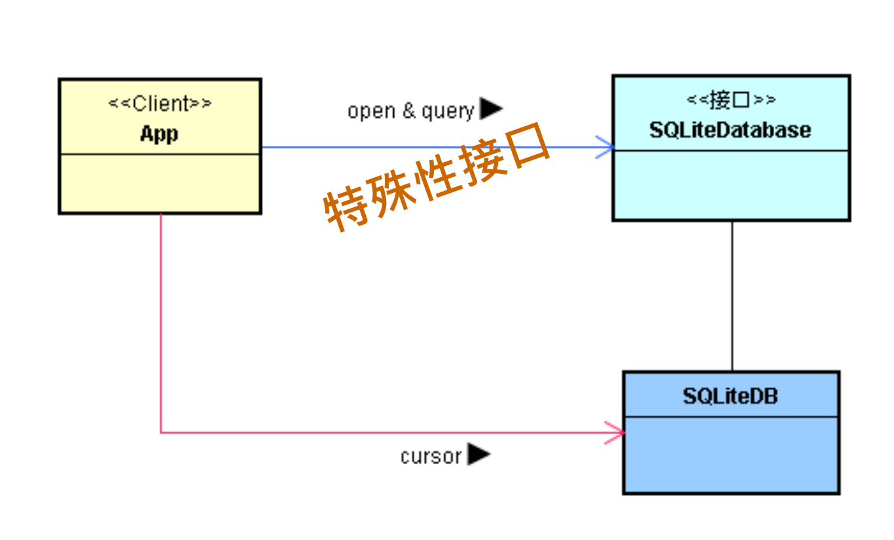

* 然而，这个 < 接口类 > 属于特殊性接口，不同 DB 引擎的厂商，都有专属的 < 接口类 >；所以不是各 DB 引擎都适合的通用性接口。
* 比較美好的絕對策是：提供通用性接口給 Client 端。

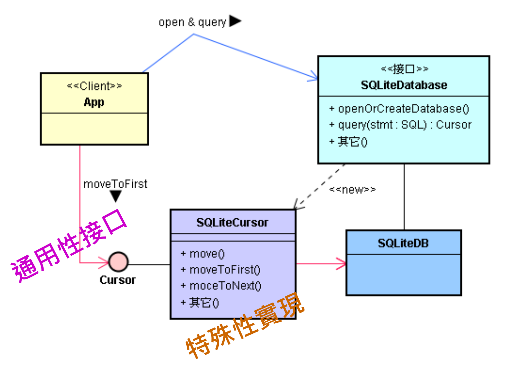

* 上图解决了一半的设计问题，对于 ” open & query ” 的交互，还是透过特殊性接口。即使再增添一个 DataPersist 类 (如下图)，仍然是一样的问题。

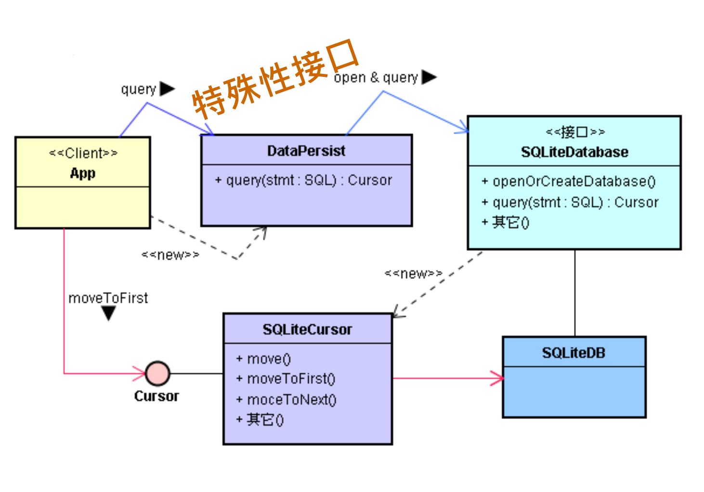

* 解决之道是：让特殊性的 DataPersist 类，来实践一个通用性的 <E&I>。Android 提供一个 ContentProvider 基类，就是这个通用性 <E&I> 角色。

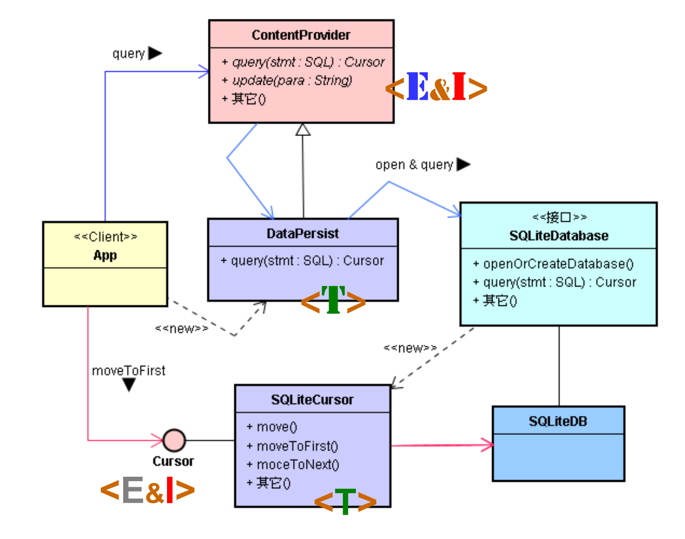

# 2. 从 Cursor 接口谈起

* 在 Android 里定义了一个 Cursor 接口，让 App ( 如 Activity 或 Service 等 ) 能透过此 Cursor 接口来浏览 DB 里的各笔数据或内容。

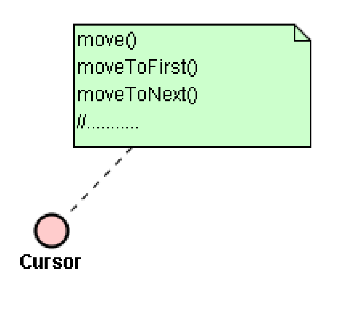

* 如果搭配 SQLite ( 数据库 ) 引擎的话，就可设计一个类来实现这 Cursor 接口。其实，Android 里已经撰写了这个实现类，名叫：SQLiteCursor。
* 于是，Cursor 成为 Client 端浏览 SQLite 数据库内容的标准接口了。

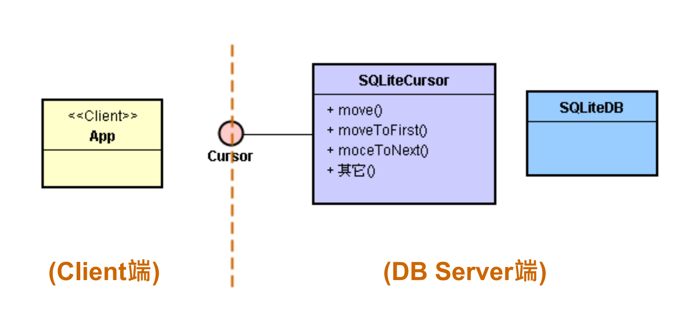

# 3. 通用性接口 Cursor 的使用规范

## 范例架构

* 取得 Cursor 接口

* 撰写一个 DataPersist 类，来开启 DB，并提供 query() 函数；在执行 query() 时就创建一个 SQLiteCursor 对象，将其 Cursor 接口回传给 Client 端。

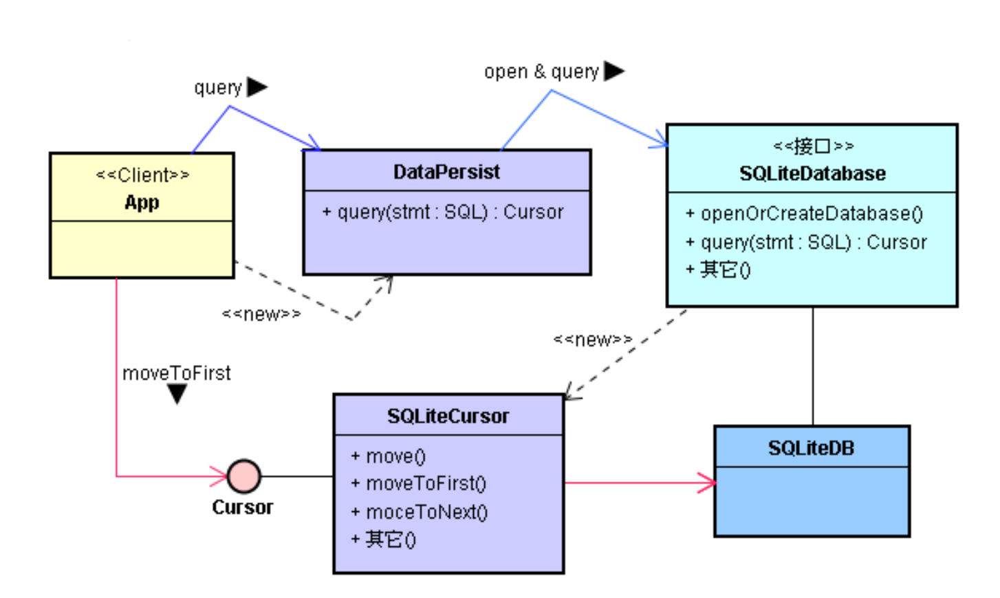

* 使用 Cursor 接口
* 接下来，只要调用 Cursor 接口的函数，就能浏览 DB 里的内容了。

## 范例代码

* 由于 Android 平台里已经有了 SQLite 引擎了，而且已经写好了 SQLiteCursor 实现类。因此在这范例里，我们只需要 DataPersist 类和 Activity 的子类，就行了。

* DataPersist.java 代码

```java
/* ----- DataPersist.java ------*/
// ………
public class DataPersist {
private static final String DATABASE_NAME = "StudDB";
private static final String TABLE_NAME = "Student";
private final int DB_MODE = Context.MODE_PRIVATE;
private SQLiteDatabase db=null;
public DataPersist(Context ctx) {
try { db = ctx.openOrCreateDatabase(DATABASE_NAME, 
DB_MODE, null); }
catch (Exception e) { Log.e("ERROR", e.toString()); return; }
try {
db.execSQL("drop table "+ TABLE_NAME); }
catch (Exception e) { Log.e("ERROR", e.toString()); }
db.execSQL("CREATE TABLE " + TABLE_NAME + " (" +
"stud_no" + " TEXT," + "stud_name" + " TEXT" + ");");
String sql_1 = "insert into "+ TABLE_NAME + 
" (stud_no, stud_name) values('S101', 'Lily');";
String sql_2 = "insert into " + TABLE_NAME + 
" (stud_no, stud_name) values('S102', 'Linda');";
String sql_3 = "insert into " + TABLE_NAME + 
" (stud_no, stud_name) values('S103', 'Bruce');";
try { db.execSQL(sql_1); db.execSQL(sql_2); 
db.execSQL(sql_3); }
catch (SQLException e)
{ Log.e("ERROR", e.toString()); return; }
}
public Cursor query(String[] projection, String selection, String[] 
selectionArgs, String sortOrder) {
Cursor cur = db.query(TABLE_NAME, projection, null, null, 
null, null, null);
return cur;
}
public void close(){ db.close(); }
}
```

* ac01.java 代码

```java
/* ----- ac01.java ------*/
// …….
public class ac01 extends ListActivity {
private static final String[] PROJECTION = 
new String[] { "stud_no", "stud_name" };
@Override protected void onCreate(Bundle 
savedInstanceState) {
super.onCreate(savedInstanceState);
DataPersist dp = new DataPersist(this);
Cursor cur = dp.query(PROJECTION, null, null, null);
ArrayList<Map<String, Object>> coll = 
new ArrayList<Map<String, Object>>();
Map<String, Object> item; 
cur.moveToFirst();
while(!cur.isAfterLast()) {
item = new HashMap<String, Object>();
item.put("c1", cur.getString(0) + ", " + cur.getString(1));
coll.add(item);
cur.moveToNext();
}
dp.close();
this.setListAdapter(new SimpleAdapter(this, coll,
android.R.layout.simple_list_item_1, new String[] { "c1" },
new int[] {android.R.id.text1}));
}
@Override
protected void onListItemClick(ListView l, View v, 
int position, long id) {
finish();
}}
```

* 指令：

```java
DataPersist dp = new DataPersist(this);
```

* 此时，诞生一个 DataPersist 对象；并开启了 DB。然后执行指令：

```java
Cursor cur = dp.query(PROJECTION, null, null, null);
```

* 这查询出某些数据，创建 Cursor 对象，并回传之。

# 4. 通用性基类 ContentProvider 的使用范例

* 刚才的范例里，我们直接使用 DataPersist 类的接口来与 SQLite 沟通。
* 本节将替 DataPersist 配上 ContentProvider 基类，让 Client 能透过 ContentProvider 新接口来沟通。

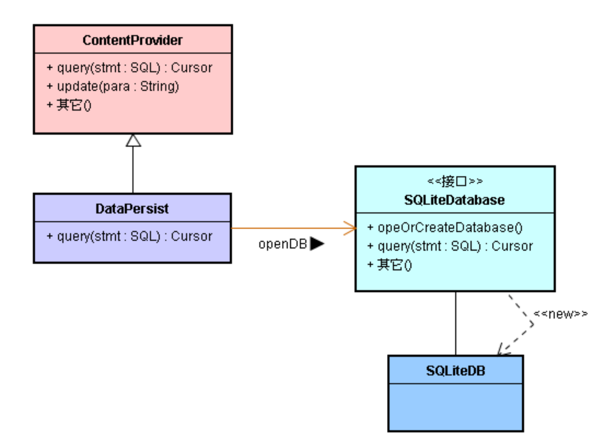

* ContentProvider 定义了多个函数，包括
  * query() 函数 -- 它查询出合乎某条件的数据。
  *  insert() 函数 -- 它将存入一笔新资料。
  * delete() 函数 -- 它删除合乎某条件的资料。
  * update() 函数 -- 更新某些笔数据的内容。
* DataPersist 类实现 query() 接口，实际呼叫 SQLite 数据库的功能。
* 也就是说，Client 程序透过 ContentProvider 接口间接呼叫到 DataPersist 的 query() 函数，然后此 query() 函数才去查询 SQLite 的 DB 内容。
* 查询出来，就诞生一个 SQLiteCursor 对象，并回传 Cursor 接口 。
* 让 Client 程序可藉由 Cursor 接口来浏览所查询出来的各笔数据。

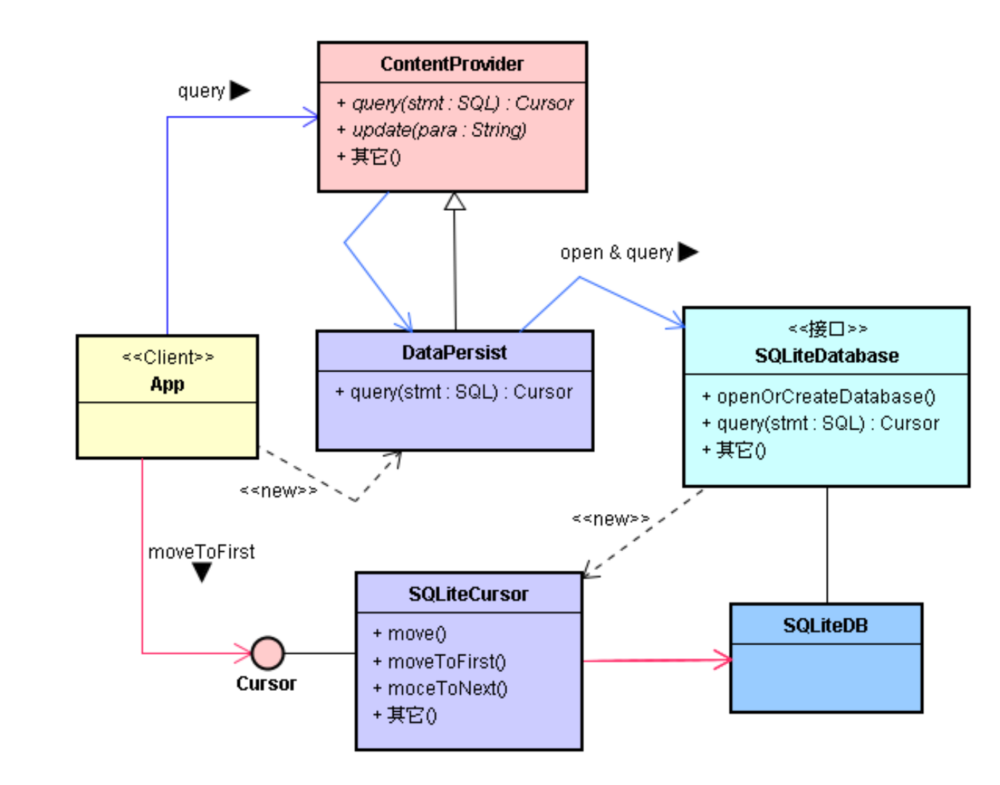

## 进一步优化架构设计

### 从 DB 引擎供应商的视角看

* 在上述的范例中，是由 DataPersist 类去开启和调用 DB 引擎的。

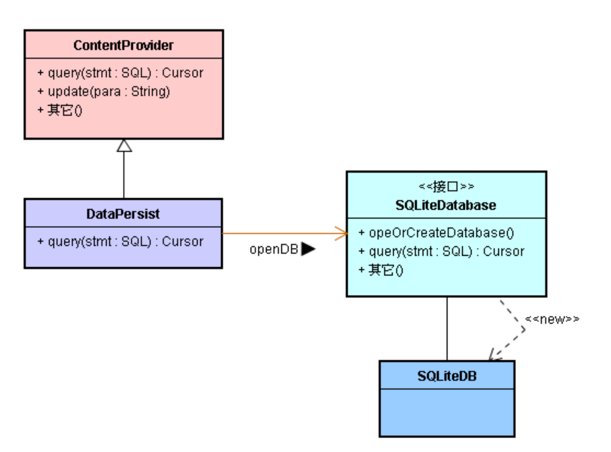

* 仅仅提供 DB 引擎的接口，还是不够的。因为这个 SQLiteDatabase 接口还是被 DataPersist 所调用的，尤其是 DB 引擎的开起任务。因而，DB 引擎厂商提供接口，只是属于被动型 API 而已。
* 于是，可擅用 EIT 造形来提供主动型 API。
* 在 Android 里，这 EIT 造形的实现类别如下图所示。
* SQLiteOpenHelper 类就是 \<E> 角色；而 onCreate() 就是 \<I> 角色，提供了强势的主动型 API。这对 DB 引擎厂商是有利的，因为 SQLiteOpenHelper 类有效保护了 DB 引擎的变动自由度；让 DB 引擎厂商能够实现 ” 没钱就改版、改版就有钱 ” 的商业策略。

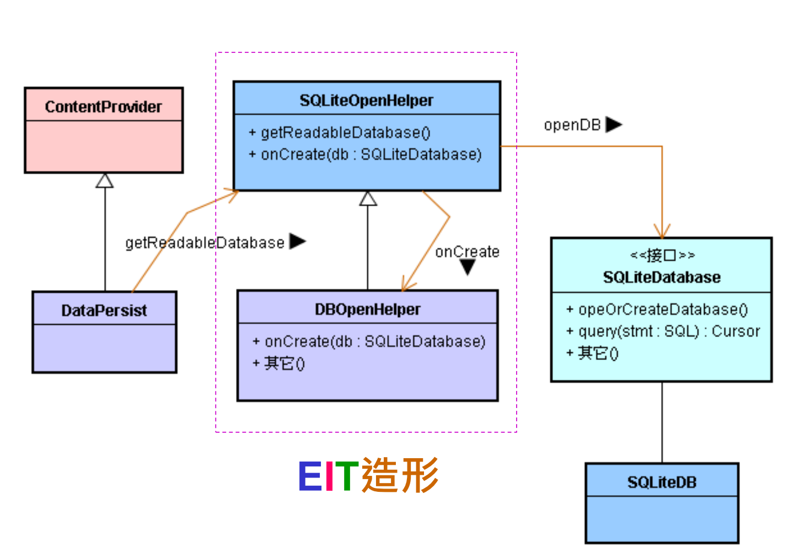

* EIT 造形只是在于实现主动型 API 和创造底层 ( 如 DB 引擎 ) 变动的自由度而已；它并没有改变 DB 数据的流动路径，所以没有降低数据的存取效率。

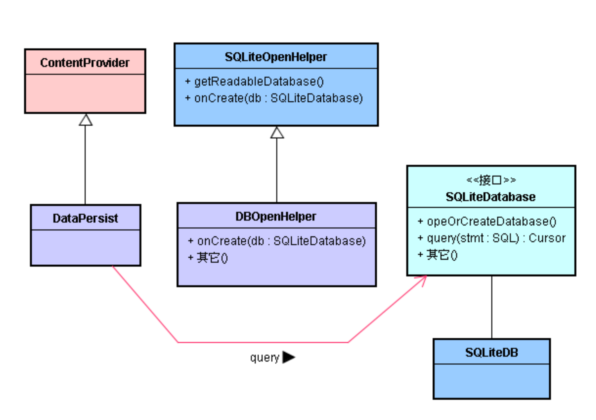

* SQLiteDatabase 接口类开启 DB，并提供 query() 函数；在执行 query() 时就创建一个 SQLiteCursor 对象，将其 Cursor 接口回传给 Client 端。

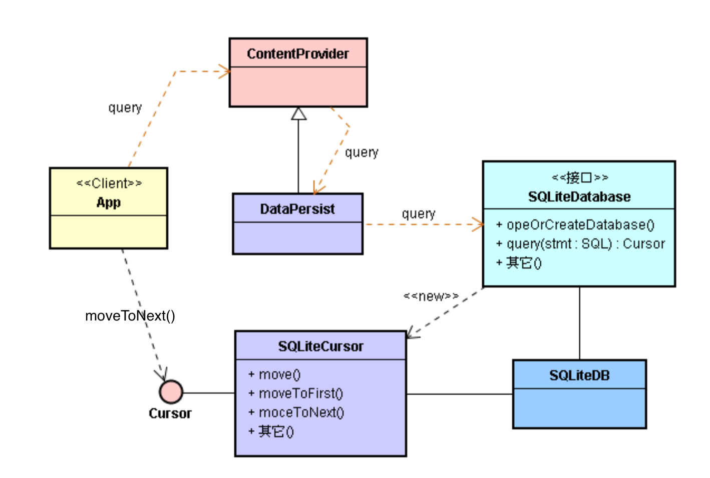

* Client 程序藉由 Cursor 接口来浏览所查询出来的各笔数据。
* 这也就是目前 Android 在 ContentProvider 和 DB 引擎的整合架构设计了。

## 范例代码

### 撰写 DataPersist 类代码

```java
// DataPersist.java 
// …….
public class DataPersist extends ContentProvider {
  private static final String DATABASE_NAME = "StudNewDB";
  private static final int DATABASE_VERSION = 2;
  private static final String TABLE_NAME = "StudTable";
  
  private static class DatabaseHelper extends SQLiteOpenHelper {
    DatabaseHelper(Context context) {
      super( context, DATABASE_NAME, null, DATABASE_VERSION); 
    }
    
    @Override 
    public void onCreate(SQLiteDatabase db) {
      db.execSQL("CREATE TABLE " +TABLE_NAME+" (" +"stud_no"
                 + " TEXT," + "stud_name" + " TEXT" + ");");
      String sql_1 = "insert into " + TABLE_NAME
        + " (stud_no, stud_name) values('S1001', 'Pam');";
      String sql_2 = "insert into " + TABLE_NAME
        + " (stud_no, stud_name) values('S1002', 'Steve');";
      String sql_3 = "insert into " + TABLE_NAME
        + " (stud_no, stud_name) values('S1003', 'John');";
      try { 
        db.execSQL(sql_1); 
        db.execSQL(sql_2); 
        db.execSQL(sql_3);
      } catch (SQLException e) { 
        Log.e("ERROR", e.toString()); 
      }
    }

    @Override
    public void onUpgrade(SQLiteDatabase db, int oldVersion, int newVersion) {
      
    }
  }
  
  @Override 
  public boolean onCreate() {
    mOpenHelper = new DatabaseHelper(getContext()); 
    return true; 
  }
  
  @Override 
  public Cursor query(Uri uri, String[] projection, String selection, 
                                String[] selectionArgs, String sortOrder) {
    SQLiteDatabase db = mOpenHelper.getReadableDatabase();
    Cursor c = db.query(TABLE_NAME, projection, null, null, 
                        null, null, null);
    return c; 
  }

  @Override 
  public String getType(Uri uri) { 
    return null; 
  }
  
  @Override 
  public Uri insert(Uri uri, ContentValues initialValues) { 
    return uri; 
  }

  @Override 
  public int delete(Uri uri, String where, String[] whereArgs) {
    return 0; 
  }
  
  @Override 
  public int update(Uri uri, ContentValues values,
                    String where, String[] whereArgs) { 
    return 0; 
  }
}
```

### 撰写 Activity 代码

```java
// ac01.java
// …….
public class ac01 extends ListActivity {
  public static int g_variable;
  public static final String AUTHORITY = "com.misoo.provider.rx09-02";
  public static final Uri CONTENT_URI =
    Uri.parse("content://" + AUTHORITY + "/Student");
  private static final String[] PROJECTION = new String[]{ "stud_no", "stud_name"};

  @Override 
  protected void onCreate(Bundle savedInstanceState) {
    super.onCreate(savedInstanceState);
    Intent intent = getIntent();
    if (intent.getData() == null) intent.setData(CONTENT_URI);
    Cursor cur = getContentResolver().query(getIntent().getData(),
                                            PROJECTION, null, null, null);
    ArrayList<Map<String, Object>> coll = new ArrayList<Map<String, Object>>();
    Map<String, Object> item;
    cur.moveToFirst();
    while (!cur.isAfterLast()) {
      item = new HashMap<String, Object>();
      item.put("c1", cur.getString(0) + ", " + cur.getString(1));
      coll.add(item);
      cur.moveToNext(); 
      this.setListAdapter(new SimpleAdapter(this, coll,android.R.layout.simple_list_item_1, 
                                            new String[] { "c1" }, new int[] { android.R.id.text1 }));
    }

    @Override
    protected void onListItemClick(ListView l, View v, int position, long id) {
      finish();
    }
}
```

# 5. 展现 DB 引擎的变化自由度：以 Linter 引擎的移植为例

* 在上一个范例里，Client 使用 ContentProvider 接口与 SQLite DB 引擎銜接。

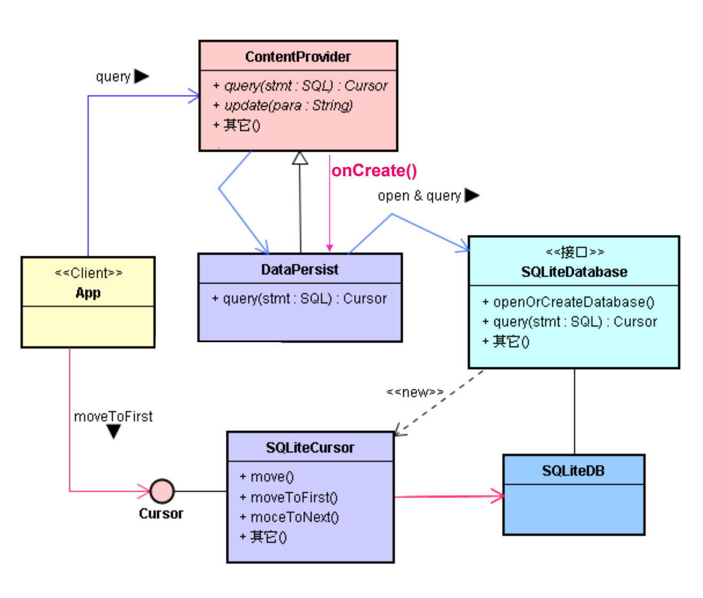

* DataPersist 对象是由 Android 框架所创建的。
* 之后，Client 就调用 getContentResolver() 函数来要求 Android 框架去进行配对和绑定此 DataPersist 对象。然后间接绑定了 Linter DB 引擎。
* 此 ContentProvider 接口与特定 DB 引擎是无关的，可以让 Client 与 DB 引擎互为独立。非常有助于双方的独立成长，或各自的版本更新，甚至新 DB 引擎的移植。
* 例如，我们先将 Linter DB 引擎安装到 Android 的 Linux 环境里，并建立 JDBC 存取通道；接着就我们能轻易地将 Linter 引擎整合到 ContentProvider 框架里。
* 这包含了 3 个类：
  1.  LinterPersist 类
  2. LinterCursor 类
  3. DispActivity 类
* LinterPersist 类实现 query() 接口，实际呼叫 Linter 数据库的功能。
* 也就是说，DispActivity 透过 ContentProvider 接口呼叫到 LinterPersist 的 query() 函数。
* 此时创建一个 LinterCursor 对象，将其 Cursor 接口回传给 DispActivity 。 

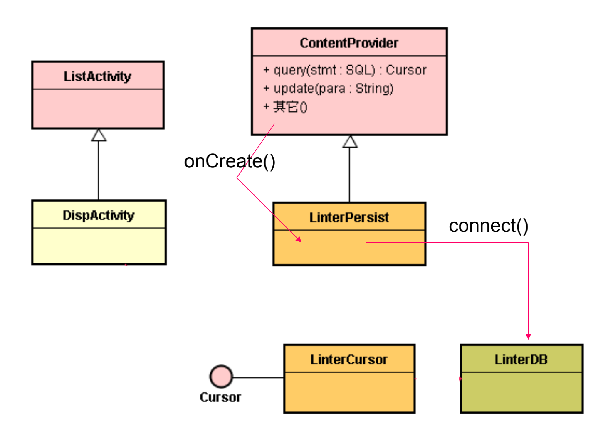

* 此 LinterPersist 对象是由 Android 框架所创建的。
* 之后，Client 就调用 getContentResolver() 函数来要求 Android 框架去进行配对和绑定此 LinterPersist 对象。然后间接绑定了 Linter DB 引擎。

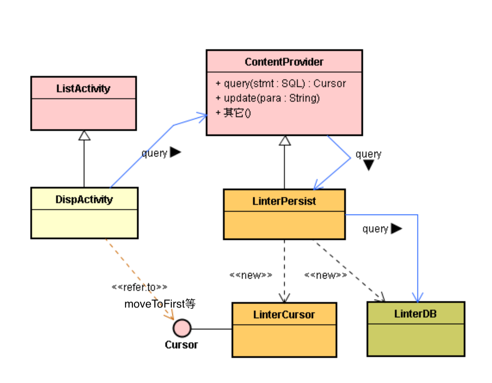

## Linter + Android 范例代码

* 于此，我们需要撰写 3 个类：
  *  LinterPersist 类
  * LinterCursor 类
  * DispActivity 类

### 撰写 LinterPersist 类代码

```java
/* ----- LinterPersist.java 程序代码 ------*/
// ……..
public class LinterPersist extends ContentProvider {
private static final String LINTER_TABLE_NAME
= "Student123";
private Connection con;
@Override public boolean onCreate() {
try {
Class.forName("com.relx.jdbc.LinterDriver").newInstance();
con = DriverManager.getConnection(
"jdbc:Linter:linapid:localhost:1070:local", "SYSTEM",
"MANAGER");
} catch(Exception e) { Log.e("Conn failed", e.toString());}
return false; }
try{ Statement stmt = con.createStatement();
stmt.executeUpdate("drop table " + 
LINTER_TABLE_NAME);
} catch (Exception e)
{ Log.e("drop table failed", e.toString()); }
try { Statement stmt = con.createStatement();
stmt.executeUpdate( "create table " + 
LINTER_TABLE_NAME + " (stud_no char(10),
stud_name char(20));");
PreparedStatement prepstmt1 = con.prepareStatement(
"insert into " + LINTER_TABLE_NAME + " values (?,?);");
prepstmt1.setString(1, "linter_5"); prepstmt1.setString(2, "Lisa");
prepstmt1.executeUpdate();
prepstmt1.setString(1, "linter_8"); prepstmt1.setString(2, "Kitty");
prepstmt1.executeUpdate( );
} catch (Exception e){ Log.e("create/insert table failed", 
e.toString());
return false; }
return true;
}
@Override public Cursor query(Uri uri, String[] 
projection, String selection,
String[] selectionArgs, String sortOrder) {
ResultSet rs = null;
try { Statement stmt = con.createStatement();
rs = stmt.executeQuery("select * from " + 
LINTER_TABLE_NAME);
} catch (Exception e) { e.printStackTrace(); 
return null; }
Cursor c = new LinterCursor(rs, con);
return c;
}
@Override public String getType(Uri uri) {
return null; 
}
@Override public Uri insert(Uri uri, ContentValues initialValues) {
String field_1 = initialValues.get("stud_no").toString();
String field_2 = initialValues.get("stud_name").toString();
try{ PreparedStatement prepstmt1 = con.prepareStatement(
"insert into " + LINTER_TABLE_NAME + " values (?,?);");
prepstmt1.setString(1, field_1); 
prepstmt1.setString(2, field_2);
prepstmt1.executeUpdate();
} catch (Exception e) { Log.e("ERROR", e.toString()); }
return uri;
}
@Override public int delete(Uri uri, String where, String[] 
whereArgs) { return 0; }
@Override public int update(Uri uri, ContentValues values, String 
where,String[] whereArgs) { return 0; }
```

### 撰写 LinterCursor 类代码

```java
//----------------- 定义LinterCursor 类 -----------------------------------
class LinterCursor implements Cursor{
ResultSet res; Connection conn;
LinterCursor( ResultSet rs, Connection con) 
{ res = rs; conn = con; }
@Override public void close() {
try { res.close(); conn.close();
} catch (java.sql.SQLException e) { e.printStackTrace(); } }
@Override
public void copyStringToBuffer(int columnIndex, 
CharArrayBuffer buffer) {}
@Override public void deactivate() {}
@Override public byte[] getBlob(int columnIndex) { return null; }
@Override public int getColumnCount() { return 0; }
@Override public int getColumnIndex(String columnName)
{ return 0; }
@Override
public int getColumnIndexOrThrow(String columnName)
throws IllegalArgumentException { return 0; }
@Override public String getColumnName(int columnIndex)
{ return null; }
@Override public String[] getColumnNames() { return null; }
@Override public int getCount() { return 0; }
@Override public double getDouble(int columnIndex) 
{ return 0; }
@Override public Bundle getExtras() { return null; }
@Override public float getFloat(int columnIndex) { return 0; }
@Override public int getInt(int columnIndex) { return 0; }
@Override public long getLong(int columnIndex) { return 0; }
@Override public int getPosition() { return 0; }
@Override public short getShort(int columnIndex) { return 0; }
@Override public String getString(int columnIndex) {
try { return res.getString(columnIndex + 1);
} catch (java.sql.SQLException e) { e.printStackTrace(); }
return null; }
@Override public boolean getWantsAllOnMoveCalls()
{ return false; }
@Override public boolean isAfterLast() {
try { return res.isAfterLast();
} catch (java.sql.SQLException e) 
{ e.printStackTrace(); return false; }}
@Override public boolean isBeforeFirst() {
try { return res.isBeforeFirst();
} catch (java.sql.SQLException e) 
{ e.printStackTrace(); return false; }}
@Override public boolean isClosed() { return false; }
@Override public boolean isFirst() { return false; }
@Override public boolean isLast() {return false; }
@Override public boolean isNull(int columnIndex) { return false; }
@Override public boolean move(int offset) { return false; }
@Override public boolean moveToFirst() {
try { return res.first();
} catch (java.sql.SQLException e)
{ e.printStackTrace(); return false; }}
@Override public boolean moveToLast() { return false; }
@Override public boolean moveToNext() {
try { return res.next();
} catch (java.sql.SQLException e) 
{e.printStackTrace(); return false; }}
@Override public boolean moveToPosition(int position)
{ return false; }
@Override public boolean moveToPrevious() { return false; }
@Override public void registerContentObserver(
ContentObserver observer) {}
@Override public void registerDataSetObserver(
DataSetObserver observer) {}
@Override public boolean requery() { return false; }
@Override public Bundle respond(Bundle extras) { return null; }
@Override public void setNotificationUri(
ContentResolver cr, Uri uri) {}
@Override public void unregisterContentObserver(
ContentObserver observer) {}
@Override public void unregisterDataSetObserver(
DataSetObserver observer) {}
}}
```

* LinterPersist 类里的指令：

```java
@Override public Cursor query(Uri uri, String[] projection, 
String selection, String[] selectionArgs, String sortOrder) 
{
ResultSet rs = null;
try { Statement stmt = con.createStatement();
rs = stmt.executeQuery("select * from " + 
LINTER_TABLE_NAME);
} catch (Exception e)
{ e.printStackTrace(); return null; }
Cursor c = new LinterCursor(rs, con);
return c;
}
```

* 此函数呼叫了 Linter 的 executeQuery() 函数，要求 Linter 进行数据库的查询任务。Linter 回传一个 ResultSet 对象，让应用程序可浏览所查询到的各笔数据。在这 query() 函数里，就诞生一个 LinterCursor 对象，让它内含该 ResultSet 对象，然后将此 LinterCursor 对象回传给 DispActivity 应用类。
* 于是，顺利地将 Linter 数据库配上 ContentProvider 接口，飞上枝头变凤凰，成为 Android 嫡系成员。
* 终于完成我们的目：让远从万里之外的 Linter 舶来组件，顺利融入 ( 移植到 ) Android 之中，成为其嫡系成员之一。

### 撰写 DispActivity

```java
/* ----- DispActivity.java -----*/
// …………
public class DispActivity extends ListActivity {
public static final String AUTHORITY
= "com.misoo.provider.rx09-04";
public static final Uri CONTENT_URI
= Uri.parse("content://" + AUTHORITY + /"/Stud202");
private static final String[] PROJECTION
= new String[] { "stud_no", "stud_name" };
@Override protected void onCreate(Bundle savedInstanceState) {
super.onCreate(savedInstanceState);
Intent intent = getIntent();
if (intent.getData() == null) { intent.setData(CONTENT_URI); }
Cursor cursor = getContentResolver().query(
getIntent().getData(),PROJECTION, null, null, null);
if(cursor == null) return;
ArrayList<Map<String, Object>> coll
= new ArrayList<Map<String, Object>>();
Map<String, Object> item;
cursor.moveToFirst();
while (!cursor.isAfterLast()) {
item = new HashMap<String, Object>();
item.put("c1", cursor.getString(0) + ", " +
cursor.getString(1));
coll.add(item);
cursor.moveToNext();
}
this.setListAdapter(new SimpleAdapter(this, coll,
android.R.layout.simple_list_item_1, new String[] { "c1" },
new int[] {android.R.id.text1}));
}
@Override
protected void onListItemClick(ListView l, View v, int position, 
long id)
{ finish(); }
}
```

* 指令

```java
Cursor cursor = getContentResolver().query(
getIntent().getData(),PROJECTION, null, null, null);
```

* 透过 getContentResolver() 而要求 Android 寻找适当的 ContentProvider 实作类 ( 如本范例的 LinterPersist )，并呼叫其 query() 函 数，以进行数据查询的任务。
* 其查询出多笔的数据，查询之后，它会传回数据指针值 (Record pointer) 给 LinterCursor，并将 LinterCursor 的 Cursor 接口回传给 DispActivity 程序。
* 由于在 LinterPersist 类里，我们定义了一个 LinterCursor 类，所以这指令所传回来的 cursor 是参考 (Reference) 到 LinterCursor 对象。
* 我们把原来的 Cursor 实作类抽换掉了，换为新的 LinterCursor 类，这些应用类 ( 如 DispActivity 等 ) 则丝毫不受影响，表现出高度的抽换性。
* 接下来，DispActivity 只要调用 Cursor 接口的函数，就能浏览 Linter DB 里的内容了。
* 例如指令：

```java
cursor.moveToFirst();
```

* 就将 DB 的数据指针值 (Record pointer) 移到最前头。

* 也能提供 Linter DB 特殊性的 Helper EIT。

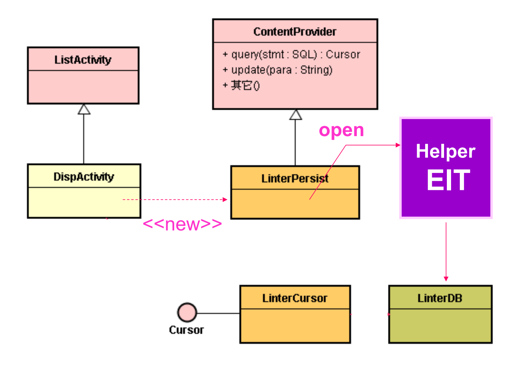


