# 观摩：WebView 的 PhoneGap 小框架设计

# 1. PhoneGap 小框架的特殊意义

* 前面谈过的 ListView 框架、SQLite DB 框架、HAL 驱动框架等都是属于 Android 提供的小框架，也都位于 App 层 ( 应用框架 ) 之内。 
* PhoneGap 框架则是位于 App 层之外，而且不是由 Google 提供的。

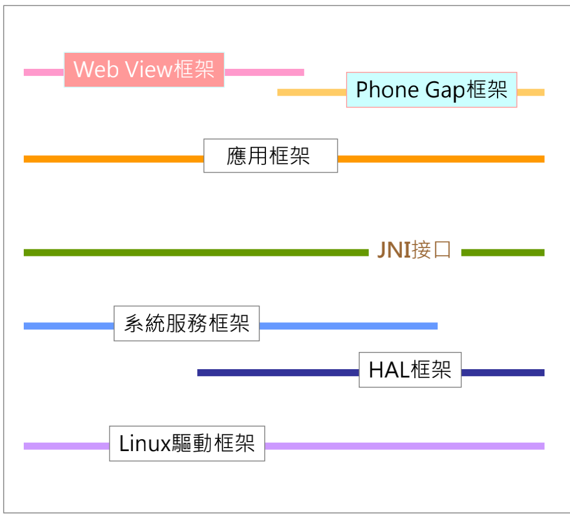

* 此外，PhoneGap 不仅仅有 Android 版本，还有 iOS 等其它平台的版本，能够支持跨 OS 平台的 HTML5 应用开发。

## PhoneGap 与插件

* PhoneGap 管理一些以 Java 撰写的插件 (Plug-in)，让 WebView (  含幕后的 WebKit 引擎 ) 在执行 HTML5 和 JS ( 即 JavaScript ) 时，能够很方便地调用这些插件。

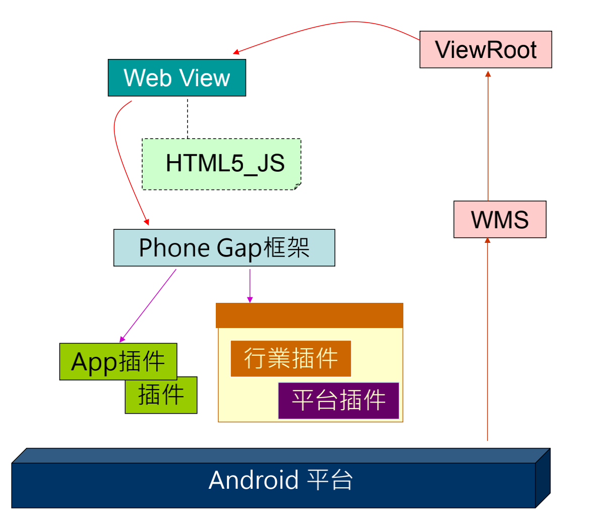

* HTML 或 HTML5 主要用来设定 UI 画面 ( 或页面 ) 的布局 (Layout)，画面展现出来，让用户来操作画面，触发事件(Event)。WebView ( 含 WebKit ) 会去执行 JS ( 即 JavaScript ) 的函数代码，来处理这些事件。在执行 JS 代码时，可以转而调用 PhoneGap 里的 Java 插件。
* PhoneGap 是开源的小框架，可以加上新创意而进行重构。

* 虽然 PhoneGap 官方版本都是紧密搭配 WebView 和 HTML5 的。
* 然而，PhoneGap 框架本身是开源 (open source) 软件，有些公司基于 GPL 协议，将它重构而发展出更多形式。 

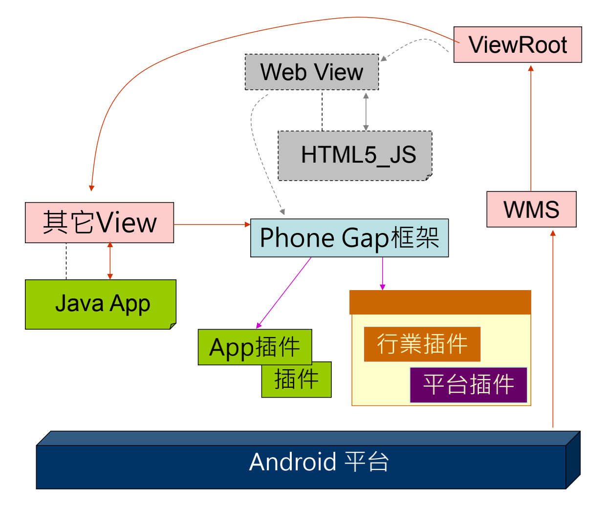

* 例如 ，这项创意性重构之后 ，除了 WebView 之外，Android 传统 App 的其它 View ( 如 TextView、Button 等 ) ，也一样能调用 PhoneGap 的插件。

## 如何设计 PhoneGap 框架？

* PhoneGap 的主要任务：
* 管理 Java 插件，让 WebView 执行 JS 函数时来调用这些插件。
* 那么，这 PhoneGap 小框架又是如何设计的呢?

# 2. 从 WebView 说起

## WebView

*  Android 的 View 类别体系里，定义了各式各样的子类别，包括 TextView、Button、SurfaceView 和 WebView 等。
* 其中的 WebView 是给浏览器 ( 如 WebKit ) 用来呈现网页画面的。而画面布局 (Layout) 是由 HTML ( 含 HTML5 ) 来规范的。

## 先看大家熟悉的代码

* 例如，一般的语言表达 Android 的 WebView 的一段 JavaScript 语言：

```javascript
// show.html (JavaScript代碼)
<input type=”button” value=”Say hello”
onClick=”jsShow(‘Hello Android!’)” />
<script type=”text/javascript”>
function jsShow(str) {
IComponent.show(str);
}
</script>
```

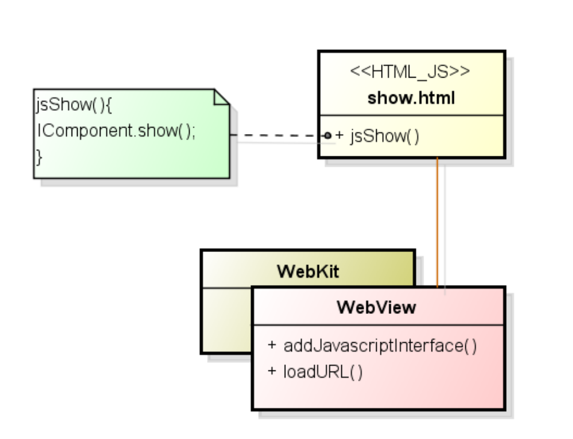

* 当 WebView ( 含幕后的 Webkit ) 执行到 jsShow() 的指令：

```javascript
IComponent.show(str);
```

* 就会去调用 Java 插件(类)里的函数代码。

```java
// myComponent.java
public class myComponent{
	Context mContext;
	
  myComponent(Context c) {
		mContext = c;
	}

  public void show(String str) {
		Toast.makeText(mContext, str, 
		Toast.LENGTH_SHORT).show();
  } 
}
```

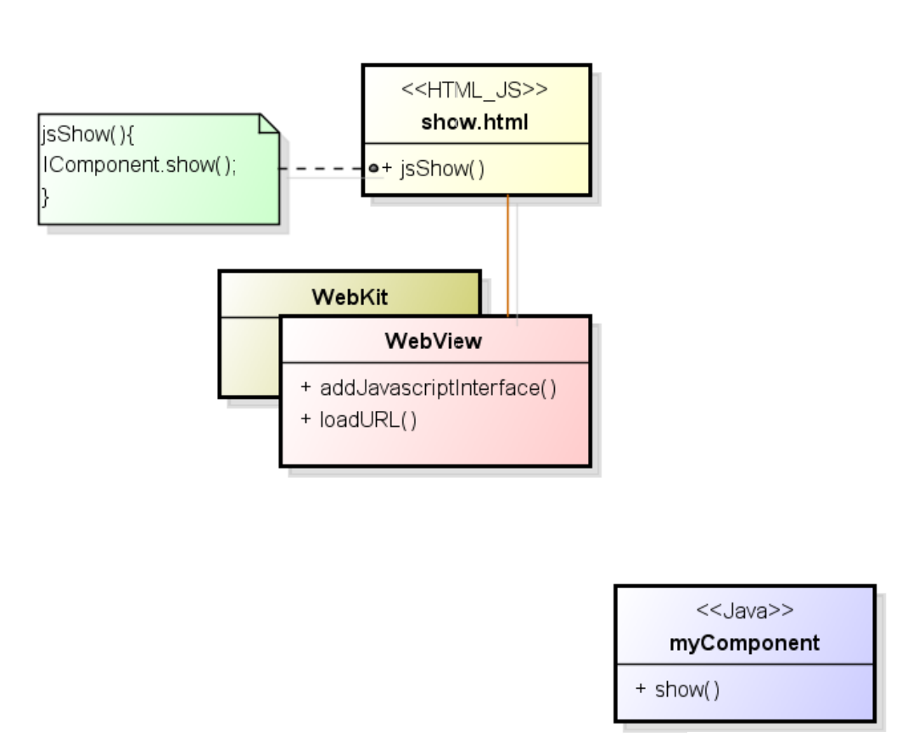

* 于是，WebView 执行上述 JS 代码时，就调用 myComponent 里的 show() 函数了。
* 那么，这两段代码之间，又由谁来建立其连结关系呢? 那就依赖另一段代码了，就是：

```java
public class myActivity extends Activity {
  
	@Override
	public void onCreate(Bundle savedInstanceState) {
		super.onCreate(savedInstanceState);
		WebView appView = new WebView(this);
		appView.loadUrl(“file:///android_asset/www/index.html”);
		appView.getSettings().setJavaScriptEnabled(true);\
		myComponent obj = new myComponent(this);
		appView.addJavascriptInterface(obj, “IComponent”);
		appView.loadUrl(“file:///android_asset/show.html”);
		setContentView(appView);
  }
}
```

```java
WebView appView = new WebView(this);
// ……
myComponent obj = new myComponent(this);
// ……
```

* 创建了引擎 \<E\> 和轮胎 \<T\>。

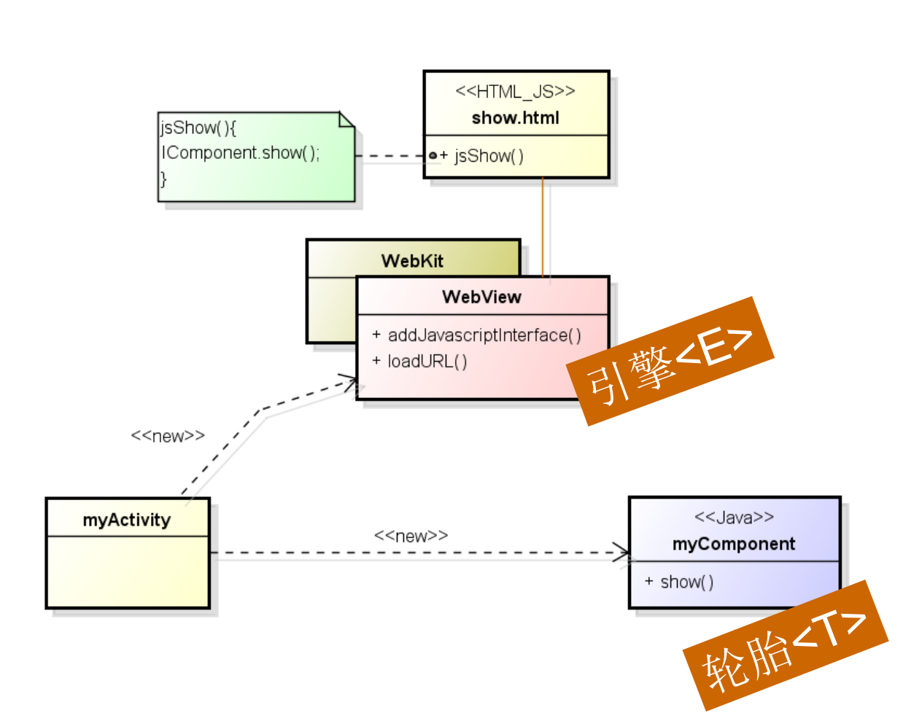

```java
// ……
appView.addJavascriptInterface(obj, “IComponent”);
// ……
```

* 将轮胎 \<T> 装配到引擎 \<E>。

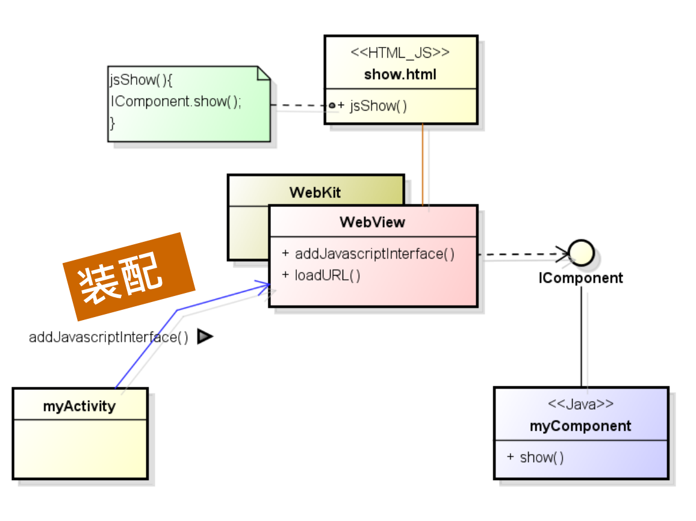

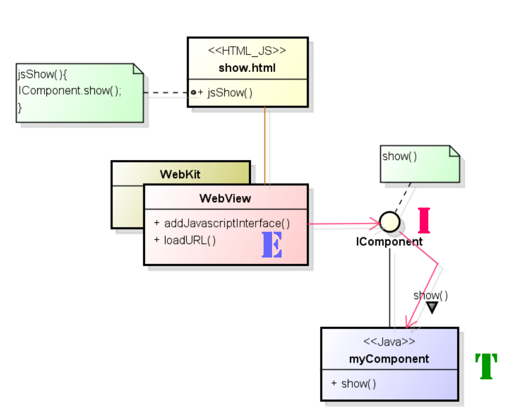

* IComponent 是特殊性接口，其变动成本很高；因为牵一发动全身。

## 设计通用性接口

* 以上的 IComponent 接口属于特殊性接口。你知道为什么它是一个特殊性接口吗? 
* 如果将 IComponent 接口设计成为通用性接口，应该由谁来定义这项接口呢?
* Java 插件实现 IComponent 通用性接口；然后 WebView 可以透过 IComponent 接口而调用 Java 插件的 disp() 函数。

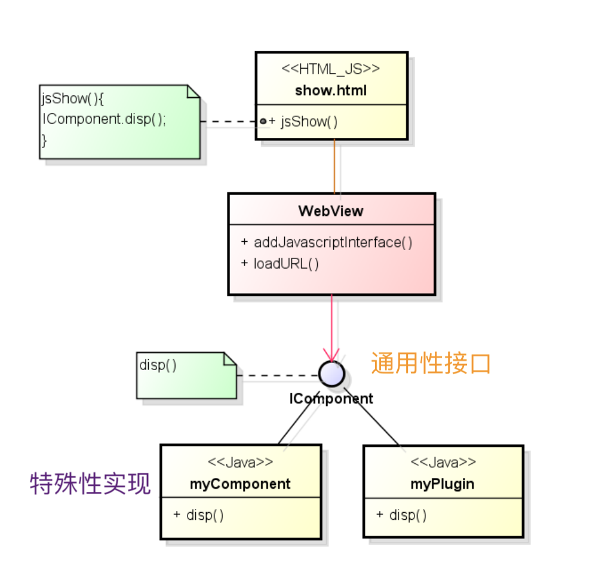

## 设计通用性基类

* 以上的 IComponent 接口已经转变成为通用性接口了。可以设计一个通用性基类来实现此通用性接口。你知道为什么需要这个通用性基类吗?那么，又应该由谁来定义这项基类呢?

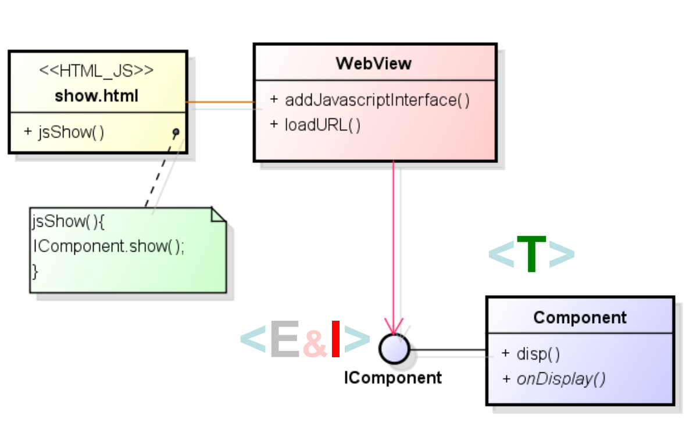

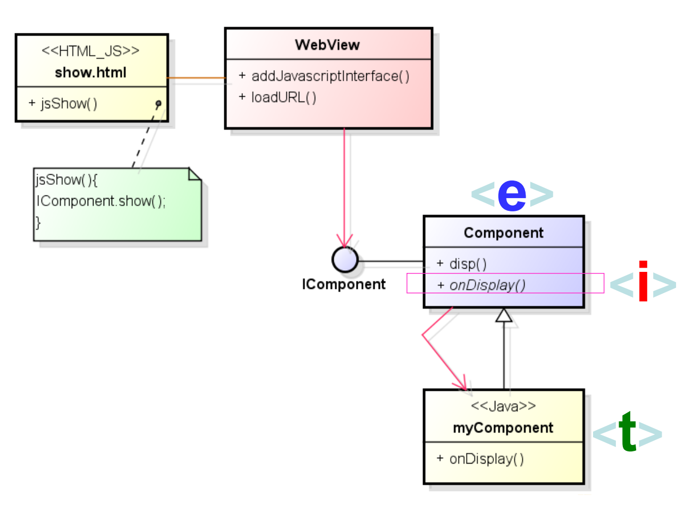

# 3. 认识 PhoneGap 框架

* 就如同上述 IComponent 通用性接口，PhoneGap 也设计了 IPlugin 接口。
* 接着，PhoneGap 撰写了 Plugin 通用性基类，扮演 \<E> 的角色；提供 execute() 抽象函数，扮演 \<I> 角色。于是，让开发者能撰写各式各样的 Java 插件，其扮演 \<T> 的角色。

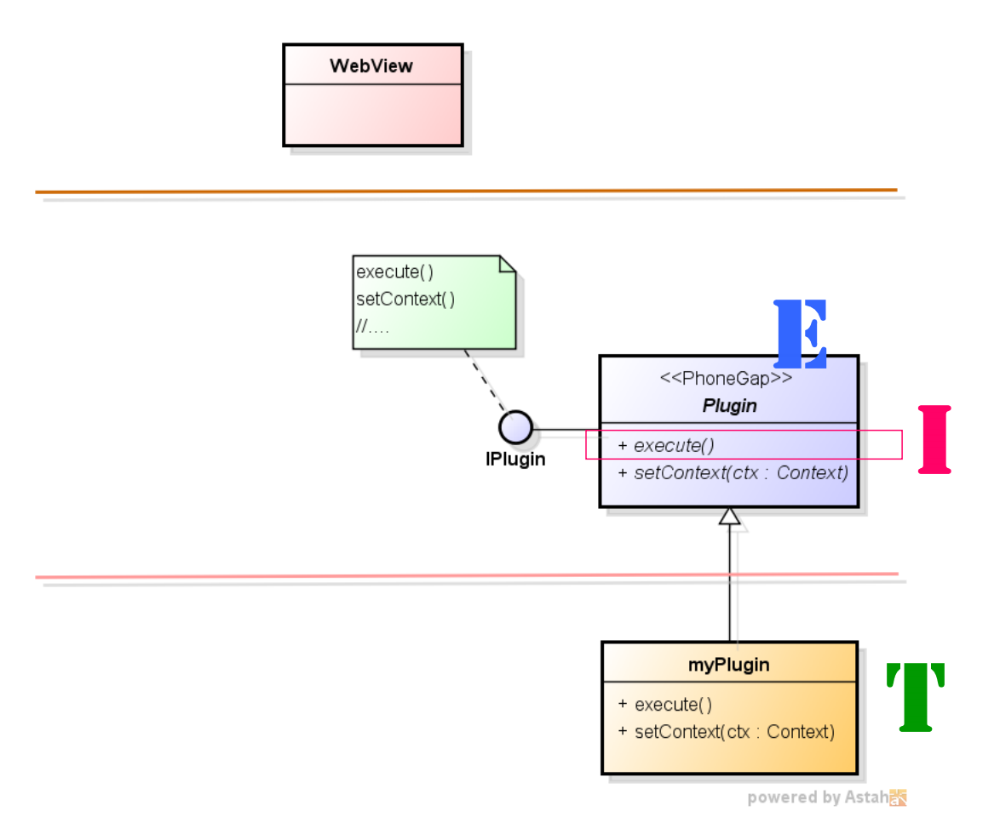

* 基于 PhoneGap 的框架，可以写 HTML5/JS 模块来调用 Java 插件。
* 在 App 执行时，用户会使用 WebView 画面而触发 UI 事件，JS 就负责处理这些事件。必要时，JS 会透过 WebView ( 包含幕后的 WebKit 引擎 ) 调用到 IPlugin 接口的函数，而实际执行了 Java 插件。
* 此外，Java 插件也能反向调用到 JS 模块里的函数。

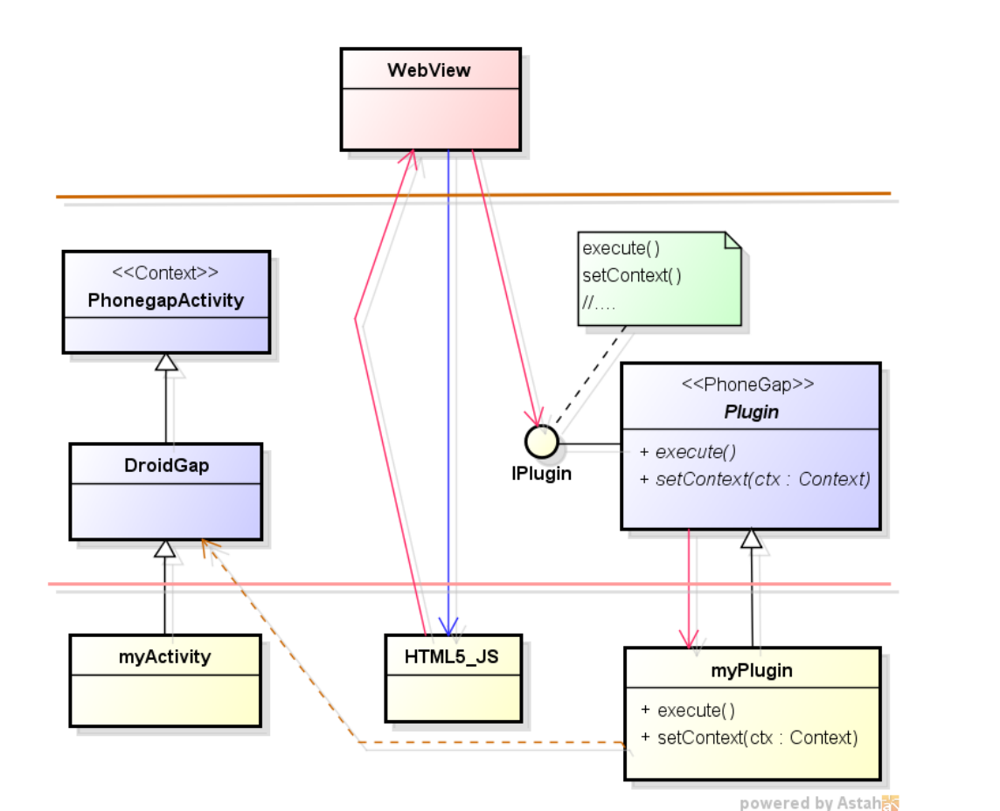

* 此外，Java 插件也能反向调用到 JS 模块里的函数。

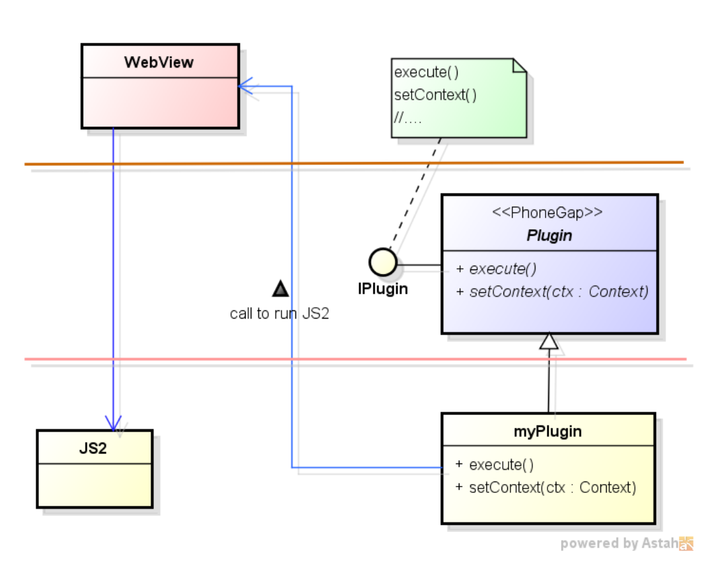

* Java 插件透过 JNI 调用本地 C 函数，再调用底层驱动，发挥硬件独特性，实践软硬整合商业效益。

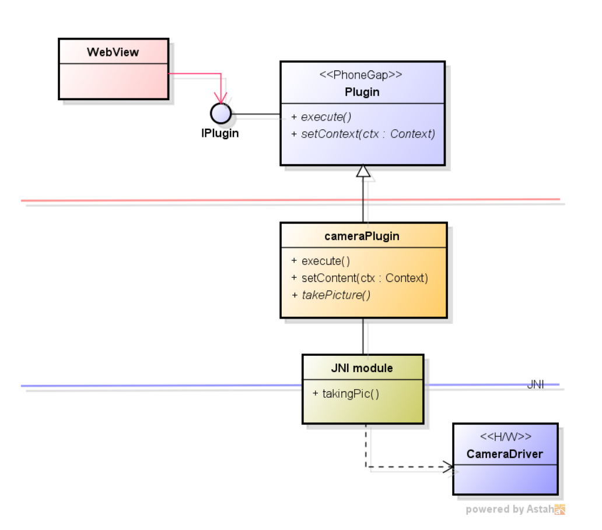

* PhoneGap 也撰写了 PluginManager 来负责管理 Java 插件。例如，常用的插件能事先创建起来，当 App 需要时，就能迅速提供服务；而且能让多 App 来共享同一个插件。

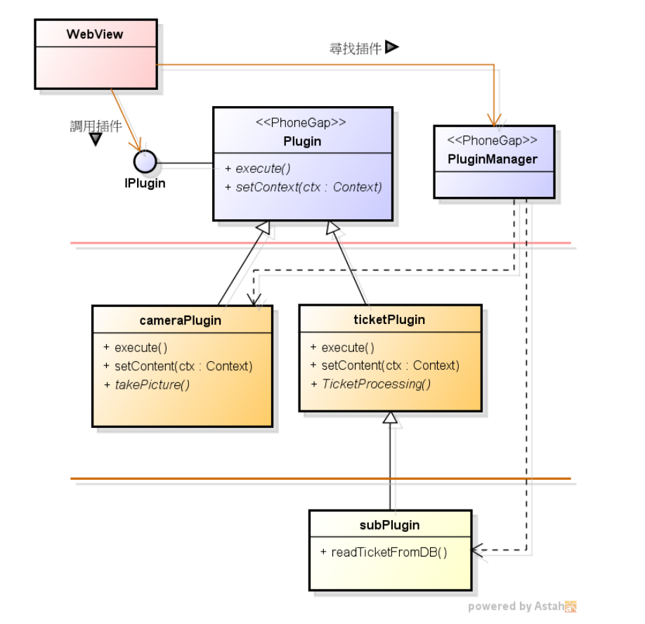

# 4. 使用 Proxy-Stub 模式来包装 IPlugin 接口

* 基于上述的 PhoneGap 框架，可以写 JavaScript 来呼叫 Java 插件。在许多范例里，你会看到如下的一段程序代码：

```javascript
var myProxy=function(){};

myProxy.prototype.play = function(success, fail, para1, para2){
	return PhoneGap.exec( success, fail,
		'myPlugin', //java类别名称，注册于plugins.xml中
		'PLAY', //在Plugin里用来配对的action名称
		[para1, para2] //所传递的参数(parameter)，Array结构
	);
};

myProxy.prototype.stop = function(success, fail, para1, para2){
	return PhoneGap.exec( success, fail,
		'myPlugin', //java类别名称，注册于plugins.xml中
		'STOP', //在Plugin里用来配对的action名称
		[para1, para2] //所传递的参数(parameter)，Array结构
	);
};

PhoneGap.addConstructor(function() {
	PhoneGap.addPlugin('myProxy', new myProxy());
});
```

* 在 PhoneGap 框架里，由 HTML5_JS 模块呼叫 Java 插件的基本架构如下：

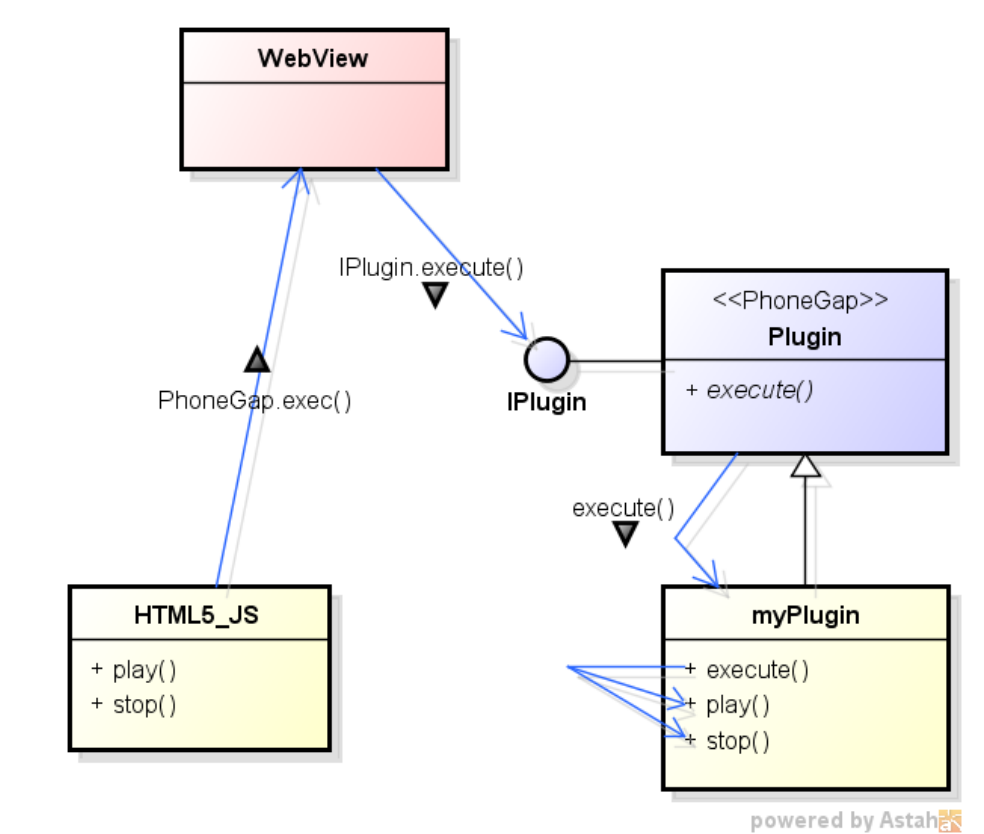

* 由于 IPlugin 接口只提供单一函数：execute()；使得 PhoneGap 也只能提供单一函数：exec()。 
* 然而，在 HTML5_JS 里可能有多个函数，例如 play() 和 stop() 等。
* 于是，在 HTML5_JS 里，必须从 play() 函数转而呼叫 PhoneGap.exec()。
* 这个 PhoneGap.exec() 再透过 WebView 而呼叫到 IPlugin.execute()。 
* 如果我们在上述架构里面，加上一个 myProxy 类别，它包装了 PhoneGap.exec() 函数，扮演 Java Plugin 的 Proxy 角色。
* 此时，HTML5_JS 里面就看不到 PhoneGap.exec() 函数了，其好处是：
* 一方面让 HTML5_JS 程序代码比较单纯；
* 另一方面，让 HTML5_JS 与 PhoneGap.exec() 两者相依性(Dependency) 降低，让 HTML5_JS 不受制于 PhoneGap 的框架界面。也因而提升了 PhoneGap 框架接口的变动自由度。
* 通常，在框架设计里，myProxy 和 myStub 会是成对的，这称为 Proxy-Stub 模式。


* 其中的指令：

```java
PhoneGap.addPlugin('myProxy', new myProxy());
```

* 这诞生了一个 myProxy 类别的对象，然后将其指针存入于 window.plugins.myProxy 里。于是，在 HTML5_JS 里面就能呼叫 myProxy.play() 或 myProxy.stop()，如下述的程序代码：

```javascript
<script type="text/javascript" src="cordova-1.7.0.js"></script>
<script type="text/javascript" src="json.js"></script>
<script type="text/javascript">
var hello = function(){
var success = function(data){ alert("data : " + data.para1); };
var fail = function(e){ alert(e); };
window.plugins.myProxy.play(success, fail, "Hello", " Mike");
}
```

* 于此，你已经学会了使用 proxy-stub 模式来封装 PhoneGap.exec() 界面。除了 PhoneGap 框架之外，在 Android 框架里，也使用同样的技巧来封装跨进程的 IBinder 接口。
* 这项技巧是各种框架开发时，经常使用到的。

# 5. 一般 App 如何使用 PhoneGap 框架呢？

* PhoneGap 框架原本的信息流向，承接来自 WebView 的事件。
* 原本 PhoneGap 是用来支持 Web App 开发。
* Web App 是以 HTML5/JS 语言开发的。
* WebView 是 UI 事件的来源。

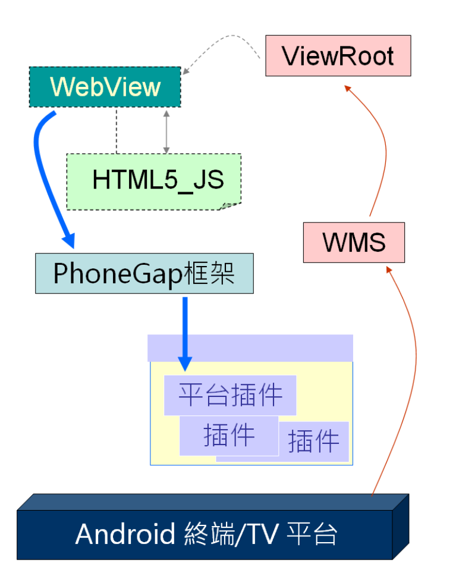


```java
public class DroidGap extends PhonegapActivity { 
	// …..
	protected WebView appView;
	protected LinearLayout root; 
	// ……
  
	public void onCreate(Bundle savedInstanceState) {
		// ……
		root = new LinearLayoutSoftKeyboardDetect(this, width, height);
		// ……
	}
  
	public void init() { 
		this.appView = new WebView(DroidGap.this); 
		// …….
		root.addView(this.appView); 
		setContentView(root);
  } 
}
```

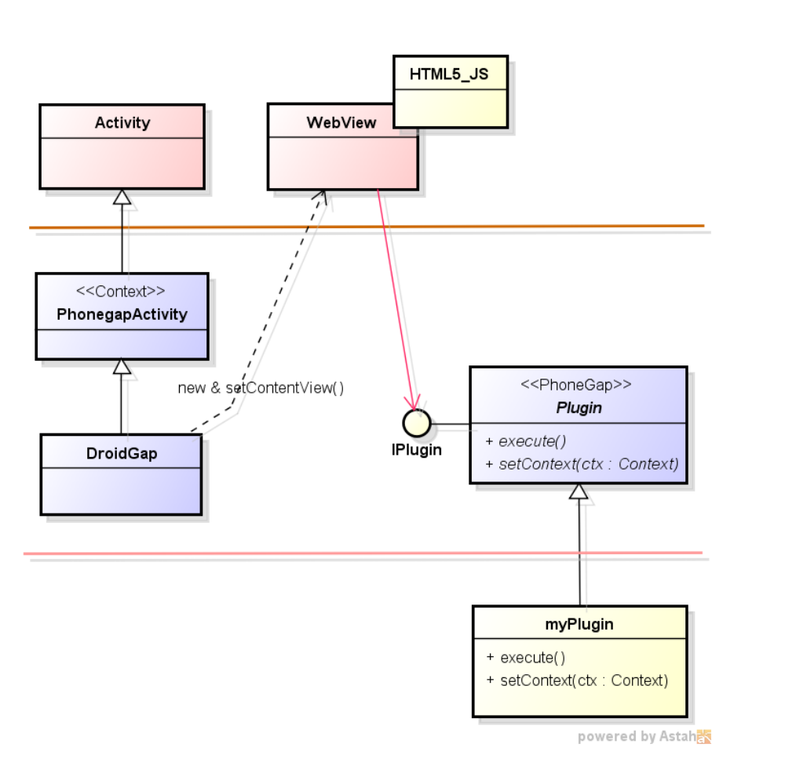

## 重构 PhoneGap 框架

* 我们可以依循 GPL 开源协议而修改 PhoneGap 的源代码，用来支持一般 Android App 的开发。
* 在一般 App 里，会用到许多 View 控件 ( 如 Button 等)，而不局限于 WebView，而这些 View 控件都是 UI 事件的来源。如果事件处理需要使用到 Java 插件，就能将信息传递给 PhoneGap 了。

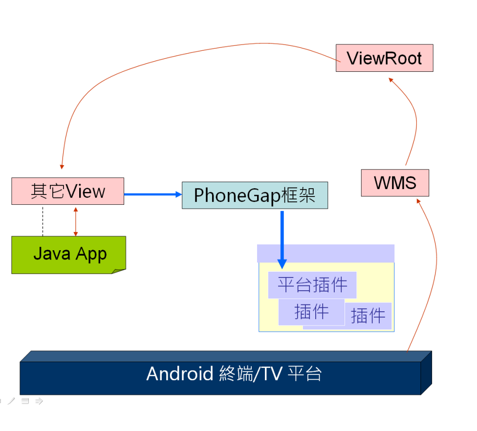

* 使用一般 Android App 的撰写方式，在 myActivity 里创建有关的 views，如 Button、SurfaceView 等；并且setContentView() 来将 views 呈现于 UI 画面上。
* 当 myActivity 接到 UI 事件时，如果需要的话，才调用 PhoneGap 的 API，间接执行到 Java 插件的代码。

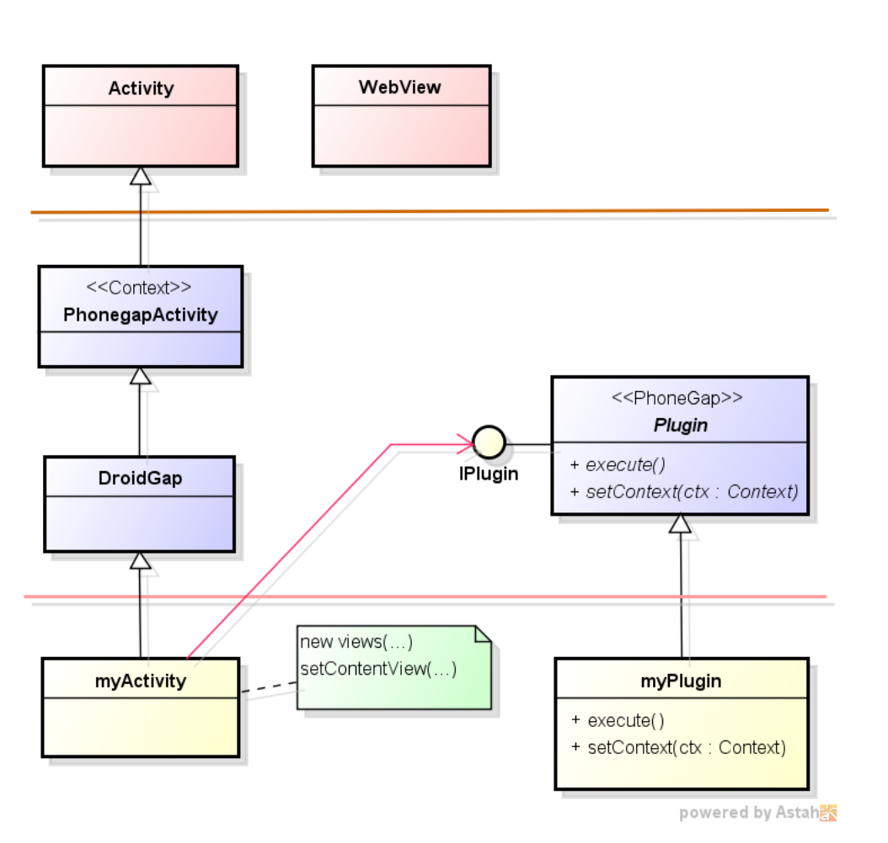

* 在重构 PhoneGap 框架中，获得宝贵的架构设计经验。